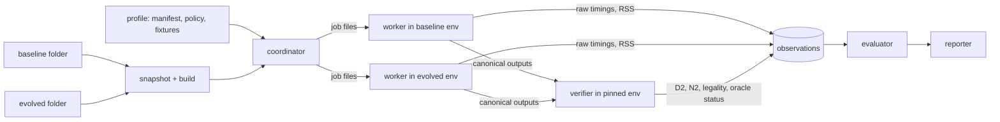

# Standalone Qiskit transpilation benchmark: implementation plan

This plan specifies how to build a dedicated repository (working name
`qiskit-transpile-bench`, Python package `qtb`) that depends on Qiskit and answers one
question:

> Given a baseline Qiskit source folder and an evolved Qiskit source folder, does the
> evolved version improve transpilation under the declared constraints?

**Status: proposal — nothing described here is built.** The document is self-contained: it
defines its own terms, workloads, formulas and policies, and implementing or interpreting
it requires no other design document. Statements about Qiskit's behavior were read from
the source or measured at the *baseline*, Qiskit `2.6.0.dev0` at commit `0131cbbcc`, in the
serial reference environment of section 2.6 on a development machine. They describe that
baseline. They are not benchmark results, and every number must be re-measured on the
controlled runner before it is relied on. Every threshold is an initial policy default, to
be frozen before the first candidate is evaluated (section 12 lists them).

**Contents:** [Highlights](#highlights) ·
[1 Scope](#1-scope-claims-and-vocabulary) ·
[2 Architecture](#2-architecture) ·
[3 Workloads](#3-workloads-in-detail) ·
[4 Formulas](#4-metrics-and-formulas-in-detail) ·
[5 Correctness](#5-correctness-in-detail) ·
[6 Seeds](#6-how-seeds-are-used) ·
[7 Optimization levels](#7-how-optimization-levels-are-used) ·
[8 Decision engine](#8-decision-engine) ·
[9 Lifecycle](#9-run-lifecycle-campaign-state-and-caching) ·
[10 Work breakdown](#10-work-breakdown) ·
[11 Harness validation](#11-validating-the-harness-itself) ·
[12 Risks and defaults](#12-risks-open-questions-and-defaults-to-freeze) ·
[Appendix](#appendix-record-schemas)

## Highlights

1. **What gets built.** One command,
   `qiskit-transpile-bench compare --baseline <folder> --evolved <folder>`, snapshots and
   builds both Qiskit folders in isolated environments, compiles frozen workloads with
   both, verifies the outputs, and prints one of five verdicts: `PASS`, `NO_IMPROVEMENT`,
   `CONSTRAINT_VIOLATION`, `INCONCLUSIVE` or `ERROR`. Only `PASS` exits with code 0.
2. **One objective, hard constraints.** The objective is lower **native two-qubit depth
   (`D2`)**. Native two-qubit gate count (`N2`), compilation time, peak memory (general
   profile) and correctness are constraints. It is never a weighted sum: a depth gain
   cannot pay for a wrong circuit or a failed cost guard.
3. **The revision under test never grades itself.** A worker inside each Qiskit
   environment only compiles and exports a Qiskit-independent operation list. Harness-owned
   code computes `D2`, `N2` and target legality from that list, and semantic oracles run in
   a separately pinned, trusted environment.
4. **The core formula.** Per case, take the ratio of geometric means over seeds,
   evolved over reference. The suite score is the weighted geometric mean of those ratios.
   Uncertainty comes from the per-seed paired log differences. Improvement requires
   `ln(score) + 2·SE < 0`; a regression guard requires `ln(score) <= 2·SE`; no case may
   exceed 1.05 (quality) or 1.10 (cost). Section 4 works an example to the last digit.
5. **Workloads.** The *focused* profile scores three 100-qubit circuits — QFT (25,100
   gates, all 4,950 qubit pairs interact), a square-lattice Heisenberg simulation (7,660
   gates, 180 pairs) and a three-layer QAOA on a Barabási–Albert graph (2,264 gates, 196
   pairs) — on a 193-qubit heavy-hex target with a `cz` basis at optimization level 2.
   The same circuits on `cx`/`ecr` targets, held-out circuits, two canaries and a 19-case
   timing panel are guards. The *general* profile requires eight workload families, three
   size bands, four topology classes, three bases and all four levels, in a tuning split
   and an independent validation split.
6. **Seeds.** Every quality case runs on a block of 100 transpiler seeds, paired across
   revisions: block 0–99 for tuning, then one fresh block per decision (100–199, 200–299,
   …), retired after use whatever the verdict. Circuits and targets are frozen as hashed
   data, never regenerated from a seed. Inside Qiskit the transpiler seed drives only the
   SABRE layout and routing search; section 6 traces it to the trial level.
7. **Optimization levels.** The focused profile scores level 2 only, so a focused `PASS`
   is a level-2 claim. Its timing panel spans levels 0–3. The general profile gives the
   four levels equal weight inside every (family, size, topology, basis) cell and guards
   each level's summary. Section 7 tabulates what each level does at the baseline and why
   a changed search budget is a configuration change, not an algorithmic gain.
8. **Correctness, in layers.** Structural checks (legal instructions on real ordered
   physical qubits, valid injective layouts) run on *every* scored output. Exact
   small-circuit equivalence runs at levels 0–3. Layout, ancilla, measurement and
   observable semantics, dynamic-circuit and API-contract regressions, and an at-scale
   Clifford-variant equivalence check with explicit *stage coverage* complete the set.
9. **Known limit, stated up front.** At levels 2–3 two-qubit resynthesis emits
   non-Clifford angles, so the at-scale oracle verified the complete default pipeline on
   only 1 of the 9 focused circuit/target pairs; a prefix through translation (optimization
   stage dropped, a Clifford synthesis plugin substituted) verified all 9. Until a stronger oracle exists, automatic `PASS` is available only to candidates
   confined to layout and routing. Anything touching the optimization stage or two-qubit
   synthesis tops out at `INCONCLUSIVE` pending review. (At levels 0–1 the complete
   pipeline verified on all three focused circuits.)
10. **Noise drives the design.** At the baseline the per-seed standard deviation of
    `ln D2` is 4–9% (1.4–3.9% for `N2`). With 100 seeds the focused score's standard error
    is about 0.6%, so on one block a true gain of about 1.1% passes half the time and about
    1.6% passes four times in five. A `PASS` needs the test on the tuning block and again
    on a fresh block, so end to end those gains pass only about 25% and 64% of the time;
    about 1.8% is needed for four in five. Roughly 20 noisy guards would falsely reject a neutral candidate
    about 37% of the time; the predeclared remedy (one rerun of a breached guard on a
    fresh seed block) brings that to about 1%.
11. **Delivery.** M0 contracts → M1 standalone runner (smoke only) → M2 focused evaluator
    → M3 general qualification → M4 automation. A profile may issue `PASS` only after the
    known-outcome validation of section 11 succeeds.

Numbers at a glance (baseline facts; sources in the sections cited):

| Quantity | Value | Section |
| --- | --- | --- |
| Focused target | Heavy-hex distance 9: 193 qubits, 224 couplings, degree ≤ 3, diameter 32 | 3.2 |
| Baseline `D2`, median over seeds 0–49 (`cz`, level 2) | QFT 1,843 · Heisenberg 400.5 · QAOA 1,528 | 3.3 |
| Per-seed sd of `ln D2` / `ln N2` | 6.8% / 3.0% · 8.7% / 3.9% · 4.2% / 1.4% | 3.3 |
| Standard error of the focused `ln D2` score | ≈1.8% with 10 seeds, ≈0.6% with 100 seeds (planning estimate) | 4.10 |
| True gain needed to pass 50% / 80% of the time | ≈1.1% / ≈1.6% on one block; ≈1.4% / ≈1.8% for tuning plus confirmation (planning estimate) | 4.10 |
| False rejection of a neutral candidate, 20 noisy guards | ≈37% uncorrected, ≈1% with one fresh-block rerun | 4.9 |
| At-scale oracle, complete default pipeline | 3 of 3 at level 0, 3 of 3 at level 1 (`cz`); 1 of 9 at level 2. Prefix with substituted synthesis: 9 of 9 | 5.7 |
| Indicative compile time, level 2 | 0.2–1.0 s scored circuits; 41 s `hwb12`; 5 s / 33 s for an 89-qubit ring at level 2 / 3 | 3.9 |

## 1. Scope, claims and vocabulary

**In scope.** Static, gate-based transpilation with exact synthesis through Qiskit's
standard staged pipeline (`init`, `layout`, `routing`, `translation`, `optimization`,
`scheduling`), including its Python/Rust boundary and target handling. The repository owns
the workloads, measurement runner, correctness checks, decision policy and reports. It
does not live inside either Qiskit checkout and never reads workload definitions from the
evolved checkout.

**Scored versus checked.** Only static circuits enter the `D2` score. Dynamic circuits
(mid-circuit measurement, reset, control flow), symbolic-parameter semantics, scheduling
and batch execution cannot be represented by a static depth score; they have regression
checks (section 5.5) that can block acceptance but never earn it.

**Out of scope.** Hardware execution, noise characterization, simulator speed, circuit
construction and parsing speed, fault-tolerant (Clifford+T) pipelines, approximate
synthesis as an objective.

**What a verdict means.** A focused `PASS` means *focused-panel native two-qubit depth
improved at level 2 on the declared target, within the stated count, time and correctness
limits*. A general `PASS` means *native two-qubit depth improved across the declared
static-circuit families, sizes, targets and levels, within the stated count, time and
memory limits*. Neither means every circuit improves, hardware runs faster, or unseen
workload families improve. `NO_IMPROVEMENT` means improvement was not demonstrated under
this policy, not that the revisions are equivalent.

**Vocabulary.**

| Term | Meaning |
| --- | --- |
| Revision | One Qiskit source tree, snapshotted and built into its own environment |
| Baseline / evolved | The two folders given on the command line: the reference and the candidate |
| Frozen campaign baseline | The baseline recorded when a campaign is created. Every regression guard compares against it, and it never moves. Without this, each acceptance spends the noise allowance again: ten accepted changes at "+1%, within noise" compound into a 10% regression no single comparison flagged |
| Current best | The most recently accepted revision in the campaign (the baseline itself in a new campaign). The improvement test compares against it |
| Case | One circuit × one target × one compile configuration, including the optimization level |
| Input group | All cases derived from the same underlying circuit instance (its target, basis, level and parameter variants). The unit of independence for splits and for the bootstrap |
| Panel | A set of cases evaluated together: tuning, held-out, canary, timing, memory, validation |
| Profile | A versioned bundle of manifest (cases, weights, roles) and policy (thresholds): `focused-v1`, `general-v1` |
| Campaign | A line of work against one frozen baseline and one profile. Owns the seed ledger, the current best and the decision history |
| Seed block | 100 consecutive transpiler seeds with one declared purpose (section 6.3) |
| Objective / guard / canary | The quantity that must improve / a quantity that must not regress / a case with a known constant outcome whose change demands an explanation |
| Native two-qubit gate | An executable two-qubit instruction of the target: `cx`, `cz` or `ecr` here |
| SABRE, VF2 | Qiskit's randomized swap-insertion layout/routing heuristic; its deterministic subgraph-isomorphism layout search |

## 2. Architecture

### 2.1. Components and trust boundaries

| Component | Responsibility | Imports Qiskit? |
| --- | --- | --- |
| Campaign configuration | Versioned profiles: concrete case IDs, weights, roles, exclusions, limits, seed blocks, splits, thresholds | No |
| Fixtures and targets | Repository-owned circuit data and frozen synthetic target descriptions, each with a SHA-256 | No |
| Environment builder | Snapshot each folder, build Qiskit including its native extension, install locked dependencies, verify provenance | No |
| Revision worker | Inside **one** revision's environment: rebuild inputs from canonical data, compile, run the API-behavior checks that need the live library, export canonical outputs | Yes — the revision under test |
| Verifier | Inside a repository-pinned environment: stream canonical outputs, compute `D2`/`N2`, check legality and layouts, run semantic oracles | Yes — one pinned released Qiskit, for `quantum_info` oracles only; metric and legality code is pure Python |
| Coordinator | Preflight, job scheduling, seed ledger, timeouts, caching, campaign state, exclusive-machine control for cost runs | No |
| Evaluator | Ratios, scores, uncertainty, coverage, every guard, the decision — from saved observations only | No |
| Reporter | Terminal verdict, `report.md`, `decision.json`, reproduction bundle | No |



Three rules follow from the trust boundary:

- **Never import two Qiskit versions in one process, and never exchange live Qiskit
  objects.** Components communicate through versioned files (section 2.3).
- **The revision under test computes none of its own grades.** A candidate that changes
  `QuantumCircuit.depth()`, `count_ops()`, `Operator` or `Target` queries cannot alter its
  score or its oracle. The worker touches only the accessors needed to walk the output
  (`circuit.data`, operation name, parameters, bit indices, layout index arrays).
- **Evaluation is replayable.** The evaluator and reporter read only saved observations,
  so a decision can be recomputed, or a policy bug fixed, without recompiling anything.

### 2.2. Repository layout

```text
qiskit-transpile-bench/
  pyproject.toml              # core package `qtb`: no Qiskit dependency
  src/qtb/
    cli.py                    # compare, screen, smoke, calibrate, freeze, evaluate, report, repro
    config/                   # JSON Schemas and loaders: manifest, policy, protocol, records
    canonical/                # canonical circuit/layout/target formats, hashing (pure Python)
    metrics/                  # D2/N2 extraction and target legality (pure Python)
    envbuild/                 # snapshot, content hash, build, provenance
    coordinator/              # preflight, scheduler, seed ledger, cache, campaign state
    evaluator/                # ratios, scores, SE, bootstrap, guards, decision
    reporter/                 # decision.json, report.md, terminal verdict
  worker/qtb_worker/          # installed into each revision environment
    adapter.py                # small version adapter over public Qiskit API
    modes.py                  # quality, prefix, timing, memory, roundtrip, api_checks
  verifier/qtb_verifier/      # installed into the pinned verifier environment
    structural.py             # streams outputs: D2, N2, legality, layout validity, hash
    small_exact.py            # C1: operator equivalence
    layout_semantics.py       # C2: states, ancillas, measurements, observables
    dynamic.py                # C4: exact branching simulator, parameter bindings
    schedule.py               # C5: timing validity
    clifford_scale.py         # C6: full-width tableau comparison
  profiles/focused-v1/        # manifest.json, policy.json, exclusions.json
  profiles/general-v1/
  fixtures/circuits/          # *.ops.jsonl.gz canonical inputs (+ Clifford variants)
  fixtures/targets/           # *.target.json frozen targets
  fixtures/PROVENANCE.md      # origin, license, generator script and seed of every fixture
  tools/curate/               # one-time fixture generators, run in the verifier environment
  envs/                       # verifier.lock, common.lock (non-Qiskit deps), dev-tests.lock
  tests/                      # harness unit tests and the known-outcome suite (section 11)
```

### 2.3. Process model and worker protocol

The coordinator launches a worker as `<env>/bin/python -P -m qtb_worker --job job.json
--out <dir>` with a scratch working directory outside both source trees, a sanitized
environment (section 2.6), `PYTHONNOUSERSITE=1` and no inherited `PYTHONPATH`. (`-P`, which
keeps the working directory off the import path, needs Python 3.11 or later; the harness
builds both environments on one frozen Python version that satisfies this.) A job is a
JSON file naming the protocol version, mode, case, canonical circuit and target files with
their hashes, the explicit compile options, the seed list and a timeout. A result is a
directory of JSON records plus canonical output files. Unknown protocol versions are
refused by both sides.

| Mode | What the worker does | What it emits |
| --- | --- | --- |
| `roundtrip` | Build the input circuit and the `Target` from canonical data, export both back | Canonical hashes, to prove both revisions see the same inputs (section 3.8) |
| `quality` | For each seed: build the preset for (target, options, seed), compile, export | Canonical output and layout per seed, pipeline fingerprint, diagnostic wall time |
| `prefix` | As `quality`, with the oracle's declared pipeline edits (for example, optimization stage dropped) | Same, labeled with the stages it covers |
| `timing_e2e` | Warm up, then time complete `transpile()` calls | Raw samples in nanoseconds |
| `timing_reuse` | Build the pass manager outside timing, warm up, time `pm.run()` | Raw samples |
| `preset_build` | Time `generate_preset_pass_manager(...)` alone | Raw samples |
| `memory` | One compile in a fresh process | RSS after setup, peak RSS |
| `api_checks` | Behavior checks that need live objects (section 5.5) | Structured observations, judged by harness code |

Quality jobs batch up to 25 seeds of one case per process to amortize fixture loading.
Timing uses one process per (case, revision, round); memory one process per repetition.

**Version adapter.** The worker prefers public interfaces (`generate_preset_pass_manager`,
`transpile`, `Target.add_instruction`, `TranspileLayout.initial_index_layout` and
`final_index_layout`) through one small adapter module. An interface a revision lacks is
reported as `unsupported`; the adapter must never silently alter target properties,
options or the search budget to make a candidate run.

**Pipeline fingerprint.** For every (revision, configuration) the worker records, per
stage, the ordered pass class names and the search-budget attributes it can read
(`SabreLayout.layout_trials`, `swap_trials`, `max_iterations`; `SabreSwap.trials` and
heuristic; VF2 `call_limit` and `max_trials`). The report diffs fingerprints between
revisions. A differing budget is reported as a **configuration change**; its cost shows up
in the compile-time guard, and it is never described as an algorithmic gain.

### 2.4. Canonical formats

All three formats are plain JSON, serialized with sorted keys and no insignificant
whitespace, floats written as C99 hexadecimal (`float.hex()`) so that values round-trip
exactly. The hash of an artifact is the SHA-256 of its uncompressed canonical bytes.

- **Circuit** (`*.ops.jsonl.gz`): a header line, then one operation per line in circuit
  order (a valid topological order of the dependency graph).

  ```text
  {"format":"qtb-circuit/1","num_qubits":193,"num_clbits":0,"global_phase":"0x0.0p+0","parameters":[]}
  ["rz",[17],[],["0x1.921fb54442d18p+0"]]
  ["cz",[17,18],[],[]]
  ```

  Each line is `[name, qubit indices, clbit indices, parameters]`. Matrix-defined gates
  carry their matrix as nested hexadecimal pairs. A symbolic parameter is written as its
  name (inputs) or as an expression string with its free-parameter names (outputs).
  Control-flow operations carry their blocks recursively with explicit block-to-outer wire
  maps. Scheduled outputs add per-operation start time and duration.
- **Layout**: `input_num_qubits`, `output_num_qubits`, and three integer arrays of length
  `output_num_qubits`: `initial_index_layout` (input position → physical qubit at the
  start), `final_index_layout` (input position → physical qubit at the end), both with
  ancillas included, and `routing_permutation`.
- **Target** (`*.target.json`): `num_qubits`, `dt`, and per instruction its name, arity,
  parameter names, the explicit list of ordered qubit tuples it supports (or `null` for a
  global instruction), per-tuple `duration` and `error`, optional angle bounds, plus the
  persisted `native_2q_names` list that `D2`/`N2` use.

Large outputs (the `hwb12` output has about 2.6 million operations) are streamed: the
worker writes, the verifier reads once and computes hash, metrics and legality in a single
pass. Outputs above a size threshold are retained only as hash, metrics and layout unless
the case failed, is disputed or was sampled by the determinism audit; any output can be
regenerated exactly from (build, case, seed).

### 2.5. Snapshot, build and provenance

1. **Snapshot first.** Accept clean or modified folders. Enumerate tracked plus untracked,
   non-ignored files (`git ls-files -co --exclude-standard`; a default ignore list for
   non-Git folders), copy them to a snapshot directory, and hash them (sorted relative
   path plus per-file SHA-256 → tree hash). Record resolved path, commit ID and dirty state
   when available. Never modify the supplied folders. Snapshotting first means edits made
   during a long run cannot change what is measured. Exclude environment directories,
   build outputs and Git metadata.
2. **Build each snapshot independently** into a fresh virtual environment and fresh build
   directory: same Python, the same locked non-Qiskit dependencies (`envs/common.lock`), a
   non-editable wheel build from the snapshot. Build-affecting variables are pinned, not
   inherited: `QISKIT_BUILD_PROFILE=release`, `RUST_DEBUG` and `QISKIT_NO_CACHE_GATES`
   unset, `QISKIT_BUILD_WITH_MIMALLOC` set to one frozen value for both builds. (With no
   profile set, Qiskit's `setup.py` lets the build type follow the install mode, which is
   exactly the kind of silent difference to exclude.)
3. **Force one Rust toolchain.** Each checkout's `rust-toolchain.toml` can silently select
   a different compiler. Resolve the channel from the baseline snapshot, export
   `RUSTUP_TOOLCHAIN` for both builds, and record `rustc -Vv` for each. If the evolved
   snapshot cannot build with it, or the two dependency sets cannot be reconciled, the
   code-only comparison is blocked (`ERROR`); a changed environment is a separately
   labeled experiment that cannot issue `PASS`.
4. **Verify provenance in the worker.** `qiskit.__file__` and the native extension must
   resolve inside the environment, not a source tree; the extension's SHA-256 must equal
   the one recorded at build time. Save build logs, artifact hashes and the full
   `pip freeze`.
5. **Build identity** = snapshot tree hash + Python version + lock hash + resolved
   toolchain + build flags. It keys every cache entry (section 9.3).

### 2.6. Serial reference environment

Every worker runs with this environment unless a profile declares an alternative, which is
then a separate profile whose observations are never mixed with serial ones.

| Variable | Value | Why |
| --- | --- | --- |
| `QISKIT_PARALLEL` | `FALSE` | No multiprocess circuit dispatch |
| `QISKIT_IGNORE_USER_SETTINGS` | `TRUE` | A user config file can change the default level, the seed and the SABRE budget |
| `RAYON_NUM_THREADS`, `OMP_NUM_THREADS` | `1` | Serial Rust and BLAS work; SABRE trials otherwise run in a thread pool |
| `QISKIT_SABRE_ALL_THREADS` | **unset** | Any non-empty value, even `FALSE`, makes preset trial counts depend on the CPU count |
| `QISKIT_TRANSPILER_SEED`, `QISKIT_NUM_PROCS`, `QISKIT_IN_PARALLEL`, `QISKIT_FORCE_THREADS` | **unset** | Each can change seeding or threading behind the harness's back |
| `PYTHONHASHSEED` | `0` | Pinned; the determinism audit varies it deliberately (section 6.7) |

Record CPU model, OS, core count, thread libraries and resource limits with every run.

## 3. Workloads in detail

### 3.1. Anatomy of a case and the manifest

A case is a circuit, a target and an explicit compile configuration. The frozen manifest
enumerates **actual cases**, not desired families. Each entry records role (`scored`,
`guard`, `zero_baseline`, `canary`, `timing`, `memory`), family, size band, topology,
native basis, optimization level, input-group ID, split, weight, oracle, timeout and
measurement modes (full field list in the appendix). Unsupported combinations are declared
with a reason **before** evaluation; a candidate failing on a case is never an exclusion.

Two options are pinned on every scored and timed case: `approximation_degree=1.0` (exact
synthesis) and `qubits_initially_zero=True` (Qiskit's default contract, the one users get).
Semantic oracles declare their own contract where they need the stronger all-input one
(section 5.1).

### 3.2. The focused target

`heavy_hex_d9` is the heavy-hexagon lattice of code distance 9 (what
`CouplingMap.from_heavy_hex(9)` constructs): qubits sit on the vertices and edges of a
hexagonal tiling, so every qubit has at most three neighbors.

| Property | Value |
| --- | --- |
| Physical qubits | 193 (so a 100-qubit circuit leaves 93 spare qubits) |
| Couplings | 224 undirected; the two-qubit gate is defined in both directions on each (448 ordered pairs) |
| Degree distribution | 2 qubits of degree 1, 127 of degree 2, 64 of degree 3 |
| Diameter | 32 hops |
| Instructions | `rz`, `x`, `sx`, `id`, one of `cx` / `cz` / `ecr`, plus `measure`, `reset`, `delay` and the control-flow operations |
| Synthetic properties | Two-qubit error 2.9e-5 to 5.0e-3, two-qubit duration 82 to 899 ns, `dt` = 0.222 ns |

The three target files `heavy_hex_d9_{cx,cz,ecr}` differ only in the entangling gate. They
are generated **once**, at curation time, from
`GenericBackendV2(193, ["rz","x","sx",<2q>,"id"], coupling_map=heavy_hex(9),
control_flow=True, seed=12345678942)` and then frozen as data. They are never regenerated
at comparison time, because generator behavior can differ between Qiskit versions and a
seed alone would not detect that. The error and duration values are part of the hash even
though the score is `D2`: VF2 layout scoring and error-aware decomposition choices read
them. The same generator seed gives the three variants identical numeric properties, which
is one reason they are not independent cases (section 3.4). `cz` is the primary target.

### 3.3. The three scored circuits

All three are 100-qubit, measurement-free circuits with numeric angles, written in `cx`
plus single-qubit rotations, curated from the OpenQASM 2 fixtures of Qiskit's own benchmark
suite. Each has weight 1/3.

| Fact | `qft_n100` | `square_heisenberg_n100` | `qaoa_ba_n100_3reps` |
| --- | --- | --- | --- |
| What it is | Quantum Fourier transform, controlled phases already expanded into `cx` + `rz` | Trotterized Heisenberg spin model on a 10×10 square lattice | Three QAOA layers for a 100-node Barabási–Albert (preferential-attachment) graph |
| Gates | 25,100: 10,050 `cx`, 14,850 `rz`, 100 `ry`, 100 `rx` | 7,660: 2,160 `cx`, 2,880 `rx`, 1,440 `ry`, 1,180 `rz` | 2,264: 1,176 `cx`, 588 `rz`, 400 `rx`, 100 `ry` |
| Input depth (total / `cx` only) | 796 / 397 | 1,081 / 432 | 362 / 238 |
| Interacting qubit pairs | All 4,950 | 180 nearest-neighbor lattice bonds | 196 graph edges (each used twice per layer) |
| What it stresses | Dense, nonlocal interaction on a sparse device: layout and routing dominate. 7,884 of its 15,050 rotation angles are zero or negligible (5,310 literal `rz(0)` between distant qubits, 2,574 more below 1e-8), so level-2 cleanup leaves only 1,750 interacting pairs before routing — simplification matters as much as routing | A degree-4 lattice that does not embed in a degree-3 device; repeated local patterns exercise cancellation and two-qubit block resynthesis | An irregular graph with hubs: high-degree nodes serialize their gates and pull routing toward bottlenecks |

Baseline behavior, `cz` target, level 2, varying only the transpiler seed over 0–49
(output-quality values, deterministic for a given build, configuration and seed):

| Circuit | `D2` min / median / max | `N2` min / median / max | sd of `ln D2` | sd of `ln N2` | Correlation of the two logs |
| --- | --- | --- | --- | --- | --- |
| `qft_n100` | 1,610 / 1,843 / 2,144 | 8,632 / 9,522.5 / 10,088 | 6.8% | 3.0% | 0.78 |
| `square_heisenberg_n100` | 345 / 400.5 / 498 | 1,671 / 1,822.5 / 1,974 | 8.7% | 3.9% | 0.55 |
| `qaoa_ba_n100_3reps` | 1,392 / 1,528 / 1,710 | 8,272 / 8,626 / 8,877 | 4.2% | 1.4% | −0.12 |

Two readings matter for the design. `D2` varies two to three times more than `N2` from
seed to seed, because SABRE keeps the trial with the fewest swaps and never compares
depth (section 6.2): there is headroom for a depth-aware change, and a single seed cannot
show it. And one seed is unreliable: a single-seed `ln D2` comparison has a standard
deviation of about 6–12%.

### 3.4. Guards: other bases and held-out circuits

**Other native bases.** The three circuits also run on `heavy_hex_d9_cx` and
`heavy_hex_d9_ecr` with the same seeds. These cases guard; they do not enlarge the score's
sample. Over seeds 0–9 at the baseline, `D2` and `N2` were identical on `cz` and `ecr` for
all three circuits, and `cx` was identical for Heisenberg, within 1% for QAOA and within
2% for QFT. When counting independent noisy guards, identical variants count once.

**Held-out circuits** are evaluated only at acceptance (never in screening), as per-case
guards against the frozen baseline. They need not improve. They run at level 2; circuits
without a fixture-fixed target run on the primary `cz` target.

| Case | What it is | Baseline facts |
| --- | --- | --- |
| `queko_bigd_20` | QUEKO instance (a circuit built backwards from a known depth-optimal solution on a given device), Tokyo 20-qubit connectivity, basis `id, rz, sx, x, cx` | 45 `cx`, depth 45, 9 of 20 qubits used |
| `queko_bss_53` | QUEKO, Rochester 53-qubit connectivity | 3,764 gates, 1,061 `cx`, depth 100 |
| `queko_bntf_54` | QUEKO, Sycamore 54-qubit connectivity | 959 gates, 270 `cx`, depth 25 |
| `qv_n50_d50` | Quantum-volume model circuit: 50 layers of 25 Haar-random two-qubit unitaries on random pairings (1,250 matrix gates) | Upstream's generator seeds the pairings but **not** the matrices, so the matrices are generated once with a seeded generator and frozen as data |
| `hwb12` | Reversible "hidden weighted bit" function on a 20-qubit register | 171,482 gates: 97,980 `h`, 44,833 `cx`, 24,495 `ccx`, 4,174 `x`. Probe (seed 0): `D2` 386,479, `N2` 645,222, 41 s per compile — it dominates the held-out budget |
| `bv_all_ones_n100` | Bernstein–Vazirani with an all-ones secret: 99 `cx` into one hub qubit (a star), 99 measurements | Probe (seeds 0–2): `D2` 632–702, `N2` 749–861 |
| `bvlike_n100` | 198 `cx` that cancel completely once an `x` and a `z` commute out of the way; only those two single-qubit gates survive | `D2` = `N2` = 0 on every probed seed at level 2 (level 1 leaves `N2` = 1,518) → a **zero-baseline guard** (section 4.5) |

QUEKO's known-optimal depth is an absolute yardstick only once its reference basis,
allowed rewrites and depth model are matched; until then these are fixed regression
workloads and no optimality claim is made. Repeatedly inspected held-out circuits
eventually become tuning data: the campaign counts their exposures, and the report warns
once the count reaches the frozen staleness limit.

### 3.5. Canaries

A canary has a constant known outcome. Its expected value is established on the validated
baseline before tuning; any departure yields `INCONCLUSIVE` until it is explained and
freshly validated, because it signals that a simplification was lost (or gained) somewhere
the score cannot see.

| Canary | Input | Expected at the baseline | Why it is constant |
| --- | --- | --- | --- |
| `su2_circular_n100` at level 2, `cz` | `efficient_su2(100, reps=3, entanglement="circular")`: 400 `ry`, 400 `rz`, 300 `cx`, 800 unbound parameters | `D2` = `N2` = 300 on every seed | A 100-qubit ring embeds exactly in the heavy-hex graph, so VF2 finds a perfect layout, SABRE never runs and the seed is never consumed. 300 equals the input's own serial `cx` ladder |
| `long_2q_sequence` at levels 2 and 3 | Two qubits, 3,505 gates (1,002 `cx`, 900 `u1`, 1,200 `u2`, 403 `u3`); Rochester 53-qubit coupling map and the legacy basis `u1, u2, u3, cx, id` | `D2` = `N2` = 3 (total depth 7) | Two-qubit block resynthesis collapses the whole sequence into one canonical decomposition. At levels 0–1, which do no two-qubit resynthesis, the same input gives `D2` = `N2` = 1,002 |

The 89-qubit version of the ring is *not* a canary. The heavy-hex graph is bipartite, so an
odd ring cannot embed: `VF2Layout` exhausts its call budget without a solution (4.9 of the
5.0 s compile at level 2; 33 s at level 3) and SABRE then gives seed-dependent results
(`D2` 1,367–1,464 over seeds 0–2 at level 2). It belongs to the general profile's ansatz
family.

A canary may be marked `acceptance_only` in the manifest, in which case screening skips it
and it is evaluated only at confirmation. The two canaries above are not: their expected
constants are public, and an early departure is useful feedback while iterating.

### 3.6. Timing panel (19 cases)

| ID | Input and configuration | Mode | Levels | Seed |
| --- | --- | --- | --- | --- |
| T1 | `single_h`: one qubit, one `h`; fixed 27-qubit coupling map, basis `id, rz, sx, x, cx, reset` | `timing_e2e` | 2 (explicit) | 20220125 |
| T2 | `cancel_2q`: `h h cx cx cx cx` on two qubits — everything cancels; same constraints | `timing_e2e` | 2 (explicit) | 20220125 |
| T3–T6 | `qv_n14_d14`: 98 frozen random two-qubit unitaries; 14-qubit target with Melbourne connectivity | `timing_e2e` | 0, 1, 2, 3 | 0 |
| T7–T10 | `long_2q_sequence` with its legacy constraints | `timing_e2e` | 0, 1, 2, 3 | 0 |
| T11–T19 | The three scored circuits × `cx`, `cz`, `ecr` | `timing_reuse` | 2 | 1234567845 |

T1–T2 expose wrapper and fixed overhead that large workloads hide; T3–T10 time complete
compilation across levels; T11–T19 time repeated compilation of the scored workloads with
preset construction outside the clock. Upstream times T1–T2 with the level omitted; here
the level is explicit (2, the resolved default at the baseline) and each revision's
resolved default is recorded, so a changed default is reported as a configuration change
instead of appearing as a slowdown. The fixed seeds are the historical upstream values.
Timing boundaries are frozen per case: circuit loading, target construction, verification,
metric extraction and diagnostic callbacks are always outside the clock.

A **multi-seed timing companion** times T11–T19 over seeds 0–19. It is required when a
change touches randomized search (layout, routing) or its declared scope is unknown,
because fixed-seed timings do not constrain expected cost over the seed distribution.
Preset construction time is always measured and reported; it is guarded through the
`timing_e2e` cases, which contain it.

### 3.7. General profile

**Families.** All eight must contribute scored cases to both splits.

| ID | Family | Instances vary by | Why it is included |
| --- | --- | --- | --- |
| G1 | Quantum Fourier transform | Width; frozen conventions (final swaps, exact angles) | Structured, nonlocal interactions |
| G2 | Hamiltonian simulation | Lattice shape and size, model, Trotter depth, generic numeric angles | Lattice interactions, repeated evolution layers |
| G3 | QAOA | Graph instance and structure (preferential-attachment, regular, random), width, repetitions | Graph-dependent interactions |
| G4 | Quantum volume | Width, depth, independently generated **frozen matrices** | Random dense interactions, matrix-gate synthesis |
| G5 | Reversible logic | Different Boolean and arithmetic circuits, including new larger adders/multipliers | Synthesis and simplification of classical structure |
| G6 | Bernstein–Vazirani patterns | Width, secret pattern, simplification-sensitive variants | Star-shaped interaction, cancellation opportunities |
| G7 | Variational ansatz circuits | Width, entanglement pattern, repetitions; numeric and symbolic variants of one instance stay in one group | Repeated entanglers, parameter handling |
| G8 | Routing challenges | Independent QUEKO-style instances; the fixture fixes its target, declared as topology class `fixture-fixed` | Routing structures with a known reference |

**Coverage grid.**

| Dimension | Requirement |
| --- | --- |
| Size band | Small 4–16, medium 17–64, large 65–100 logical qubits, wherever the family supports the band; every split contains all three |
| Independent inputs | At least three input groups per supported family/size cell **per split**, plus at least one predeclared reserve validation panel. New transpiler seeds, wire relabelings and basis/level variants are not new inputs. A fully supported grid therefore needs 8 × 3 × 3 = 72 groups per split and at least 216 in total |
| Topology | Heavy-hex, line, 2D grid, plus an all-to-all control; each family on at least two sparse classes unless fixture-fixed; all classes in both splits |
| Basis and direction | `cx`, `cz`, `ecr`; one supported asymmetric directed target |
| Occupancy | Both fully occupied targets and targets with spare qubits |
| Level | 0, 1, 2 and 3 for every supported input/target pair |

Proposed target catalog, to finalize in M3: heavy-hex distances 3, 5, 7, 9 (19, 57, 115,
193 qubits); lines of 16, 64, 100; grids 4×4, 8×8, 10×10 and one oversized 12×12;
all-to-all controls; a one-direction-per-edge variant of heavy-hex distance 5.

**Splits.** Assign whole input groups to `tuning` or `validation`, keeping
near-duplicates together. Inputs already used to guide optimization (including the three
focused circuits) are tuning inputs. For deterministic families vary width or structure to
obtain distinct groups. Validation panels are retired after every decision that exposes
them, including rejections, and kept afterwards as regressions.

**Weights.** Give each family 1/8. Inside a family divide equally among the children
present in the frozen manifest, in this order: size band → topology → basis → level →
input group → declared variant. Persist every `w_c`; they sum to one. Example, fully
populated grid: `1/8 × 1/3 × 1/3 × 1/3 × 1/4 × 1/3 = 1/2592 ≈ 0.000386` per case, and
2,592 scored cases per split. Consequences: adding many QAOA graphs cannot outweigh the
other seven families; unequal instance counts never change a family's weight.

- The all-to-all control is **guard-only** unless the manifest declares it scored: it is
  excluded from every score and summary except its own topology summary, which uses the
  same division rule; its per-case caps still apply.
- Zero-baseline cases sit outside the logarithmic score. Their roles and the remaining
  weights are frozen before tuning. A family with no positive scored case makes the
  profile incomplete until it is redesigned; its weight is never silently redistributed.
- The same weights serve `D2`, `N2` and the general timing panels.

### 3.8. Fixture curation and input integrity

Fixtures are created once by scripts under `tools/curate/`, run in the verifier
environment, and committed as canonical data with provenance and license retained. The
files curated from Qiskit's benchmark suite come from an Apache-2.0 repository; its QUEKO
files carry their source notices, but `hwb12` carries no provenance or license header
there, so its origin and terms must be established before it is committed (or it is
replaced by a generated reversible circuit). Random fixtures record generator, version and seed, but the **artifact and its
hash** are the contract — a generation seed alone is insufficient when generator behavior
can change.

At every run the `roundtrip` mode makes each revision rebuild every input circuit and
target from canonical data through the adapter and export them back. The coordinator
requires both revisions' hashes to equal the frozen hash. This proves both compile the same
matrices, angles, connectivity, direction, instructions, durations and errors. A mismatch
is an `ERROR`, not a candidate failure. Live backend calibration data is never used.

### 3.9. Budget (indicative, development machine, serial)

| Item | Indicative cost |
| --- | --- |
| One level-2 compile | QFT 1.0 s, QAOA 0.85 s, Heisenberg 0.2 s; level 0 is 6–28× faster, level 3 about 1.3–1.4× slower |
| Focused block, scored + basis guards (9 cases × 100 seeds) | ≈10 CPU-minutes per revision |
| Held-out panel, one block | Dominated by `hwb12`: 100 × 41 s ≈ 68 CPU-minutes per revision |
| Timing panel (19 cases × 10 rounds × 2 revisions) | ≈40 minutes on an exclusive machine |
| Once per campaign | Timing A/A calibration ≈2 h exclusive; false-rejection calibration ≈20 seed blocks of baseline quality runs |
| General profile, fully populated | 2,592 cases × 100 seeds = 259,200 compiles per revision, split and block — tens of CPU-hours each, before level-3 VF2 costs |

Quality observations are deterministic for a fixed build, configuration and seed, so they
may run concurrently in separate serially configured workers — never alongside a cost
measurement. Profile baseline feasibility before freezing a campaign. If a panel is too
costly, declare a narrower scope (or a smaller per-case seed count for an expensive
held-out case) **before** tuning; never remove an expensive or unfavorable case from a
finished comparison.

## 4. Metrics and formulas in detail

### 4.1. `D2` and `N2`

Both are computed by the verifier from the same canonical output, using the target's
persisted `native_2q_names`.

- **`N2`** is the number of operations whose name is in `native_2q_names` and that act on
  exactly two qubits. Barriers, delays and control-flow containers are never counted.
- **`D2`** is the length of the longest dependency path counting only those operations.
  Every operation — counted or not, including barriers and measurements — is a node on
  all of its qubit and classical-bit wires; counted nodes weigh 1, all others 0.

```python
def d2_n2(ops, native_2q_names):
    level, n2 = {}, 0                       # wire -> counted layers so far
    for name, qubits, clbits, _params in ops:        # circuit order
        wires = [("q", q) for q in qubits] + [("c", c) for c in clbits]
        counted = name in native_2q_names and len(qubits) == 2
        new = max((level.get(w, 0) for w in wires), default=0) + counted
        for w in wires:
            level[w] = new                  # uncounted operations still synchronize wires
        n2 += counted
    return max(level.values(), default=0), n2
```

This reproduces the semantics of `QuantumCircuit.depth(filter_function=...)`, in which an
uncounted instruction is still a synchronization point; at the baseline it agreed with
Qiskit's own `depth` and `count_ops` on 33 compiled outputs across levels 0–3. Example on
four qubits: `cz(0,1); cz(2,3); rz(1); cz(1,2); cz(0,1)` has `N2` = 4 and `D2` = 3 (the
first two gates share a layer). A routing SWAP later translated into three `cz` adds 3 to
`N2` but adds to `D2` only if it lies on the critical path — which is why depth can be
bought with gates and why `N2` is guarded.

What these metrics are **not**: total depth `D` counts a layer of virtual, zero-duration
`rz` like a layer of entangling gates; a final SWAP count of zero can simply mean
translation decomposed the SWAPs; and depth is not physical duration. Total depth,
pre-decomposition routing SWAPs, stage times, scheduled duration and worst-seed outcomes
are recorded as **diagnostics** and never enter a decision. `D2` on dynamic circuits is
not defined by this score.

### 4.2. Per-case ratio and suite score

For a positive metric `m` (`D2` or `N2`), case `c`, revision `r` and seed `s` in a block
`S`, with frozen weights `w_c` summing to one over the panel:

```text
case_ratio(c) = gmean_{s in S} m_evolved(c, s)  /  gmean_{s in S} m_reference(c, s)
score         = exp( sum_c  w_c * ln(case_ratio(c)) )
```

`reference` is the revision the rule names: the current best for the improvement test,
the frozen baseline for every guard. Because both revisions use the same seeds, the ratio
of geometric means equals the geometric mean of per-seed ratios; pairing changes only the
uncertainty, never the point estimate. A score of 0.98 is a 2% reduction in this weighted
geometric summary — not a 2% reduction on every input. Logarithms are used because cases
differ in magnitude by orders (400 versus 386,479), effects are multiplicative, and a
ratio and its inverse should be treated symmetrically. Every `case_ratio` is reported
before any aggregate.

### 4.3. Seed-paired uncertainty

```text
delta_s   = sum_c  w_c * ( ln m_evolved(c, s) - ln m_reference(c, s) )      for each seed s
ln(score) = mean_s(delta_s)
SE        = sample_sd(delta_s) / sqrt(|S|)                                   (ddof = 1)
```

The first line collapses each seed to one number, the weighted log change across the
panel. Its mean is exactly `ln(score)` (swap the order of the two sums). Its spread keeps
whatever covariance exists between cases and between revisions at a shared seed, without
assuming any: matching seed IDs does **not** mean matching heuristic trajectories once an
algorithm changes, and the estimator stays valid either way because it uses the observed
differences. For a family, stratum or single-case guard, restrict the sum to those cases
and renormalize their weights; this defines `SE_family` and `SE_case`. A panel of
seed-insensitive cases has `SE = 0`, and its guard becomes an exact comparison, which is
the intended behavior.

**Worked example** (three cases, weights 1/3, four seeds — a toy block):

| Case | Reference, seeds 1–4 | Evolved, seeds 1–4 | `case_ratio` | `ln` |
| --- | --- | --- | --- | --- |
| A | 400, 420, 380, 410 | 390, 400, 385, 395 | 0.9757 | −0.02458 |
| B | 1500, 1550, 1480, 1600 | 1490, 1500, 1500, 1540 | 0.9841 | −0.01607 |
| C | 1850, 1800, 1900, 1820 | 1800, 1810, 1830, 1790 | 0.9812 | −0.01900 |

`delta_s` = (−0.01980, −0.02535, −0.00368, −0.03070); `ln(score)` = −0.01988, so
`score` = 0.9803; `sample_sd` = 0.01168; `SE` = 0.01168 / 2 = 0.00584;
`ln(score) + 2·SE` = −0.00820 < 0, so this toy block demonstrates improvement. Seed 3
alone (−0.4%) would not have. The harness test suite must reproduce these digits.

### 4.4. Decision inequalities

| Rule | Inequality | Reading |
| --- | --- | --- |
| Improvement (focused) | `ln(D2_score) + 2·SE < 0` | The score is below 1 by more than two standard errors |
| Improvement (general) | `ln(D2_score) + 2·SE < ln(0.99)` and `U_instance < ln(0.99)` | At least a 1% practical reduction, against seed noise **and** instance uncertainty (4.7) |
| Regression guard | `ln(score) <= 2·SE` | The score is not above 1 by more than two standard errors |
| Per-case quality cap | `case_ratio(c) <= 1.05` | Applied to the seed-aggregated ratio, not single seeds; worst seeds are reported |
| Per-case cost cap | Breach only if `ratio > 1.10` **and** the absolute increase exceeds the case's noise floor | Tiny timings are not judged by ratios alone |

Under a normal approximation a one-sided two-standard-error rule errs about 2.3% of the
time per test (with 100 seeds the Student-t correction is negligible). These are empirical
screens. They are not a proof of non-regression, and repeated candidate selection means no
campaign-wide false-acceptance rate is claimed.

### 4.5. Zeros and missing values

- **Zero-baseline case** (the frozen baseline gives 0 on any seed of the tuning block,
  e.g. `bvlike_n100`): role `zero_baseline`, fixed before tuning, outside every
  logarithmic score. Guard: report per-seed absolute deltas and require that the
  seed-mean of the evolved metric does not exceed the baseline's — for an all-zero
  baseline that means zero on every seed. Any increase blocks automatic acceptance.
- **A positive scored case reaching zero** in the evolved revision on any seed is reported
  separately and requires review (`INCONCLUSIVE`). Never take `ln(0)`, add an offset, or
  silently change weights.
- **Missing observation** (any case × seed on either revision): the panel is incomplete.
  Missing measurements can never produce a `PASS`, and failures are never dropped from a
  denominator to improve a score. Inapplicable metrics are absent, not zero.

### 4.6. Marginal summaries

For each family, size band, topology, basis and level, restrict to the member cases,
renormalize their weights to one, and recompute 4.2–4.3. Report each summary's coverage
next to its score: marginal differences are descriptive, not causal, because supported
case mixes differ between margins.

### 4.7. Instance uncertainty: paired cluster bootstrap (general profile)

`SE` conditions on the chosen circuits: a hundred seeds of one circuit say nothing about
other circuits. The general profile therefore also estimates the spread across
independent input groups.

```text
strata h : family x size band, refined until every group in a stratum has identical
           configuration support (same topology/basis/level/variant cells); >= 3 scored groups each
W_h      : frozen total weight of stratum h;  v(c|g): frozen within-group weights, summing to 1

repeat b = 1 .. 10,000 (recorded RNG seed):
    for each h:  G*_h = |G_h| groups drawn from G_h with replacement
    S*          = |S| seed indices drawn with replacement      # one vector shared by all cases
    ln_score*_b = sum_h (W_h / |G_h|) * sum_{g in G*_h} sum_{c in g} v(c|g)
                        * mean_{s in S*} [ ln m_evolved(c, s) - ln m_reference(c, s) ]
U_instance = 95th percentile of { ln_score*_b }
```

Groups are resampled whole, carrying all their target, basis, level and parameter variants,
so correlated variants never masquerade as new inputs. Seeds are resampled as one shared
vector, preserving the pairing between revisions and the covariance between cases. Family
and configuration weights stay fixed: resampling changes instance multiplicities, not the
intended workload mix (with identical support, `W_h/|G_h| · v(c|g)` equals the frozen
`w_c`). A group spanning size bands stays one block in a predeclared compatible stratum.
Guard-only all-to-all cases are excluded. `U_instance` is an approximate one-sided upper
bound for the declared population; with few groups per stratum it is rough, so report
group counts beside it. It supports no inference to omitted families.

### 4.8. Cost: time and memory

Cost uses its own estimators; the quality seed estimator is never applied to cost.

```text
t(c, r)     = median over rounds k  of  median over timed calls j  of  elapsed(c, r, k, j)
ratio_t(c)  = t(c, evolved) / t(c, frozen baseline)
panel_ratio = exp( sum_c u_c * ln ratio_t(c) )      # u_c = 1/|panel| (focused); quality weights (general)
t_ms(c, r)  = mean over companion seeds s  of  median over rounds k  of  elapsed(c, r, s, k)
rss(c, r)   = median over fresh processes of peak resident set size
```

- **Protocol.** Default 10 rounds, each a fresh process with one warm-up call and then
  timed calls until at least 3 calls and 1 s have accumulated. Rounds interleave the two
  revisions in a balanced, randomized order, one measurement at a time on an otherwise
  idle machine; the coordinator refuses to start a cost job while quality workers run.
- **Why an arithmetic mean over seeds** in the companion: users pay the expected compile
  time over the seed distribution, and a geometric mean would underweight slow seeds.
- **Noise calibration (A/A).** Before any candidate is selected, build the baseline
  snapshot **twice** and collect 30 rounds per build. Draw 1,000 resampled A/A comparisons
  (10 rounds per side, without replacement). `noise_panel` is the 95th percentile of
  `|ln panel_ratio|`, floored at 1%; the campaign refuses to freeze above 5%. `floor_c` is
  the 95th percentile of the absolute per-case difference. The double build also tests
  that two builds of one snapshot produce identical quality observations.
- **Guards.** `panel_ratio <= 1 + noise_panel` and no per-case cap breach, for each timing
  panel and, in the general profile, each family summary; the multi-seed companion is a
  separate panel under the same guards. Memory (general profile only): a frozen panel
  covering every family and size band including the largest cases, 5 fresh processes per
  case, medians, the same form of guard with equal family weights (selected case weights
  renormalized inside each family). All cost comparisons use the frozen baseline. Setup
  RSS is recorded so the harness's own footprint is visible.
- **Noisy breach.** One predeclared re-measurement with doubled rounds. Breached again →
  established → `CONSTRAINT_VIOLATION`. Passing → recorded as `passed_on_rerun`. If it
  cannot be completed or calibration is stale → `INCONCLUSIVE`. Never rerun until
  favorable.

### 4.9. Guard multiplicity and false-rejection calibration

Multiplicity works against a *good* candidate. A one-sided two-standard-error guard trips
on about 2.3% of comparisons with no true change, so `k` independent noisy guards reject a
neutral candidate with probability about `1 − 0.977^k`: 21% at `k` = 10, 37% at `k` = 20,
50% at `k` = 30. The focused profile has roughly 20: suite `D2` and `N2` guards on three
targets (the identical `cz`/`ecr` pair counts once), about a dozen held-out case guards,
the timing panels, and the confirmation block applying the suite guards again.
Deterministic cases add none.

1. **Count** the noisy guards in the frozen manifest and print the count in every report.
2. **Measure** the whole guard set's false-rejection rate with baseline-only null
   comparisons: side A is the frozen baseline on calibration block `K_i`, side B the same
   build on a disjoint block `K_j`, paired by position. This emulates a neutral candidate
   that merely draws random numbers differently. Default 20 calibration blocks; report the
   rate and how many disjoint comparisons produced it.
3. **Predeclare the remedy** before evaluating candidates. Default: one rerun of a
   breached noisy guard on the next unexposed seed block, failing only if breached on both
   (`k` = 20 → about 1%). If the measured rate with the remedy still exceeds 10%, widen the
   per-guard multiplier to the smallest of 2.5 or 3.0 that achieves it. Never rerun a
   failed guard until it passes.

### 4.10. Planning estimates for statistical power

Assuming independent cases and revisions with unchanged variance,
`Var(delta_s) = Σ_c w_c² · 2·sd_c²`. With the three measured `sd(ln D2)` values and weights
1/3 this gives `sd(delta_s)` ≈ 5.6%, hence `SE` ≈ 1.8% for 10 seeds and ≈ 0.56% for 100.
Passing requires the observed gain to exceed `2·SE`, so on one block a true 1.1% reduction
passes about half the time and about 1.6% is needed to pass four times in five
(`(2 + 0.84)·SE`). A fresh confirmation block is a second, independent such test, so for a
single candidate evaluated once the end-to-end chances are the squares — about 25% and
64% — and an even or four-in-five end-to-end chance needs a true gain of about 1.4% or
1.8% (`(2 + 0.55)·SE`, `(2 + 1.25)·SE`). Candidates selected by repeated screening on the
tuning block arrive at confirmation with an optimistic tuning score, which is exactly what
the fresh block corrects. These are planning numbers, not measured acceptance thresholds;
measure the actual `SE` on the runner.

## 5. Correctness in detail

### 5.1. Principles

- **Both revisions must pass independently.** Agreeing with an incorrect baseline is not
  success: a baseline correctness failure, crash or timeout invalidates the comparison
  (`INCONCLUSIVE`). An evolved mismatch, illegal output, or unexpected crash or timeout on
  a supported case is a `CONSTRAINT_VIOLATION`. A broken measurement environment is an
  `ERROR`.
- **Structure is checked on the scored outputs themselves; semantics are checked about
  the code.** Every one of the hundreds of scored outputs gets the structural pass (5.2).
  Semantic equivalence of a 100-qubit generic-angle circuit cannot be computed (a full
  operator on `n` qubits has `4^n` entries), so semantics are established on small
  circuits and on Clifford variants compiled through the same code paths, with the stages
  each check covers recorded explicitly (5.8).
- **Every check records** `verified`, `mismatch` or `unverified`, the oracle used and the
  stages covered. `unverified` is never a pass.
- **Contracts are explicit.** All-input unitary checks compile with
  `qubits_initially_zero=False` and `approximation_degree=1.0`. The default zero-state
  contract is tested separately with state checks (5.4). Selected-state tests are weaker
  than all-input tests and are labeled as such.
- **No finite suite proves correctness.** Each discovered bug becomes a permanent
  regression fixture.

### 5.2. S — structural checks on every output

Pure Python over the canonical output, canonical layout and frozen target, in the same
streaming pass that computes `D2`/`N2`. Required count of violations: zero.

| Check | Rule |
| --- | --- |
| Instruction support | The operation name is a target instruction, or a permitted directive |
| Ordered physical qubits | The **ordered** qubit tuple is in that instruction's supported set — `(a, b)` does not license `(b, a)`; a basis-name list or an undirected coupling check is insufficient |
| Parameters | Expected count; finite numerics; within angle bounds where the target defines them; fixed-angle instructions match |
| Width | Output width equals the target's; classical bit indices are valid |
| Control flow | Blocks are checked recursively with block-local wires mapped to outer physical qubits (regression fixtures only) |
| Layout validity | `initial_index_layout` and `final_index_layout` are permutations of `0..n_out−1`; `final[i] == routing_permutation[initial[i]]` for every `i`; a requested explicit initial layout is honored |

This catches illegal outputs, not wrong ones: structural legality is not semantic proof.

### 5.3. C1 — exact equivalence of small unitary circuits

**Fixtures:** deterministic 1–6-qubit circuits containing cancellations (`h h`, `cx cx`),
non-commuting gates, three-qubit gates, frozen matrix-defined one-, two- and three-qubit
unitaries, and interactions that force routing. **Configurations:** levels 0–3; `cx`,
`cz`, `ecr`; unrestricted connectivity, a directed line, a target as wide as the circuit
and one wider; no initial layout and a non-trivial explicit one; seeds 0–4. That is on the
order of 2,000 tiny compiles per revision — about a minute.

**Oracle:** the verifier rebuilds input and output from canonical data in its pinned
Qiskit and requires operator equality up to global phase, `rtol = 1e-7`, `atol = 1e-8`. It
also records the process infidelity `1 − |tr(U†V)|² / 4^n` as a diagnostic. The expected
operator is built at the **full output width** with the recipe of 5.7 — never by comparing
operators of different widths. Validation at the baseline: 24 compiles of random 5-qubit
circuits on a 7-qubit line, levels 0–3, each with a non-trivial routing permutation, all
matched.

**Phase bookkeeping:** equivalence ignores global phase, but a phase that is global in
isolation becomes relative under coherent control. A few fixtures therefore embed a
compiled block as a controlled operation and compare again.

### 5.4. C2 — layout, ancillas, measurements and observables

Compile small circuits onto a target **wider than the input**, on a line that forces
routing, at levels 0–3, with and without a non-trivial initial layout. Exact statevector
oracles, tolerance `1e-8`:

- **Whole physical state.** From `|0…0⟩` the output state equals the logical state placed
  on the final positions with every other qubit in `|0⟩` (state fidelity 1).
- **Clean ancillas.** The reduced state of the non-logical qubits is `|0…0⟩` wherever the
  operation promises clean ancillas; test that promise only where it is made.
- **Logical reduced state.** The weaker check: after tracing out ancillas the states agree.
- **Observables.** A logical observable mapped through the layout (what
  `SparsePauliOp.apply_layout` does) has the same expectation value, for single-site
  Paulis on every qubit and a random multi-term operator.
- **Measurements.** Register names and sizes survive, and the exact distribution over
  classical bits matches with total variation distance
  `TVD = ½ · Σ_x |p_original(x) − p_compiled(x)| < 1e-8`, including scrambled
  qubit-to-bit assignments and unmeasured qubits.

A prototype of exactly these checks exists as an uncommitted Qiskit unit test on the
working branch (`test/python/transpiler/test_transpile_layout_semantics.py`: three unitary
and two measured fixtures on a 6-qubit line). Port its fixtures and move its oracles to
the verifier side.

### 5.5. C3–C5 — behavioral regressions

These can block acceptance but never earn it. Oracles run in the verifier; checks needing
live objects run as harness code in the worker's `api_checks` mode.

- **C3, dynamic circuits.** Mid-circuit measurement, reset, both outcomes of an `if_else`,
  and bounded loops, on a target that supports them. The oracle is a harness-owned exact
  branching simulator (up to about 8 qubits) that enumerates measurement outcomes with
  their probabilities and compares the joint classical distribution (TVD below `1e-8`)
  and, where feasible, conditional final states. Do **not** strip measurements and compare
  unitaries: measurement-aware optimizations may legitimately change those unitaries.
  Finite-shot tests need their own statistical rule, never the exact tolerance.
- **C4, symbolic parameters.** The output's free parameters are a subset of the input's; a
  valid optimization may eliminate a parameter, so identical sets are not required. Bind
  the same values on both sides — zero, boundary angles, generic values — then apply C1/C2.
  A few bindings are evidence, not symbolic proof.
- **C5, scheduling and pass-manager contracts.** For scheduled static fixtures: no
  negative start time, no overlap on a qubit, every operation starts after its
  predecessors end, durations match the target, alignment constraints hold, inserted
  delays equal the idle gaps; record the makespan (equal makespan does not prove
  validity). For orchestration: input circuits are unchanged; a reused pass manager leaks
  no state between runs (compile A, B, A — both A outputs hash identically); a list input
  preserves order and cardinality; expected errors are raised for unsupported
  configurations (built-in `alap`/`asap` scheduling with control flow; `basic` or
  `lookahead` routing with control flow) instead of counting as compilations.

### 5.6. Upstream tests

Run the affected upstream Python and Rust tests in the evolved environment from a copy of
the snapshot, selected by a path map (for example, a change under `crates/transpiler/`
selects `cargo test -p qiskit-transpiler` plus the Python `transpiler` and `compiler`
tests). Record the selection and results. New failures are correctness failures; failures
also present on the baseline are reported as pre-existing; tests that could not run leave
the check unresolved. **List every test file the evolved folder changed or removed**: a
candidate must not pass by weakening its own tests.

### 5.7. C6 — equivalence at scale with Clifford variants

Clifford circuits can be compared in polynomial time through their stabilizer tableaux, at
any width.

1. **Build a variant, once, as a frozen fixture.** Replace every `rx`/`ry`/`rz` angle of a
   scored circuit by a seeded random **odd** multiple of π/2, and confirm the result is
   accepted as a Clifford. Odd matters: angle 0 deletes the rotation so the surrounding
   `cx` pair cancels, and π can turn a `cx·rz·cx` block into single-qubit gates — both
   change the routing problem.
2. **Compile it** on each target at the scored level with `approximation_degree=1.0` and
   `qubits_initially_zero=False`.
3. **Build the expected circuit at full width** from the exported index arrays, because a
   tableau comparison does not apply layout metadata, and a 100-qubit tableau must never
   be compared with a 193-qubit one:

   ```text
   given  L: logical circuit on n_in wires;   C: compiled circuit on n_out wires
          init[i], fin[i] for i in 0..n_out-1        # full index layouts, ancillas included
   E = empty circuit on n_out wires
   E.compose(L, onto wires init[0 .. n_in-1])        # logical qubits at their starting positions
   pattern[fin[i]] = init[i]      for every i        # per output position, its source wire
   E.append(PermutationGate(pattern))                # moves the state on wire init[i] to wire fin[i]
   verified  <=>  Clifford(E) == Clifford(C)         # equal tableaux = equal unitaries up to global phase
   ```

   `PermutationGate` is Qiskit's permutation gate, whose pattern lists the source wire of
   each output position. The inverse convention passes only when the permutation happens
   to be an involution (1 of 24 small compiles), so the direction is regression-tested
   with a fixture whose permutation is not. A zero-state-only ancilla contract needs a
   restricted-state check instead of this full-unitary assertion.
4. **Classify.** Equal → `verified`. Different → `mismatch`. If the output contains an
   angle that is not Clifford, the tableau cannot be built → `unverified` — neither wrong
   nor a pass.

**Measured at the baseline** (seed 0; two probes with different angle assignments gave the
same verdicts; building both 193-qubit tableaux took 0.4–4.2 s):

| Pipeline under test | Result |
| --- | --- |
| Complete default pipeline, level 0 and level 1, `cz` | Verified for all three circuits — these levels do no two-qubit resynthesis |
| Complete default pipeline, level 2, all three targets | Verified for **1 of 9** circuit/target pairs (Heisenberg on `cz`). The rest are `unverified`: two-qubit resynthesis emits `rz` angles that are not multiples of π/2 (7,045 of QFT's 19,893 on `cz`), so a looser tolerance would not help, and the peephole optimization alone suffices to cause it |
| Level 3, `cz` | Heisenberg verified; QFT and QAOA `unverified` |
| **Prefix**: optimization stage dropped and `unitary_synthesis_method="clifford"` | Verified for **9 of 9**, covering init, layout, routing and translation — of a pipeline whose unitary synthesis was **substituted**, which is not the scored configuration. Without the plugin only 4 of 9 (all three on `cz`, Heisenberg on `cx`), because init-stage block consolidation hands blocks to the default synthesis |

**Limits.** The variant represents the *scored* routing problem only if it keeps the
two-qubit interaction structure; compare the ordered interaction graph entering layout,
not just gate counts. Here the Heisenberg and QAOA variants kept their circuits'
interacting pairs, but the QFT variant still interacted on all 4,950 pairs where the
scored circuit keeps 1,750, and in one assignment its `(D2, N2)` was (2,298, 15,985)
against the scored (1,983, 9,835). Arbitrary quantum-volume unitaries and nonlinear reversible logic cannot
be made Clifford by replacing angles: general-profile families need fixture-appropriate
structured oracles, small counterparts and targeted regressions, with whatever remains
uncovered recorded as such. Seed or workload diversity never substitutes for correctness.

### 5.8. The stage-coverage rule

**Automatic acceptance requires, for every scored circuit/target, a `verified` check whose
stage coverage contains every stage the candidate changes.** A prefix check does not cover
a later stage.

- **Changed stages** are the union of (a) a conservative map from changed source paths to
  the pipeline stages where that code runs and (b) a change-scope declaration supplied
  with the run (`--change-scope`), which may widen but never narrow (a). Examples:
  `crates/transpiler/src/passes/sabre/**` → layout, routing; two-qubit decomposition and
  unitary synthesis → init, translation, optimization (synthesis runs in all three);
  commutative cancellation and identity-gate removal → init **and** optimization (both
  stages run them at levels 2–3); two-qubit block consolidation → init; the two-qubit
  peephole → optimization; preset assembly, pass-manager or DAG infrastructure, or any
  unmapped path → all stages.
- **Substituted components are not covered.** A check records the stages it covers *and*
  the components it replaced. The prefix check replaces unitary synthesis with the
  Clifford plugin, so it covers the init and translation stages only for changes that do
  not touch unitary synthesis or two-qubit decomposition.
- **Unknown scope** requires full coverage or review.
- **Consequence today.** At levels 2–3 only the prefix is verifiable at scale, so
  automatic `PASS` is available only to candidates confined to layout and routing. A
  candidate that changes the optimization stage or two-qubit synthesis reaches at most
  `INCONCLUSIVE`; a human-reviewed trade is recorded separately and is never converted
  into a `PASS`. Also explain any case that verified at the frozen baseline and does not
  under the candidate.

### 5.9. Canaries and the determinism audit

Canaries (3.5) catch a silently lost simplification that no equivalence check would flag,
because a worse circuit can still be correct. The determinism audit (6.7) protects the
claim that quality observations are reproducible; a failed audit makes the affected
observations `unstable` and the verdict `INCONCLUSIVE`.

## 6. How seeds are used

### 6.1. Every source of randomness, and how it is pinned

| Source | Role | How it is controlled |
| --- | --- | --- |
| Transpiler seed (`seed_transpiler`) | The replication dimension of every quality panel | Always an explicit non-negative integer from a declared seed block; never `None` (which seeds from OS entropy), never from the environment or a user config |
| Fixture generation (random unitaries, graphs, Clifford-variant angles) | Defines inputs | Used once at curation; the artifact is frozen and hashed, never regenerated at run time |
| Target generation (`GenericBackendV2` seed `12345678942`) | Synthetic errors and durations | Same: frozen target files |
| Fixed timing seeds (`20220125`, `0`, `1234567845`) | One seed per fixed-seed timing case | Frozen in the manifest; historical upstream values |
| Timing-companion seeds | Expected cost over seeds | Seeds 0–19 |
| Bootstrap RNG | Instance uncertainty (4.7) | One frozen seed in the policy, recorded in the decision |
| Measurement-order shuffle | Balanced interleaving of cost runs | Derived from the run ID and recorded |
| `PYTHONHASHSEED` | Python hashing | Pinned to 0; varied on purpose by the audit |
| Thread scheduling | Could reorder parallel work | Serial reference environment; SABRE's choice is also order-independent by construction (6.2) |

### 6.2. What the transpiler seed does inside Qiskit (baseline)

The seed is bound when the preset pass manager is **constructed**, so the harness builds a
fresh pass manager for every (case, seed). Re-running one manager re-seeds identically
each time.

- **Who consumes it.** In the default static pipeline only two passes: `SabreLayout`
  (the layout stage at levels 1–3) and `SabreSwap` (the routing stage at every level).
  `VF2Layout` and `VF2PostLayout` are constructed with `seed=-1`, meaning no
  randomization, and the presets set no wall-clock limit on them, so their own behavior
  does not depend on the seed or on machine speed. (`VF2PostLayout` still sees SABRE's
  seed-dependent output, so its result varies with the seed whenever SABRE ran.)
- **Fan-out.** `SabreLayout` seeds a PCG generator with the transpiler seed and draws one
  64-bit seed per layout trial. At level 2 that is 20 random starting layouts plus 3
  heuristic ones (dense subset, trivial, reversed; one more hard-coded ring on 127-, 133-
  and 156-qubit devices — none on the 193-qubit focused target). Each trial shuffles its
  own random initial layout, refines it with `max_iterations` forward and backward routing
  passes, then runs `swap_trials` seeded routing trials.
- **Selection.** Among routing trials, and again among layout trials, the winner is the
  minimum of `(swap count, trial index)`. Depth is never compared — the structural reason
  `D2` is noisier than `N2` — and because ties break on the trial index, the outcome does
  not depend on thread scheduling.
- **Inside a trial** the swap-scoring heuristic (a basic distance term, a lookahead term
  and a decay factor that discourages repeated swaps on the same qubits, with no depth
  term) picks uniformly at random among swaps whose scores tie within `1e-10`. A "release
  valve" forces progress along a shortest path after too many fruitless swaps.
- **Seed-blind cases.** When the layout search finds a perfect embedding, SABRE never
  runs and the seed is never consumed: the 100-qubit ring canary returns 300 on every
  seed. Such cases add no seed noise and no statistical information.

The consequence that shapes everything else: **any change that draws random numbers
differently reshuffles the result at a fixed seed.** Even a neutral refactor that merely
reorders random draws changes a single-seed `ln D2` comparison with a standard deviation
of about 6–12%. Hence 100 seeds, paired differences, and fresh blocks.

### 6.3. Seed blocks and the ledger

| Block | Seeds | Purpose | Lifetime |
| --- | --- | --- | --- |
| `T0` | 0–99 | Tuning panel; screening runs use only this block | Reused freely; it is tuning data |
| `C1`, `C2`, … | 100–199, 200–299, … | Confirmation: one fresh block per decision | **Retired** after any decision that exposed it, including rejections |
| `K1`, `K2`, … | 1,000,000–1,000,099, … | Null calibration of the guard set (4.9) | Never used for tuning or confirmation |
| Companion | 0–19 | Multi-seed timing | Frozen subset of `T0` |

Rules:

- **Same block for every revision in a comparison.** On a confirmation block the
  candidate, the frozen baseline and the current best are all evaluated on that block.
  Never compare fresh candidate seeds with cached tuning-block baseline results.
- **Guard reruns** (4.9) consume the next unexposed confirmation block and retire it.
- **Screening never touches a confirmation block**, so iterating costs no reserved data.
- **Retirement is recorded per campaign** in its seed ledger. Because the default command
  starts a new campaign, the results root also keeps an append-only **exposure ledger**
  keyed by manifest hash and frozen-baseline identity. A new campaign on a known pair
  starts from the first unexposed block and prints how many decisions and exposures came
  before. Evaluate successive candidates of one line of work in one campaign.
- Cache keys include the seed-block ID (9.3).

### 6.4. Pairing, and what it does and does not assume

Observations are paired by seed ID: `delta_s` differences the two revisions at the same
seed. Pairing is a variance device, not a claim that seed `s` follows the same search
trajectory in both revisions — after an algorithm change it generally does not. The
estimator remains valid because `SE` is computed from the observed differences rather than
assuming a beneficial correlation. If independent seed panels were ever used instead, the
standard error would be
`sqrt(var(x_evolved)/n_evolved + var(x_reference)/n_reference)`; never substitute
baseline-only variances when a candidate may change the distribution.

### 6.5. Seeds in cost measurement

Fixed-seed timing cases measure one trajectory repeatedly, which isolates machine noise
from search noise. The multi-seed companion estimates expected cost over seeds with an
arithmetic mean. Memory uses the case's fixed seed.

### 6.6. What seeds cannot do

A fresh seed tests search noise on an existing input. It does **not** test generalization
to unseen circuits. A hundred seeds of three circuits remain three circuits — which is why
the focused verdict is panel-specific and the general profile requires independent input
groups, a validation split, reserves and the bootstrap of 4.7.

### 6.7. Determinism audit

Quality observations should be bit-identical for a fixed build, configuration and seed;
caching and concurrent quality runs depend on it. For every revision the coordinator
recomputes a sample (default 5% of observations, at least 10) in fresh processes, half of
them with a different `PYTHONHASHSEED`, and compares canonical output hashes. A mismatch
marks the measurement `unstable`, invalidates quality caching for that revision, and
yields `INCONCLUSIVE`. At the baseline, level-2 output was identical across fresh
processes and hash seeds.

## 7. How optimization levels are used

### 7.1. What a level is, and what each does at the baseline

`optimization_level` (0–3) selects which preset pipeline Qiskit assembles. The harness
always passes it explicitly and identically to both revisions; an omitted level would
resolve to a default (2 at the baseline) that a user configuration file can change.

| Stage | Level 0 | Level 1 | Level 2 | Level 3 |
| --- | --- | --- | --- | --- |
| `init` | Decompose gates on three or more qubits | + inverse cancellation | + permutation elision, removal of diagonal gates before measurement and of identity-equivalent gates, inverse and commutative cancellation, two-qubit block consolidation and splitting | As level 2 |
| `layout` | Trivial (index order): no search, no seed | Trivial if perfect; else VF2 (budget 50,000 calls); else SABRE: 5 layout trials, 5 swap trials, 2 iterations | VF2 (5,000,000 calls); else SABRE: 20 / 20 trials, 2 iterations | VF2 (30,000,000 calls); else SABRE: 20 / 20 trials, 4 iterations |
| `routing` | SABRE routing, `basic` heuristic, 5 trials; no post-layout | `decay` heuristic, 5 trials, + error-aware VF2 post-layout (50,000 calls) | `decay`, 20 trials, + VF2 post-layout (50,000 calls) | `decay`, 20 trials, + VF2 post-layout (30,000,000 calls) |
| `translation` | Basis translation and gate-direction repair — the same at every level | ← | ← | ← |
| `optimization` | **None** | Loop: single-qubit resynthesis, inverse cancellation; until depth and size stop changing | Two-qubit peephole resynthesis once, then loop: identity removal, single-qubit resynthesis, commutative cancellation; until depth and size stop changing | The peephole **inside** the loop; keep the best (depth, size) point seen; then a strict-direction VF2 post-layout |

Notes. Each `VF2Layout` budget is a pair: the search may use the listed number of calls to
find a first match, then only a small extension budget (1,000 / 10,000 / 100,000 at levels
1 / 2 / 3). The routing-stage post-layout also caps complete trials at 2,500 / 2,500 /
250,000, and the level-3 strict post-layout in the optimization stage gets 300,000 calls
and 2,500 trials. SABRE layout also routes, so the routing stage usually finds nothing left to do
(level 0, with a trivial layout, is the exception). Every optimization-loop iteration
re-checks the basis and re-translates if a rewrite left it. The optimization stage's
stopping rules look at **total** depth and size; nothing in the pipeline selects by final
`D2`. Higher levels spend more effort and guarantee nothing per circuit — in the probe
below, level 3 is worse than level 2 for QAOA on one seed.

Probe (`cz` target; seeds 0–2, level 3 seeds 0–1), range of `D2` / `N2`:

| Circuit | Level 0 | Level 1 | Level 2 | Level 3 |
| --- | --- | --- | --- | --- |
| Heisenberg | 1,092–1,197 / 5,391–5,505 | 891–999 / 3,558–3,747 | 375–498 / 1,866–1,947 | 342–387 / 1,587–1,683 |
| QAOA | 2,128–2,252 / 14,679–14,913 | 1,496–1,612 / 8,796–8,949 | 1,436–1,603 / 8,575–8,681 | 1,564–1,602 / 8,466–8,703 |
| QFT | 3,920–4,143 / 45,093–46,056 | 2,824–3,700 / 25,695–27,987 | 1,811–1,983 / 9,430–9,835 | 1,634–1,785 / 8,973–9,520 |
| Seconds per compile | 0.03–0.15 | 0.07–0.6 | 0.17–1.0 | 0.26–1.4 |

### 7.2. Levels in each part of the benchmark

| Where | Levels | Why |
| --- | --- | --- |
| Focused scored, basis-guard and held-out cases | **2 only** | One configuration keeps iteration fast; level 2 is the preset default. A focused `PASS` is therefore a level-2 claim |
| Focused canaries | 2; and 2–3 for `long_2q_sequence` | That canary tests two-qubit resynthesis, which exists only at levels 2–3 (1,002 versus 3) |
| Timing panel | 2 for T1–T2 and T11–T19; **0–3** for T3–T10 | Level-specific slowdowns (for example a costlier loop at level 3) must not hide behind level 2 |
| C1–C2 correctness | **0–3** | Each level assembles different passes |
| At-scale oracle | The scored level; general profile: every scored level | Coverage differs by level (7.4) |
| General profile | **0–3 for every supported input/target pair** | A campaign restricted to level 2 supports only that narrower claim |

### 7.3. Levels in the general score

A level is a dimension of the case, like basis or topology:

- **Weight.** Inside each (family, size band, topology, basis) cell the present levels
  share the weight equally, so with four levels each carries a quarter of the cell. The
  case ID contains the level; the four levels of one input are separate cases in the
  **same input group**, never independent inputs.
- **Level summaries guard.** Each level's marginal summary (4.6) must satisfy
  `ln(score) <= 2·SE` for `D2` and `N2` against the frozen baseline, so a gain at level 2
  cannot hide a regression at level 1. Per-case caps apply at every level.
- **Reporting.** Scores, coverage and worst cases are shown per level. Do not require
  level 3 to beat level 2: the heuristics promise no such ordering.

### 7.4. How levels interact with seeds, cost and oracles

- **Seeds.** All four levels are seed-sensitive on circuits that need routing, including
  level 0, whose routing draws on the seed. The spread differs by level and circuit, so
  `SE` is always computed from the observations at hand, never assumed. Cases where the
  layout search finds a perfect embedding are seed-blind at levels 1–3.
- **Cost.** The `VF2Layout` call budget grows 100× from level 1 to level 2 and 6× again
  to level 3; the post-layout budget is equal at levels 1–2 and 600× larger at level 3.
  For inputs that do not embed this dominates compile time: the 89-qubit ring takes about
  5 s at level 2 (three probed seeds, 98% of it in `VF2Layout`) and 33 s at level 3 (one
  seed), and because VF2 ignores the seed the same search is repeated for every seed.
  Profile level-3 cases before freezing the general manifest. Because the budgets count
  calls rather than time, slow cases are still deterministic.
- **Oracles.** Levels 0–1 do no two-qubit resynthesis, so the complete pipeline is
  verifiable at scale on Clifford variants (3 of 3 at each level). Levels 2–3 need the
  prefix configuration. Under the stage-coverage rule a general-profile candidate is
  therefore limited by its level 2–3 cases.

### 7.5. A level is configuration, never a tunable

Both revisions always receive the same level. What a candidate may change is what a level
*does* — that is the thing being measured. Two safeguards keep this honest. The pipeline
fingerprint (2.3) reports changed trial counts, iteration counts or VF2 budgets as a
configuration change: raising them converts compile time into quality. And the
compile-time guard prices that conversion: the preset feeds one trial count to both the
layout and the swap trials, so doubling it (20 → 40) made a routing-dominated compile
about 3× slower in a one-seed probe on the QAOA circuit — far beyond the 1.10 cap.

## 8. Decision engine

### 8.1. Constraint records

The evaluator turns observations into constraint records
`{id, scope, reference, statistic, threshold, value, SE, result}` with `result` one of
`passed`, `failed`, `passed_on_rerun`, `unresolved`, `not_evaluated`. The verdict is a pure
function of these records and the run mode.

### 8.2. Focused acceptance checklist

| # | Constraint | Reference |
| --- | --- | --- |
| F1 | All required correctness checks pass on both revisions, and stage coverage is satisfied | — |
| F2 | Primary `cz` panel: `ln(D2_score) + 2·SE < 0` | Current best |
| F3 | On each of `cx`, `cz`, `ecr`: `ln(D2_score) <= 2·SE`, `ln(N2_score) <= 2·SE`, no `case_ratio` above 1.05 for either metric | Frozen baseline |
| F4 | Each held-out case: `ln(case_ratio) <= 2·SE_case` and ratio at most 1.05, both metrics; zero-baseline guards show no increase | Frozen baseline |
| F5 | Canaries equal their expected values (a departure is `unresolved`) | Frozen baseline |
| F6 | Timing panel: `panel_ratio <= 1 + noise_panel`, no case breach; the multi-seed companion likewise when required | Frozen baseline |
| F7 | F2 and F3 hold **again** on a fresh confirmation block, evaluated for the candidate and both references on that block; F4 and F5 are evaluated there | As above |
| F8 | Complete measurements, zero unexpected crashes or timeouts, determinism audit passed | — |

### 8.3. General acceptance checklist

The broad rules replace F2–F3; a general pass does not additionally require improvement on
the three-circuit score. Correctness, canaries, zero-baseline guards, the focused overhead
timing guards and confirmation still apply. Rules G-1 to G-5 must hold on **both** the
broad tuning panel and the independent validation panel, on a fresh seed block:

| # | Constraint |
| --- | --- |
| G-1 | Meaningful improvement against **both** the current best and the frozen baseline: `ln(D2_score) + 2·SE < ln(0.99)` and `U_instance < ln(0.99)`. The validation panel must improve, not merely avoid regression |
| G-2 | Breadth, against both references: at least 4 of the 8 families satisfy `ln(D2_family_score) + 2·SE_family < 0`, and removing any one family and renormalizing still leaves `D2_score < 1`. These are concentration screens, not eight significance claims |
| G-3 | Regression guards against the frozen baseline: every family, size, topology, basis and level summary has `ln(score) <= 2·SE` for `D2` and `N2`; so does overall `N2`; no positive case ratio above 1.05; zero-baseline guards show no increase; all-to-all guards are retained |
| G-4 | Cost against the frozen baseline: every timing panel (end-to-end and reusable-manager, plus companions when required) and each family summary within its calibrated noise, no case above 1.10; the memory aggregate within its noise, no case above 1.10 |
| G-5 | Required coverage, independent inputs, semantic evidence and measurements complete; zero unexpected crashes or timeouts; an unused validation reserve is available |

### 8.4. Verdict precedence

```python
def verdict(records, mode):
    if invalid_input or incompatible_build or harness_failure:  return "ERROR"
    if baseline_invalid:                          # baseline incorrect, crashed or timed out
        return "INCONCLUSIVE"                     # matching a broken baseline is not success
    if any_mismatch or any_illegal_output or unexpected_evolved_crash_or_timeout:
        return "CONSTRAINT_VIOLATION"
    if any(r.result == "failed" for r in records):           # established guard breach
        return "CONSTRAINT_VIOLATION"
    if quality_panel_complete_and_valid and not improvement_demonstrated:
        return "NO_IMPROVEMENT"                   # later checks may stay not_evaluated
    if any(r.result == "unresolved" for r in records) or mode != "full":
        return "INCONCLUSIVE"                     # missing evidence; screening can never pass
    return "PASS"
```

Confirmed failures take precedence over a lack of improvement. Missing measurements never
produce a pass. Reports retain all failures even when execution stops early.

| Status | Meaning | `improved_under_constraints` | Exit code |
| --- | --- | --- | --- |
| `PASS` | Improvement demonstrated, every required constraint satisfied, for the named profile | `true` | 0 |
| `NO_IMPROVEMENT` | A complete, valid quality panel does not show the required improvement; no evaluated constraint has a confirmed violation | `false` | 10 |
| `CONSTRAINT_VIOLATION` | A correctness failure or an established quality/cost breach | `false` | 20 |
| `INCONCLUSIVE` | Missing evidence, unstable measurements, unresolved coverage, canary departure, or a reduced mode | `null` | 30 |
| `ERROR` | Invalid input, incompatible build, harness failure | `null` | 40 |

Command-line usage errors exit with 64.

### 8.5. Commands, modes and outputs

| Command | What it does | Can return `PASS`? |
| --- | --- | --- |
| `compare --baseline A --evolved B` | Full lifecycle. Defaults: `focused-v1`, a new campaign, a new run directory. Options select a profile, an existing campaign, the output root and a change-scope file. Prints the selected scope and expected work before measuring | Yes |
| `screen …` | Evolved correctness, then the tuning block and in-panel guards (F1–F3, canaries not marked acceptance-only; cost on request). Exposes no held-out input, confirmation seed or reserve | No — at best `INCONCLUSIVE`, with unrun checks `not_evaluated` |
| `smoke …` | Build both, one seed per case on a reduced list, structural checks. Writes `smoke.json` and **no** decision | No decision |
| `freeze`, `calibrate` | Create a campaign: validate the baseline, profile cost, run both calibrations, freeze manifest and policy hashes | — |
| `evaluate`, `report` | Recompute the decision and reports from saved observations, without compiling | Re-derives the verdict |
| `repro <observation-id>` | Rebuild one observation's exact job for debugging | — |

A supplied baseline whose identity differs from the campaign's frozen one is an `ERROR`.
Every run directory holds `decision.json`, `report.md`, raw observations, logs, build
provenance and the commands to reproduce. The report leads with the scope-qualified
verdict and failed constraints, then aggregate improvement with uncertainty, marginal
summaries, per-case ratios, zero-baseline deltas, worst seeds, time and memory changes,
correctness coverage with stage boundaries, fingerprint differences, exclusions, the
noisy-guard count and calibrated false-rejection rate, and the number of decisions already
made in the campaign.

## 9. Run lifecycle, campaign state and caching

### 9.1. Lifecycle of `compare`

1. **Validate and build.** Check paths and profile; snapshot and build both revisions
   (plus the current best when it differs from the baseline); verify provenance; run the
   input round-trip (3.8).
2. **Campaign preflight** (first run, or `freeze`): baseline correctness, available
   oracles and their stage coverage, canary expected values, zero-baseline roles, cost
   profile, timing/memory A/A calibration, false-rejection calibration. Freeze manifest and
   policy before any candidate is evaluated.
3. **Evolved correctness first:** C1–C5, `api_checks`, upstream tests, change-scope and
   stage-coverage resolution. A mismatch stops the run with all evidence recorded.
4. **Tuning block (`T0`):** quality for every revision, structural pass on every output,
   score and in-panel guards. Observations are persisted as they finish; an early
   rejection records which later measurements were not attempted.
5. **Cost**, only for candidates that passed quality: timing panel, companion if required,
   memory (general). Exclusive machine, interleaved.
6. **Confirmation.** Take the next unexposed seed block. Evaluate the candidate, the
   frozen baseline and the current best on it: tuning-panel quality rules again, held-out
   guards, acceptance-only canaries. General: also the independent validation panel under
   all rules.
7. **Retire** the exposed block — and, for the general profile, the exposed validation
   panel — whatever the verdict. Keep retired cases as regressions. Store unsuccessful
   attempts as well as passes.
8. **Report.** Mark every constraint passed, failed, unresolved or not evaluated. Only on
   `PASS` record the candidate as the campaign's current best; the frozen baseline never
   moves.

### 9.2. Campaign state

`campaign.json` holds: campaign ID; profile, manifest and policy hashes; frozen-baseline
identity; current-best identity and its archived snapshot (so it can be rebuilt); the seed
ledger (block, purpose, status, decision); held-out exposure counts; the
validation-reserve ledger; calibration records with machine identity; and the decision
history. All files are written atomically; an interrupted run resumes from saved
observations and never accepts partial results.

### 9.3. Caching

Cache entries are content-addressed by: build identity, harness and protocol version,
manifest and fixture hashes, the full option set, worker environment, seed-block ID and
measurement mode. Reuse only exact matches. Timing and memory entries additionally require
the same machine identity and a valid, unexpired noise calibration; stale cost data is
remeasured. A failed determinism audit invalidates a revision's quality cache.

## 10. Work breakdown

Sizes are relative (S, M, L). Each milestone ends with a demonstrable exit criterion.

**M0 — Contracts and skeleton**

| # | Task | Size |
| --- | --- | --- |
| 0.1 | Repository skeleton, packaging of `qtb`, `qtb_worker`, `qtb_verifier`; harness CI | S |
| 0.2 | JSON Schemas and versioning rules: manifest, policy, job/result protocol, observation, decision | M |
| 0.3 | Canonical formats, hashing, pure-Python `D2`/`N2` and legality with reference examples | M |

*Exit:* schema tests pass; the extractor reproduces the reference examples and matches a
pinned Qiskit's `depth(filter_function)` on sample circuits.

**M1 — Standalone runner (smoke only)**

| # | Task | Size |
| --- | --- | --- |
| 1.1 | Snapshotter: Git and non-Git folders, dirty state, untracked files, tree hash, read-only sources | M |
| 1.2 | Environment builder: locked dependencies, forced toolchain, pinned build flags, provenance, artifact hashes | L |
| 1.3 | Version adapter and worker (`roundtrip`, `quality`), sanitized import path, provenance self-check, pipeline fingerprint | L |
| 1.4 | Focused fixtures and frozen targets curated with provenance and licenses | M |
| 1.5 | Coordinator: scheduling, timeouts, resumable persistence, content-addressed cache | L |
| 1.6 | `smoke` command and raw output bundle | S |

*Exit:* given two real folders, both build and verify provenance; round-trip hashes equal
the frozen hashes on both; one compile per focused case is exported; identical folders
give identical output hashes; editing a source file changes the snapshot hash and misses
the cache; a test proves no process imports two Qiskits. Smoke runs issue no decision.

**M2 — Focused evaluator**

| # | Task | Size |
| --- | --- | --- |
| 2.1 | Verifier environment; streaming structural pass (S checks, `D2`, `N2`, hash) | M |
| 2.2 | C1–C2 suites (port the prototype), C3 branching simulator, C4 bindings, C5 schedule and contract checks, worker `api_checks` | L |
| 2.3 | C6: Clifford variants curated; full and `prefix` modes; stage-coverage engine (path map, change-scope file) | L |
| 2.4 | Scorer: ratios, scores, `SE`, guards, caps, zero handling, marginal summaries; evaluation from saved observations only | M |
| 2.5 | Seed ledger, campaign state, exposure ledger; `screen` and `compare` flows; confirmation and retirement | M |
| 2.6 | Cost: timing modes, interleaving, A/A calibration, noise floors, multi-seed companion, preset-build timing | L |
| 2.7 | False-rejection calibration and the predeclared remedy | M |
| 2.8 | Held-out and canary panels; determinism audit | S |
| 2.9 | Upstream-test runner and changed-test report | M |
| 2.10 | Reporter: terminal verdict, `report.md`, `decision.json`, `repro` | M |
| 2.11 | Known-outcome validation suite (section 11) | L |

*Exit:* section 11 passes; an end-to-end run on two real folders on the controlled runner,
with the evidence behind every decision field inspected.

**M3 — General qualification**

| # | Task | Size |
| --- | --- | --- |
| 3.1 | Fixture generators for G1–G8: at least three groups per family/size cell per split, plus reserves | L |
| 3.2 | Target catalog, asymmetric target, occupied and spare variants | M |
| 3.3 | Manifest generator: expansion, weight tree, coverage validation, exclusions, role assignment from baseline data | M |
| 3.4 | Family-balanced scorer, marginal summaries, breadth and leave-one-family-out checks | M |
| 3.5 | Paired cluster bootstrap with support validation | M |
| 3.6 | Complete timing coverage (both modes, companions) and the fresh-process memory panel | L |
| 3.7 | Validation-reserve ledger and retirement | S |
| 3.8 | Baseline feasibility profiling and scope freeze | M |

**M4 — Automation and maintenance**

| # | Task | Size |
| --- | --- | --- |
| 4.1 | Controlled-runner jobs, machine identity, quiet-machine checks | M |
| 4.2 | Supported Qiskit range; adapter tests against each supported version | M |
| 4.3 | Fixture and policy versioning, migration rules | S |
| 4.4 | Deterministic failure reproducers | S |

Order inside M2: 2.1 → 2.4 → 2.5 give a usable `screen` early; 2.2–2.3 and 2.6–2.7 can
proceed in parallel; 2.11 gates the first `PASS`.

## 11. Validating the harness itself

Before a profile may issue `PASS`, the harness must produce known outcomes:

1. **A/A.** Two independent builds of one snapshot give identical output hashes for every
   quality observation, every delta is exactly 0, and the verdict is `NO_IMPROVEMENT`.
2. **Injected defects are caught.** A test-only shim corrupts exported outputs — drop one
   `cz`, reverse a `cx` on a one-way edge, use an unsupported gate, swap two entries of the
   final layout, perturb one `rz` by `1e-3` — and each yields an illegal-output or
   `mismatch` record and `CONSTRAINT_VIOLATION`.
3. **Self-grading is impossible.** Against a patched Qiskit whose `depth()` halves its
   answer and whose `Operator.equiv` always returns true, scores and oracle results are
   unchanged.
4. **Synthetic regressions.** Replaying saved observations with the evolved `D2` of one
   guard target scaled by 1.03 produces a violation; scaling everything by 0.97 walks the
   `PASS` path.
5. **Missing data.** A missing case or seed gives `INCONCLUSIVE`, never `PASS`; zero
   values follow 4.5 and never reach `ln(0)`; exhausted seed blocks or validation reserves
   cannot pass.
6. **Estimators.** The worked example of 4.3 reproduces to the printed digits; the
   weight tree reproduces 1/2592; the bootstrap reproduces under its recorded RNG seed.
7. **Isolation and caching.** No process imports two Qiskits; a source edit invalidates
   cached builds; a changed option misses the cache.
8. **Replay and resumption.** Reports regenerate from saved observations; an interrupted
   run resumes without accepting partial results.
9. **End to end.** Both real Qiskit folders run on the controlled runner, and the evidence
   behind every decision field is inspected by a person.

## 12. Risks, open questions and defaults to freeze

| Risk or open question | Consequence | Mitigation or decision needed |
| --- | --- | --- |
| No at-scale oracle for the optimization stage at levels 2–3 | Automatic `PASS` limited to layout/routing candidates | State it in every report; pursue a stronger oracle (block-wise equivalence of resynthesized two-qubit regions is one candidate) as separate work |
| The verifier's pinned Qiskit could share a bug with both revisions | A common-mode error goes unseen | Keep metric and legality code pure Python; mutation tests (section 11); update the pin deliberately, never implicitly |
| Budget: `hwb12` 41 s per compile; level-3 VF2 up to 33 s per compile; the general grid is about 259,200 compiles per revision, split and block | Campaigns too slow to run | Profile before freezing; run quality concurrently; declare a narrower scope or a per-case seed count up front |
| Guard multiplicity | Good candidates rejected | Calibrate and predeclare the remedy (4.9) |
| Timing noise on shared machines | False cost breaches or masked regressions | Controlled runner, A/A calibration, absolute floors, refuse to freeze above 5% noise |
| Adapter drift across Qiskit versions | Silent configuration differences | Public interfaces only, `unsupported` instead of workarounds, fingerprint diffs, adapter tests per supported version |
| Different Rust toolchain pins between folders | Compiler differences confounded with code changes | Force one toolchain; otherwise a labeled changed-environment experiment that cannot pass |
| Fixture provenance and licensing (QUEKO files carry notices; `hwb12` carries none) | Redistribution problems | Record origin and license per fixture before committing it; replace a fixture whose terms cannot be established |
| Repeated attempts within a campaign | No formal campaign-wide false-acceptance rate | Fresh blocks and reserves reduce overfitting; report the attempt count; claim no formal rate |
| Held-out circuits become tuning data | Guards lose independence | Exposure counts; refresh in a new manifest version |
| Clifford variants are not the scored routing problem (QFT) | At-scale evidence weaker than it looks | Compare interaction graphs; report the variant's metrics beside the scored ones |

**Defaults to freeze before the first candidate** (all adjustable, none after freezing):

| Parameter | Default |
| --- | --- |
| Seeds per block; blocks | 100; tuning 0–99, confirmation from 100, calibration from 1,000,000 |
| Improvement and guard multiplier | 2.0 standard errors |
| Per-case caps | 1.05 quality; 1.10 cost, together with the absolute noise floor |
| General practical effect; breadth | 1%; at least 4 of 8 families and leave-one-family-out below 1 |
| Bootstrap | 10,000 replicates, 95th percentile, frozen RNG seed, at least 3 groups per stratum |
| Numerical tolerances | Operators `rtol 1e-7`, `atol 1e-8`; states, expectations and TVD `1e-8` |
| Timing protocol | 10 rounds; 1 warm-up; at least 3 timed calls and 1 s per round; companion seeds 0–19 |
| Memory protocol | 5 fresh processes per case, median |
| Calibration | 30 rounds × 2 baseline builds; 1,000 resamples; noise floor 1%, freeze refused above 5%; 20 null seed blocks |
| Multiplicity remedy | One rerun of a breached noisy guard on a fresh block; widen the multiplier only if the measured rate stays above 10% |
| Determinism audit | 5% of observations, at least 10 per revision, half with a different hash seed |
| Case timeout | The larger of 120 s and 10× the baseline's slowest observed compile |
| Held-out staleness warning | After 5 exposing decisions |

## Appendix: record schemas

**Manifest case** (one entry per case):

```json
{
  "case_id": "focused/qft_n100/heavy_hex_d9_cz/L2",
  "role": "scored",
  "family": "G1-qft", "size_band": "large", "logical_qubits": 100,
  "topology": "heavy-hex", "native_basis": "cz", "optimization_level": 2,
  "input_group": "qft_n100", "split": "tuning", "variant": "numeric",
  "circuit": {"file": "circuits/qft_n100.ops.jsonl.gz", "sha256": "<hash>"},
  "target": {"file": "targets/heavy_hex_d9_cz.target.json", "sha256": "<hash>",
             "native_2q_names": ["cz"]},
  "options": {"approximation_degree": 1.0, "qubits_initially_zero": true,
              "initial_layout": null, "layout_method": null, "routing_method": null,
              "translation_method": null, "scheduling_method": null},
  "weight": 0.3333333333333333,
  "oracle": {"structural": true, "at_scale": "clifford-variant:qft_n100_cv1",
             "pipeline_edits": ["drop_stage:optimization", "unitary_synthesis_method=clifford"],
             "covers": ["init", "layout", "routing", "translation"],
             "substituted": ["unitary_synthesis"]},
  "timeout_s": 120,
  "modes": ["quality", "timing_reuse", "timing_reuse_multiseed"]
}
```

**Observation** (one row per case × revision × seed, or per timing/memory sample set):
case, group and split IDs; circuit and target hashes; revision and build identity;
options and worker environment; seed and seed-block ID; weight; measurement mode; raw
samples; canonical output hash; `D2`; `N2`; applicable memory or scheduling metrics;
correctness status with oracle and stage boundary; pipeline-fingerprint hash; errors.
Inapplicable metrics are absent, not zero.

**Decision** (`decision.json`):

```json
{
  "status": "INCONCLUSIVE",
  "improved_under_constraints": null,
  "profile": "focused-v1", "mode": "full",
  "campaign": {"id": "<id>", "decisions_before": 3, "confirmation_block": "C4"},
  "identities": {"frozen_baseline": "<build id>", "current_best": "<build id>",
                 "evolved": "<build id>"},
  "objective": {"metric": "D2", "panel": "cz", "reference": "current_best",
                "score": 0.9731, "ln_score": -0.02727, "SE": 0.00561,
                "ln_score_plus_2SE": -0.01605},
  "constraints": [
    {"id": "F3/cx/N2", "reference": "frozen_baseline", "value": 0.0031, "SE": 0.0024,
     "threshold": "ln(score) <= 2*SE", "result": "passed"},
    {"id": "F1/stage-coverage", "result": "unresolved",
     "detail": "candidate changes 'optimization'; at-scale coverage ends at 'translation'"}
  ],
  "reasons": [{"code": "UNRESOLVED_SEMANTIC_COVERAGE",
               "cases": ["focused/qft_n100/heavy_hex_d9_cz/L2"]}],
  "noisy_guard_count": 22, "calibrated_false_rejection_rate": 0.012
}
```
