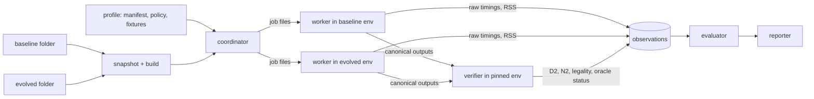

# Standalone Qiskit transpilation benchmark: implementation plan

This plan specifies how to build a dedicated repository (working name
`qiskit-transpile-bench`, Python package `qtb`) that depends on Qiskit and answers one
question:

> Given a baseline Qiskit source folder and an evolved Qiskit source folder, does the
> evolved version improve transpilation under the declared constraints?

**Status: proposal — no part of the harness is built.** A few throwaway prototypes (the
metric extractor, two equivalence recipes, a routing-replay check) and the confirm-profile
probe of 3.7 (kept under `design/probes/`) were run to test feasibility; their results
are quoted where relevant. The document is self-contained: it
defines its own terms, workloads, formulas and policies, and implementing or interpreting
it requires no other design document. Statements about Qiskit's behavior were read from
the source or measured at the *baseline*, Qiskit `2.6.0.dev0` at commit `0131cbbcc`, in the
serial reference environment of section 2.6 on a development machine. They describe that
baseline. They are not benchmark results, and every number must be re-measured on the
controlled runner before it is relied on. Every threshold is an initial policy default, to
be frozen before the first candidate is evaluated (section 12 lists them).

**Contents:** [Highlights](#highlights) ·
[1 Scope](#1-scope-claims-and-vocabulary) ·
[2 Architecture](#2-architecture) ·
[3 Workloads](#3-workloads-in-detail) ·
[4 Formulas](#4-metrics-and-formulas-in-detail) ·
[5 Correctness](#5-correctness-in-detail) ·
[6 Seeds](#6-how-seeds-are-used) ·
[7 Optimization levels](#7-how-optimization-levels-are-used) ·
[8 Decision engine](#8-decision-engine) ·
[9 Lifecycle](#9-run-lifecycle-and-caching) ·
[10 Work breakdown](#10-work-breakdown) ·
[11 Harness validation](#11-validating-the-harness-itself) ·
[12 Risks and defaults](#12-risks-open-questions-and-defaults-to-freeze) ·
[Appendix](#appendix-record-schemas)

## Highlights

1. **What gets built.** One command,
   `qiskit-transpile-bench compare --baseline <folder> --evolved <folder>`, snapshots and
   builds both Qiskit folders in isolated environments, compiles the chosen profile's frozen
   workload with both on one fixed block of 100 transpiler seeds, verifies the outputs, and prints one
   of five verdicts: `PASS`, `NO_IMPROVEMENT`, `CONSTRAINT_VIOLATION`, `INCONCLUSIVE` or
   `ERROR`. Of those, only `PASS` exits with code 0. The only other choice the user makes
   is the profile (`--profile`), which selects the workload: `iterations-profile`, the small workload
   for iterating, or `confirm-profile`, the broad workload for the final check.
2. **One objective, hard constraints, one reference.** The objective is lower **native
   two-qubit depth (`D2`)**. Native two-qubit gate count (`N2`), compilation time, peak
   memory (confirm profile) and correctness are constraints. It is never a weighted sum: a
   depth gain cannot pay for a wrong circuit or a failed cost guard. Improvement and every
   guard are judged against the same baseline, the one named on the command line; the
   harness keeps no accepted-change history of its own.
3. **The revision under test never grades itself.** A worker inside each Qiskit
   environment only compiles and exports a Qiskit-independent operation list. Harness-owned
   code computes `D2`, `N2` and target legality from that list, and semantic oracles run in
   a separately pinned, trusted environment.
4. **The core formula.** Per case, take the ratio of geometric means over seeds, evolved
   over reference. The suite score is the weighted geometric mean of those ratios.
   Uncertainty comes from the per-seed paired log differences. Improvement requires
   `ln(score) + 2·SE < 0`; a regression guard requires `ln(score) <= 3·SE` (three, not
   two, because a profile has many guards, 4.9); no case may exceed 1.05 (quality) or
   1.10 beyond its absolute noise floor (cost). Section 4 works an example to the last
   digit.
5. **Workloads.** The *iterations* profile scores three 100-qubit circuits — QFT (25,100
   gates, all 4,950 qubit pairs interact), a square-lattice Heisenberg simulation (7,660
   gates, 180 pairs) and a three-layer QAOA on a Barabási–Albert graph (2,264 gates, 196
   pairs) — on a 193-qubit heavy-hex target with a `cz` basis at optimization level 2.
   The same circuits on `cx`/`ecr` targets, two canaries and a 19-case timing panel are
   guards. The *confirm* profile is the broad check: 38 scored input groups (133 cases)
   and 14 guard inputs drawn entirely from Qiskit's in-tree benchmark suite — all eight
   circuit families at levels 0–3 on fourteen frozen targets (heavy-hex and grid
   classes, one of them directed; `cx`/`cz` scored, `ecr` guarded; an all-to-all
   control), at about 87 CPU-minutes of quality compiles per revision.
6. **Seeds.** A seed is the non-negative integer the worker passes as `seed_transpiler`
   when it builds the preset pass manager for one compile; inside Qiskit it drives only
   the SABRE layout and routing search (section 6.2 traces it to the trial level), and
   it never touches the inputs, which are frozen as hashed data and never regenerated
   from a seed. Seeds are the replication dimension: every quality case is compiled once
   per seed of the comparison block (`B0`, seeds 0–99) by every revision in the
   comparison, so one case yields 100 `(D2, N2)` observations per revision, and the
   score and its uncertainty come from the differences between revisions at the same
   seed. The block is fixed by the policy, never chosen by the user or the run, so a
   baseline's observations are compiled once and reused by every later comparison
   against it. The opening of section 6 walks one seed through a run.
7. **Workflow: iterate on the small profile, check on the big one.** The tool guards
   against a candidate being selected on the seeds and circuits it is judged on by the
   choice of profile, not by a second stage inside a run. Iterate with `iterations-profile`
   (three circuits, about ten CPU-minutes per run); when a change looks good there, run
   `confirm-profile` once. Its workload is mostly circuits the iteration loop never
   contained, so a gain that was an artifact of tuning against those three circuits does
   not carry over to the rest of it (the report also prints the score with the three
   removed). Section 1 states the one rule this depends on: the confirm run is a check, not
   the loop.
8. **Optimization levels.** The iterations profile scores level 2 only, so its `PASS`
   is a level-2 claim. Its timing panel spans levels 0–3. The confirm profile gives the
   four levels equal weight inside every family and guards each level's summary. Section 7 tabulates what each level does at the baseline and why
   a changed search budget is a configuration change, not an algorithmic gain.
9. **Correctness, in layers (C0–C7).** Structural checks (legal instructions on real
   ordered physical qubits, valid layouts) run on *every* scored output. Exact
   small-circuit equivalence runs at levels 0–3. Layout, ancilla, measurement and
   observable semantics and dynamic-circuit and API-contract regressions follow. At scale,
   an exact **routing replay** verifies layout and routing on the scored circuits
   themselves, and a Clifford-variant tableau comparison verifies whole pipelines where
   the output stays Clifford. Every check records the pipeline *stages it covers*.
10. **Known limit, stated up front.** At levels 2–3 two-qubit resynthesis emits
   non-Clifford angles, so the Clifford oracle verified the complete default pipeline on
   only 1 of the iterations profile's 9 circuit/target pairs. Layout and routing, however, are verified
   exactly by the replay check on every scored output. Automatic `PASS` is therefore
   available only to candidates confined to layout and routing; anything touching the
   optimization stage or two-qubit synthesis tops out at `INCONCLUSIVE` pending the review
   workflow of section 8.6. (At levels 0–1 the complete pipeline verified on all three
   100-qubit circuits; in `confirm-profile` the small half of the scored panel is verified exactly
   at every level by C1-lite, 5.3, which gives that review real evidence.)
11. **Noise drives the design.** At the baseline the per-seed standard deviation of
    `ln D2` is 4–9% (1.4–3.9% for `N2`). With 100 seeds the iterations score's standard error
    is about 0.6%, so a true gain of about 1.1% passes half the time and about 1.6% four
    times in five. Regression guards use three standard errors rather than two, because
    the confirm profile has about 45 noisy guards and at two standard errors they
    would falsely reject a neutral candidate about two-thirds of the time; at three the rate is
    about 6% (about 1% for the iterations profile's seven), and the calibration of 4.9
    measures the real, correlated figure on baseline-only data.
12. **Delivery.** M0 contracts → M1 standalone runner (smoke only) → M2 iterations evaluator
    → M3 confirm-profile qualification (fixtures curated from the in-tree suite, no new
    generators) → M4 automation. A profile may issue
    `PASS` only after the known-outcome validation of section 11 succeeds.

Numbers at a glance (baseline facts and planning estimates; sources in the sections cited):

| Quantity | Value | Section |
| --- | --- | --- |
| Primary target | Heavy-hex distance 9: 193 qubits, 224 couplings, degree ≤ 3, diameter 32 | 3.2 |
| Baseline `D2`, median over seeds 0–49 (`cz`, level 2) | QFT 1,843 · Heisenberg 400.5 · QAOA 1,528 | 3.3 |
| Per-seed sd of `ln D2` / `ln N2` | 6.8% / 3.0% · 8.7% / 3.9% · 4.2% / 1.4% | 3.3 |
| Standard error of the iterations `ln D2` score | ≈1.8% with 10 seeds, ≈0.6% with 100 seeds (planning estimate) | 4.10 |
| True gain needed to pass 50% / 80% of the time | ≈1.1% / ≈1.6% | 4.10 |
| False rejection of a neutral candidate by the noisy guards at `3·SE` | ≈1% iterations (7 guards), ≈6% confirm (≈45 guards), assuming independence; ≈65% for the confirm profile at `2·SE` | 4.9 |
| Routing replay on the scored circuits | 24 of 24 prototype compiles verified (levels 0–3); both injected defects rejected; ≤0.15 s each | 5.7 |
| Clifford oracle, complete default pipeline | 3 of 3 at level 0, 3 of 3 at level 1 (`cz`); 1 of 9 at level 2. Prefix with substituted synthesis: 9 of 9 | 5.8 |
| Indicative compile time, level 2 | 0.2–1.0 s scored circuits; 41 s `hwb12`; 5 s / 33 s for an 89-qubit ring at level 2 / 3 | 3.9, 7.4 |
| `confirm-profile` workload | 38 scored input groups, 133 scored cases, 14 guard inputs, 14 frozen targets (11 scored); every input from `test/benchmarks/` | 3.7 |
| `confirm-profile` cost | ≈87 CPU-minutes of quality compiles per revision (×2 with the routing replay, plus ≈30 for C1-lite), so ≈3.5 CPU-hours for a candidate once the baseline is cached; < 3 exclusive hours of cost measurement per decision | 3.7, 3.9 |
| `confirm-profile` standard error | ≈0.2% on the 100-seed block (planning estimate; inputs, not seeds, are the binding constraint) | 3.7 |
| Seed-blind inputs in the suite | Path- and ring-shaped circuits are deterministic at levels 1–3 (VF2 embeds them); `time_qft_16` cancels to `D2` = 0 at levels 2–3 | 3.7 |

## 1. Scope, claims and vocabulary

**In scope.** Static, gate-based transpilation with exact synthesis through Qiskit's
standard staged pipeline (`init`, `layout`, `routing`, `translation`, `optimization`,
`scheduling`), including its Python/Rust boundary and target handling. The repository owns
the workloads, measurement runner, correctness checks, decision policy and reports. It
does not live inside either Qiskit checkout and never reads workload definitions from the
evolved checkout.

**Scored versus checked.** Only static circuits enter the `D2` score. Dynamic circuits
(mid-circuit measurement, reset, control flow), symbolic-parameter semantics, scheduling
and batch execution cannot be represented by a static depth score; they have regression
checks (section 5.5) that can block acceptance but never earn it.

**Out of scope.** Hardware execution, noise characterization, simulator speed, circuit
construction and parsing speed, fault-tolerant (Clifford+T) pipelines, approximate
synthesis as an objective.

**What a verdict means.** An iterations `PASS` means *native two-qubit depth on the iterations scored panel
improved at level 2 on the declared target, within the stated count, time and correctness
limits*. A confirm `PASS` means *native two-qubit depth improved across the eight
declared circuit families, levels 0–3, heavy-hex and grid-class targets and the `cx` and
`cz` bases, on the fixed public workload of Qiskit's in-tree benchmark circuits, within the
stated count, time, memory and correctness limits* (3.7). Neither means every circuit
improves, hardware runs faster, or unseen circuit families improve. `NO_IMPROVEMENT` means improvement was not demonstrated under
this policy, not that the revisions are equivalent.

**Why two profiles, and how they are meant to be used.** Seeds and inputs answer
different questions. A hundred seeds of three circuits are still three circuits (6.6):
more seeds shrink the search noise on those inputs and say nothing about other circuits,
sizes, topologies or levels. The iterations profile is the iteration loop — about ten
CPU-minutes per revision, level 2 only, a claim about its three circuits. The confirm profile
(3.7) is the check: every family, level and topology class the in-tree suite can
supply, at about ninety CPU-minutes per revision, with the gaps in its coverage declared
case by case. A `PASS` names its profile.

The profiles are also the harness's only protection against selection bias. Every
comparison uses the same fixed seed block and the same frozen workload, so a candidate that
is edited, compared, edited again and compared again on one profile is being selected on
that profile's seeds and circuits, and after enough rounds a neutral change can look like
a gain there by luck (4.10). The intended workflow is therefore: **iterate on the iterations
profile; when a change looks good, run the confirm profile once as the check.** Its
scored panel is 38 input groups of which the iteration loop contained three, so the selection
bias does not carry over to the rest. Two rules keep that sound. The check profile must be
mostly circuits the loop profile does not contain — true of the profiles defined here,
and to be kept true when they are revised. And **the check is not the loop**: a
candidate that fails the confirm run goes back to the iteration loop, not to another round
of edits judged on the confirm profile. The report prints how many decisions the results root
already holds for the manifest, so that drift is at least visible. No profile inside one
run compares a candidate on seeds or circuits it has not seen before; that is what the
confirm profile is for.

**One reference.** Every test — the improvement test, every quality guard and every cost
guard — compares the evolved folder with the baseline folder given on the command line.
The harness never records an accepted change as a new reference, so the improvement test
asks whether the evolved tree beats that baseline, not whether it beats an earlier
candidate; ranking candidates against each other is done by reading their reports side by
side. One responsibility stays with the user: when evaluating a series of changes, keep
naming the same original baseline rather than the last accepted evolved tree. If each
comparison used the previous accepted change as its baseline, every acceptance would spend
the noise allowance again: ten accepted changes at "+1%, within noise" compound into a 10%
regression that no single comparison flagged.

**Vocabulary.**

| Term | Meaning |
| --- | --- |
| Revision | One Qiskit source tree, snapshotted and built into its own environment |
| Baseline / evolved | The two folders given on the command line: the reference of every test, and the candidate |
| Case | One circuit × one target × one compile configuration, including the optimization level |
| Fixture | A circuit file: one frozen input circuit that this repository stores in `fixtures/circuits/` as a canonical operation list, with its SHA-256 and a `PROVENANCE.md` entry. A curation script writes it once (3.8); no run regenerates or edits it. A fixture is only *what* gets compiled — it fixes no target, level or seed. Most fixtures are the inputs of cases (`qft_n100`); the rest feed correctness checks only: the Clifford variants of C7 (5.8) and the small circuits of C0–C5. Frozen targets sit beside fixtures in `fixtures/targets/` but are called targets. Upstream QASM files and constructors are the sources fixtures are curated from, not fixtures |
| Input group | Within one profile, every case compiled from one circuit instance: normally one fixture, plus any declared variant fixture of it (the symbolic form of `qaoa_complete_n8`); named after that fixture. It answers *which cases are the same input?* Another target, basis, level, compile method, role or seed never makes a new group, so each group counts once in the coverage rule of 3.7 and is resampled whole by the bootstrap of 4.7 (full rule in 3.1) |
| Panel | It answers *which cases are scored together?* A panel is the set of cases that one rule turns into one number — a quality score with its `SE`, or a cost `ln_panel` — using one weight vector that sums to one and, for quality, every seed of the block; one missing observation invalidates the whole panel. Quality panels: each profile's primary scored panel (iterations: the three `cz` cases; confirm: the 133 scored cases) and the `cx` and `ecr` basis-guard panels of 3.4. Cost panels: T1–T19 (3.6), the multi-seed companion, the preset-construction panel, and in the confirm profile the confirm timing panel and the memory panel. Canaries and deterministic, zero-baseline and per-case guards are judged one case at a time and belong to no panel |
| Summary | A subset of one panel, such as a family or a level, scored with its weights renormalized (4.3). It is not a panel of its own |
| Workload | It answers *what does this profile run?* The workload is every case the profile's manifest lists, in every role (scored, guard, deterministic, zero-baseline, canary, timing, memory), together with the fixtures and frozen targets those cases need. Every case in it either belongs to a panel or is judged on its own. The profile fixes the workload, not the user or the run: choosing a profile chooses its workload, the profile's policy holds the thresholds that judge it, and changing it means a new manifest version. The circuits the correctness checks bring along (the C1–C5 fixtures, the C7 Clifford variants) are checks, not workload. Iterations: the three scored circuits on the `cz`, `cx` and `ecr` targets, its canaries and its cost panels. Confirm: 38 scored input groups (133 scored cases), 14 guard inputs and its cost panels (3.7). Not to be confused with a *family* (G1–G8), a kind of circuit that a workload draws inputs from |
| Profile | A versioned bundle of manifest (cases, weights, roles) and policy (thresholds): `iterations-profile`, `confirm-profile`. The one choice the user makes per run |
| Transpiler seed | The non-negative integer passed as `seed_transpiler` for one compile of one case by one revision: one seed, one compile. The replication dimension of every quality panel (section 6); never a fixture-generation seed, since inputs are frozen files |
| Seed block | 100 consecutive transpiler seeds with one declared purpose: `B0`, the comparison block every decision uses; `KB1`, `KB2`, the baseline-only calibration blocks (section 6.3) |
| Objective / guard / canary | The quantity that must improve / a quantity that must not regress / a case with a known constant outcome whose change demands an explanation |
| Native two-qubit gate | An executable two-qubit instruction of the target: `cx`, `cz` or `ecr` here |
| SABRE, VF2 | Qiskit's randomized swap-insertion layout/routing heuristic; its deterministic subgraph-isomorphism layout search |
| Upstream | Qiskit's own in-tree benchmark suite (`test/benchmarks/`) at the baseline commit, from which most fixtures are curated |
| A/A comparison | The same revision measured against itself (two independent builds); calibrates noise |
| RSS, `dt` | Resident set size (process memory); the target's time resolution in seconds |

**Fixture, case, input group, panel, workload.** These five terms describe the same
inputs at different levels of grouping, and each answers its own question:

- A **fixture** is the circuit file: *what* is compiled.
- A **case** is one fixture compiled one way: on one target, at one level, with one compile
  configuration. One fixture gives many cases.
- An **input group** collects every case of one fixture (and of its declared variants).
  It tells the evaluator which cases are *not* independent evidence, because they all
  pose the same circuit. Fixtures and groups correspond almost one to one; one group
  holds many cases.
- A **panel** collects the cases that one rule scores together. It is cut from cases, not
  from fixtures or groups. So the cases of one group usually land in several panels, and
  some land in none. One panel holds cases of many groups. The group still matters inside
  a scored panel: the confirm weight tree hands weight down through the group to its cases
  (3.7), and the bootstrap resamples groups whole (4.7).
- A **workload** is everything one profile runs: all of its groups' cases, spread over its
  panels, plus the cases it judges one at a time. It is the outermost level. The same
  fixture can appear in two workloads, but each workload has its own groups and its own
  panels.

Example, iterations profile. The fixture `qft_n100` (curated from upstream
`qft_N100.qasm`) opens the input group `qft_n100`, whose cases land as follows:

| Case of group `qft_n100` | Panel |
| --- | --- |
| `iterations/qft_n100/heavy_hex_d9_cz/L2` | Primary scored panel, with the matching cases of the `square_heisenberg_n100` and `qaoa_ba_n100_3reps` groups |
| `iterations/qft_n100/heavy_hex_d9_cx/L2` | `cx` basis-guard panel |
| `iterations/qft_n100/heavy_hex_d9_ecr/L2` | `ecr` basis-guard panel |
| Its three `timing_reuse` cases among T11–T19 | Timing panel T1–T19 |

Its Clifford variant is a separate fixture that only C7 compiles; it is neither a case nor
a member of any group. In the confirm profile the same fixture opens its own `qft_n100`
group (groups are per profile). Its four scored cases (levels 0–3 on `heavy_hex_d9_cz`)
sit in the confirm scored panel, and its level-2 `cx` and `ecr` cases sit in the retained
basis-guard panels.

## 2. Architecture

### 2.1. Components and trust boundaries

| Component | Responsibility | Imports Qiskit? |
| --- | --- | --- |
| Profile configuration | Versioned profiles: concrete case IDs, weights, roles, exclusions, limits, seed counts, thresholds | No |
| Fixtures and targets | Repository-owned circuit data and frozen synthetic target descriptions, each with a SHA-256 | No |
| Environment builder | Snapshot each folder, build Qiskit including its native extension, install locked dependencies, verify provenance | No |
| Revision worker | Inside **one** revision's environment: rebuild inputs from canonical data, compile, run the API-behavior checks that need the live library, export canonical outputs | Yes — the revision under test |
| Verifier | Inside a repository-pinned environment: stream canonical outputs, compute `D2`/`N2`, check legality and layouts, replay routing, run semantic oracles | Yes — one pinned released Qiskit, for `quantum_info` oracles only; metric, legality and replay code is pure Python |
| Coordinator | Preflight, job scheduling, timeouts, caching, run state, exclusive-machine control for cost runs | No |
| Evaluator | Ratios, scores, uncertainty, coverage, every guard, the decision — from saved observations only | No |
| Reporter | Terminal verdict, `report.md`, `decision.json`, reproduction bundle | No |



(A full run also builds a second baseline environment for the timing control arm of 4.8.)

Three rules follow from the trust boundary:

- **Never import two Qiskit versions in one process, and never exchange live Qiskit
  objects.** Components communicate through versioned files (section 2.3).
- **The revision under test computes none of its own grades.** A candidate that changes
  `QuantumCircuit.depth()`, `count_ops()`, `Operator` or `Target` queries cannot alter its
  score or its oracle. The worker touches only the accessors needed to walk the output
  (`circuit.data`, operation name, parameters, bit indices, layout index arrays).
- **Evaluation is replayable.** The evaluator and reporter read only saved observations,
  so a decision can be recomputed, or a policy bug fixed, without recompiling anything.

### 2.2. Repository layout

```text
qiskit-transpile-bench/
  pyproject.toml              # core package `qtb`: no Qiskit dependency
  src/qtb/
    cli.py                    # compare, smoke, calibrate, evaluate, report, review, repro
    config/                   # JSON Schemas and loaders: manifest, policy, protocol, records
    canonical/                # canonical circuit/layout/target formats, hashing (pure Python)
    metrics/                  # D2/N2 extraction, target legality, routing replay (pure Python)
    envbuild/                 # snapshot, content hash, build, provenance
    coordinator/              # preflight, scheduler, cache, run state
    evaluator/                # ratios, scores, SE, bootstrap, guards, decision
    reporter/                 # decision.json, report.md, terminal verdict
  worker/qtb_worker/          # installed into each revision environment
    adapter.py                # small version adapter over public Qiskit API
    modes.py                  # roundtrip, quality, prefix, timing_e2e, timing_reuse, preset_build,
                              # memory, diagnostics, api_checks
  verifier/qtb_verifier/      # installed into the pinned verifier environment
    importer.py               # canonical data -> circuits in the pinned Qiskit
    structural.py             # C0: streams outputs: D2, N2, legality, layout validity, hash
    small_exact.py            # C1: operator equivalence
    layout_semantics.py       # C2: states, ancillas, measurements, observables
    dynamic.py                # C3: exact branching simulator
    parameters.py             # C4: free-parameter rule and bound-circuit checks
    schedule.py               # C5: timing validity
    replay.py                 # C6: routing replay (pure Python)
    clifford_scale.py         # C7: full-width tableau comparison
  profiles/iterations-profile/ # manifest.json, policy.json, exclusions.json
  profiles/confirm-profile/   # the in-tree-benchmark check profile (3.7)
  fixtures/circuits/          # *.ops.jsonl.gz canonical inputs (+ Clifford variants)
  fixtures/targets/           # *.target.json frozen targets
  fixtures/PROVENANCE.md      # origin, license, generator script and seed of every fixture
  tools/curate/               # one-time fixture generators, run in the verifier environment
  tools/probes/               # the measuring scripts behind every baseline fact quoted here
  envs/                       # verifier.lock, common.lock, build-constraints.txt, dev-tests.lock
  tests/                      # harness unit tests and the known-outcome suite (section 11)
```

### 2.3. Process model and worker protocol

The coordinator launches a worker as `<env>/bin/python -P -m qtb_worker --job job.json
--out <dir>` with a scratch working directory outside both source trees, a sanitized
environment (section 2.6), `PYTHONNOUSERSITE=1` and no inherited `PYTHONPATH`. (`-P`, which
keeps the working directory off the import path, needs Python 3.11 or later; the harness
builds all environments on one frozen Python version that satisfies this.) A job is a JSON
file naming the protocol version, mode, case, canonical circuit and target (or loose
constraints) with their hashes, the explicit compile options, any `pipeline_edits`, the
seed list and a timeout. A result is a directory of append-only JSON Lines records plus
canonical output files. Unknown protocol versions are refused by both sides.

| Mode | What the worker does | What it emits |
| --- | --- | --- |
| `roundtrip` | Build the input circuit and the `Target` from canonical data, export both back | Canonical hashes, to prove both revisions see the same inputs (section 3.8) |
| `quality` | For each seed: build the preset for (target, options, seed), compile, export | Canonical output and layout per seed, pipeline fingerprint |
| `prefix` | As `quality`, with declared `pipeline_edits` (for example `drop_stage:optimization`) | Same, labeled with the stages it covers and the components it substituted |
| `timing_e2e` | Warm up, then time complete `transpile()` calls | Raw samples in nanoseconds |
| `timing_reuse` | Build the pass manager outside timing, warm up, time `pm.run()` | Raw samples |
| `preset_build` | Time `generate_preset_pass_manager(...)` alone | Raw samples |
| `memory` | One compile in a fresh process | RSS after setup, peak RSS (normalized to bytes; the OS counter's unit differs between Linux and macOS) |
| `diagnostics` | One untimed compile with a pass callback | Per-pass times and counts; never mixed with timing samples |
| `api_checks` | Behavior checks that need live objects (section 5.5) | Structured observations, judged by harness code |

Quality jobs batch up to 25 seeds of one case per process to amortize fixture loading. The
worker appends one record per finished seed; the coordinator enforces the per-compile
timeout from those heartbeats, kills a stuck process and reschedules the remaining seeds.
Timing uses one process per (case, revision, round); memory one process per repetition.

**Version adapter.** The worker prefers public interfaces (`generate_preset_pass_manager`,
`transpile`, `Target.add_instruction`, `TranspileLayout.initial_index_layout` and
`final_index_layout`, stage attributes of the staged pass manager) through one small
adapter module. An interface a revision lacks is reported as `unsupported`; the adapter
must never silently alter target properties, options or the search budget to make a
candidate run.

**Pipeline fingerprint.** For every (revision, configuration) the worker records, per
stage, the ordered pass class names and the search-budget attributes it can read
(`SabreLayout.layout_trials`, `swap_trials`, `max_iterations`; `SabreSwap.trials` and
heuristic; VF2 `call_limit` — a pair at the baseline — and `max_trials`). An attribute it
cannot read is recorded as `unknown`, which counts as a difference. The report diffs
fingerprints between revisions. A differing budget is reported as a **configuration
change**; it is report-only, its cost shows up in the compile-time guard, and it is never
described as an algorithmic gain.

### 2.4. Canonical formats

All formats are plain JSON with floats written as C99 hexadecimal (`float.hex()`) so that
values round-trip exactly. The hash of an artifact is the SHA-256 of its uncompressed
canonical bytes (object keys sorted, no insignificant whitespace, list order preserved).

- **Circuit** (`*.ops.jsonl.gz`): a header line, then one operation per line in circuit
  order (a valid topological order of the dependency graph).

  ```text
  {"format":"qtb-circuit/1","num_qubits":193,"num_clbits":0,"qregs":[["q",193]],"cregs":[],"global_phase":"0x0.0p+0","parameters":[]}
  ["rz",[17],[],["0x1.921fb54442d18p+0"]]
  ["cz",[17,18],[],[]]
  ```

  Each line is `[name, qubit indices, clbit indices, parameters]`. Register names and sizes
  are in the header because C2 checks that they survive. Matrix-defined gates carry their
  matrix as nested hexadecimal pairs. Control-flow operations carry their blocks
  recursively with explicit block-to-outer wire maps; version 1 supports only conditions
  that test a bit or a register for equality, and reports anything else as `unsupported`.
  Scheduled outputs add per-operation start time and duration.
- **Symbolic parameters.** An input names its parameters. An output is exported twice:
  structurally, with each symbolic parameter as an opaque expression string plus its
  free-parameter names (enough for `D2`, `N2`, legality and the free-parameter rule of C4),
  and as one **bound numeric circuit per declared binding**, produced by the revision's
  own `assign_parameters` — the binding step is part of what C4 tests. No component ever
  parses an expression string.
- **Layout**: `input_num_qubits`, `output_num_qubits`, and three integer arrays of length
  `output_num_qubits`: `initial_index_layout` (input position → physical qubit at the
  start), `final_index_layout` (input position → physical qubit at the end), both with
  ancillas included, and `routing_permutation`. The worker exports whatever layout Qiskit
  attached. A compile without connectivity constraints may attach none — exported as
  `null`, meaning the identity on the input width — but at levels 2–3 it can still carry
  the permutation that the init stage elided (5.7), so absence must never be assumed.
- **Target** (`*.target.json`): `num_qubits`, `dt`, timing constraints (`granularity`,
  `min_length`, `pulse_alignment`, `acquire_alignment`), optional qubit properties, and an
  **ordered list** of instructions (insertion order is preserved because it can affect
  tie-breaks inside Qiskit). Each instruction gives its name, arity, parameter names, the
  explicit list of ordered qubit tuples it supports (or `null` for a global instruction),
  per-tuple `duration` and `error`, and optional angle bounds. The file also persists the
  `native_2q_names` list that `D2`/`N2` use.
- **Loose constraints.** Cases inherited from upstream that pass `basis_gates` and a
  `coupling_map` instead of a target (the tiny timing inputs, `long_2q_sequence`, QUEKO)
  declare `constraint_form: "loose"`. The worker passes those lists to Qiskit unchanged,
  because that code path is part of what those cases time. For legality the verifier
  derives the implied target: every listed gate on every qubit, two-qubit gates on each
  directed edge.

Large outputs (the `hwb12` output has about 2.6 million operations) are streamed: the
worker writes, the verifier reads once and computes hash, metrics and legality in a single
pass. Outputs above 8 MB compressed are retained only as hash, metrics and layout unless
the case failed, is disputed or was sampled by the determinism audit; any output can be
regenerated exactly from (build, case, seed).

### 2.5. Snapshot, build and provenance

1. **Snapshot first.** Accept clean or modified folders. Enumerate tracked plus untracked,
   non-ignored files (`git ls-files -co --exclude-standard`; a default ignore list for
   non-Git folders), copy them to a snapshot directory, and hash them (sorted relative
   path plus per-file SHA-256 → tree hash). Record resolved path, commit ID and dirty state
   when available. Never modify the supplied folders. Snapshotting first means edits made
   during a long run cannot change what is measured. Exclude environment directories,
   build outputs and Git metadata. The two snapshot trees are also what the change-scope
   diff of section 5.9 compares, so no Git history is needed.
2. **Build each snapshot independently** into a fresh virtual environment and fresh build
   directory: same Python, the same locked non-Qiskit dependencies (`envs/common.lock`), a
   non-editable wheel build from the snapshot, build requirements (`setuptools`,
   `setuptools-rust`) pinned through `envs/build-constraints.txt` because Qiskit declares
   only lower bounds for them. Build-affecting variables are pinned, not inherited:
   `QISKIT_BUILD_PROFILE=release`, `RUST_DEBUG` and `QISKIT_NO_CACHE_GATES` unset,
   `QISKIT_BUILD_WITH_MIMALLOC` set to one frozen value for both builds; `RUSTFLAGS`,
   `CARGO_ENCODED_RUSTFLAGS`, `CARGO_BUILD_*`, `CARGO_PROFILE_*` and `CARGO_TARGET_DIR`
   cleared; a harness-owned Cargo configuration instead of the user's. `Cargo.lock` must be
   unchanged by the build. (With no profile set, Qiskit's `setup.py` lets the build type
   follow the install mode — exactly the kind of silent difference to exclude.)
3. **Force one Rust toolchain.** Each checkout's `rust-toolchain.toml` can silently select
   a different compiler. Preflight checks that `rustup` is present, resolves the channel
   from the baseline snapshot, exports `RUSTUP_TOOLCHAIN` for every build, and records
   `rustc -Vv` for each. If the evolved snapshot cannot build with it, or the dependency
   sets cannot be reconciled, the code-only comparison is blocked (`ERROR`); a changed
   environment is a separately labeled experiment that cannot issue `PASS`.
4. **Verify provenance in the worker.** `qiskit.__file__` and the native extension must
   resolve inside the environment, not a source tree; the extension's SHA-256 must equal
   the one recorded at build time. Save build logs, artifact hashes and the full
   `pip freeze`.
5. **Build identity** = snapshot tree hash + Python version + lock hashes + resolved
   toolchain + build flags + OS and CPU architecture. It keys every cache entry (9.3).

### 2.6. Serial reference environment

Every worker runs with this environment unless a profile declares an alternative, which is
then a separate profile whose observations are never mixed with serial ones.

| Variable | Value | Why |
| --- | --- | --- |
| `QISKIT_PARALLEL` | `FALSE` | No multiprocess circuit dispatch |
| `QISKIT_IGNORE_USER_SETTINGS` | `TRUE` | A user config file can change the default level, the seed and the SABRE budget |
| `RAYON_NUM_THREADS`, `OMP_NUM_THREADS` | `1` | Serial Rust and BLAS work; SABRE trials otherwise run in a thread pool |
| `QISKIT_SABRE_ALL_THREADS` | **unset** | Any non-empty value, even `FALSE`, makes preset trial counts depend on the CPU count |
| `QISKIT_TRANSPILER_SEED`, `QISKIT_NUM_PROCS`, `QISKIT_IN_PARALLEL`, `QISKIT_FORCE_THREADS` | **unset** | Each can change seeding or threading behind the harness's back |
| `PYTHONHASHSEED` | `0` | Pinned; the determinism audit varies it deliberately (section 6.7) |

Record CPU model, OS, core count, thread libraries and resource limits with every run.

### 2.7. The controlled runner

Quality observations are deterministic, so any machine may produce them. **Cost
observations count toward a decision only on a controlled runner**, defined operationally:
a machine whose A/A calibration (section 4.8) meets the freeze limit. The usual way to get
there is a dedicated Linux host with no other jobs, a fixed CPU frequency policy with the
turbo setting recorded, workers pinned to fixed cores with the sibling hyper-thread idle,
swap disabled, and a load check before every cost job. Machine identity (host, CPU model,
core count, kernel, frequency settings) keys cost caches and calibration records. The
baseline probes quoted here ran on a macOS development machine, where most of those
controls are unavailable; treat their timings as indicative only.

## 3. Workloads in detail

### 3.1. Anatomy of a case and the manifest

A case is a circuit, a target and an explicit compile configuration. The frozen manifest
enumerates **actual cases**, not desired families. Each entry records role (`scored`,
`guard`, `deterministic`, `zero_baseline`, `canary`, `timing`, `memory`), family, size
band, topology,
native basis, optimization level, input-group ID, weight, oracle, timeout and
measurement modes (full field list in the appendix). Unsupported combinations are declared
with a reason **before** evaluation; a candidate failing on a case is never an exclusion.

**Input group.** The input-group ID names the circuit instance a case was compiled from,
and every case compiled from that instance carries the same ID: the instance on each of
its targets and native bases, at every optimization level, in every declared variant and
in every role. An *instance* is one frozen input as generated or imported — one call of
an upstream constructor with its arguments fixed, or one imported file — and two inputs
of a family are different instances only when they differ as circuits, by what the
family table of 3.7 lists under "instances vary by": width, depth, repetitions, a
lattice or graph, a Boolean function, a secret pattern, an independently drawn random
matrix. So `qv_n14_d14` and `qv_n14_d14_s10` are two groups (two frozen draws) and
`ripple_adder_10` and `ripple_adder_20` are two groups (two widths), whereas each QUEKO
instance is one group holding its scored explicit-SABRE cases and its default-method
deterministic guards as two declared variants, `qft_n100` on `heavy_hex_d9_cx` and
`_ecr` is a pair of basis guards inside the `qft_n100` group, and the symbolic form of
`qaoa_complete_n8` is a variant of that group, not an input of its own. Nothing that
re-poses the same routing problem opens a new group: another target, basis or level, a
wire relabeling, a binding of the same parameters, an explicit layout or routing method,
a different role, a fresh transpiler seed. Counting any of these as an input would let
one circuit vote several times in the coverage rule and the bootstrap.

The `variant` field records the declared variant (`numeric` or `symbolic` for the parameter form,
`sabre_methods` or `default_methods` for the QUEKO compile methods); the group ID is the
fixture name and follows the profile name in the case ID, with the variant suffixed when
it is not the default one (`confirm/queko_bss_53+sabre/rochester_53/L2`). A group is
*scored* when at least one of its cases is: the independent-inputs rule of 3.7 counts
scored groups per family/size cell, and the bootstrap of 4.7 resamples scored groups
whole, each carrying its scored cases with their frozen weights. A guard-only group
(`revlib_4mod5_v0_19`) or a deterministic-only one (the all-to-all controls) counts for
neither.

Two options are pinned on every scored and timed case: `approximation_degree=1.0` (exact
synthesis) and `qubits_initially_zero=True` (Qiskit's default contract, the one users get).
Semantic oracles declare their own contract where they need the stronger all-input one
(section 5.1).

### 3.2. The primary target

`heavy_hex_d9` is the heavy-hexagon lattice of code distance 9 (what
`CouplingMap.from_heavy_hex(9)` constructs): qubits sit on the vertices and edges of a
hexagonal tiling, so every qubit has at most three neighbors.

| Property | Value |
| --- | --- |
| Physical qubits | 193 (so a 100-qubit circuit leaves 93 spare qubits) |
| Couplings | 224 undirected; the two-qubit gate is defined in both directions on each (448 ordered pairs) |
| Degree distribution | 2 qubits of degree 1, 127 of degree 2, 64 of degree 3 |
| Diameter | 32 hops |
| Instructions | `rz`, `x`, `sx`, `id`, one of `cx` / `cz` / `ecr`, plus `measure`, `reset`, `delay` and the control-flow operations |
| Synthetic properties | Two-qubit error 2.9e-5 to 5.0e-3, two-qubit duration 82 to 899 ns, `dt` = 0.222 ns |

The three target files `heavy_hex_d9_{cx,cz,ecr}` differ only in the entangling gate. They
are generated **once**, at curation time, from
`GenericBackendV2(193, ["rz","x","sx",<2q>,"id"], coupling_map=heavy_hex(9),
control_flow=True, seed=12345678942)` and then frozen as data. They are never regenerated
at comparison time, because generator behavior can differ between Qiskit versions and a
seed alone would not detect that. The error and duration values are part of the hash even
though the score is `D2`: VF2 layout scoring and error-aware decomposition choices read
them. The same generator seed gives the three variants identical numeric properties, which
is one reason they are not independent cases (section 3.4). `cz` is the primary target.

### 3.3. The three scored circuits

All three are 100-qubit, measurement-free circuits with numeric angles, written in `cx`
plus single-qubit rotations. Each has weight 1/3.

| Fact | `qft_n100` | `square_heisenberg_n100` | `qaoa_ba_n100_3reps` |
| --- | --- | --- | --- |
| What it is | Quantum Fourier transform, controlled phases already expanded into `cx` + `rz` | Trotterized Heisenberg spin model on a 10×10 square lattice | Three QAOA layers for a 100-node Barabási–Albert (preferential-attachment) graph |
| Gates | 25,100: 10,050 `cx`, 14,850 `rz`, 100 `ry`, 100 `rx` | 7,660: 2,160 `cx`, 2,880 `rx`, 1,440 `ry`, 1,180 `rz` | 2,264: 1,176 `cx`, 588 `rz`, 400 `rx`, 100 `ry` |
| Input depth (total / `cx` only) | 796 / 397 | 1,081 / 432 | 362 / 238 |
| Interacting qubit pairs | All 4,950 | 180 nearest-neighbor lattice bonds | 196 graph edges (each used twice per layer) |

What each stresses:

- **QFT:** dense, nonlocal interaction on a sparse device, so layout and routing dominate.
  But 7,884 of its 15,050 rotation angles are zero or negligible (5,310 literal `rz(0)`
  between distant qubits, 2,574 more below 1e-8), so level-2 cleanup leaves only 1,750
  interacting pairs before routing: simplification matters as much as routing. Its score
  therefore depends on an identity-removal tolerance, which C1 pins down with tiny-angle
  fixtures (section 5.3).
- **Heisenberg:** a degree-4 lattice that does not embed in a degree-3 device; repeated
  local patterns exercise cancellation and two-qubit block resynthesis (level-2 init
  consolidates the whole circuit into 180 two-qubit blocks, one per bond).
- **QAOA:** an irregular graph with hubs: high-degree nodes serialize their gates and pull
  routing toward bottlenecks.

Baseline behavior, `cz` target, level 2, varying only the transpiler seed over 0–49
(output-quality values, deterministic for a given build, configuration and seed):

| Circuit | `D2` min / median / max | `N2` min / median / max | sd of `ln D2` | sd of `ln N2` | Correlation of the two logs |
| --- | --- | --- | --- | --- | --- |
| `qft_n100` | 1,610 / 1,843 / 2,144 | 8,632 / 9,522.5 / 10,088 | 6.8% | 3.0% | 0.78 |
| `square_heisenberg_n100` | 345 / 400.5 / 498 | 1,671 / 1,822.5 / 1,974 | 8.7% | 3.9% | 0.55 |
| `qaoa_ba_n100_3reps` | 1,392 / 1,528 / 1,710 | 8,272 / 8,626 / 8,877 | 4.2% | 1.4% | −0.12 |

Two readings matter for the design. `D2` varies two to three times more than `N2` from
seed to seed, because SABRE keeps the trial with the fewest swaps and never compares
depth (section 6.2): there is headroom for a depth-aware change, and a single seed cannot
show it. And one seed is unreliable: a single-seed `ln D2` comparison has a standard
deviation of about 6–12%.

### 3.4. Guards: other bases, and the routing guard circuits of the confirm profile

**Other native bases.** The three circuits also run on `heavy_hex_d9_cx` and
`heavy_hex_d9_ecr` with the same seeds. These cases guard; they do not enlarge the score's
sample. Over seeds 0–9 at the baseline, `D2` and `N2` were identical on `cz` and `ecr` for
all three circuits, and `cx` was identical for Heisenberg, within 1% for QAOA and within
2% for QFT. When counting independent noisy guards, identical variants count once.

**Routing guard circuits.** The circuits below are per-case guards or scored cases of
`confirm-profile` (3.7), not of the iterations profile: the iterations profile is the fast
loop, and `hwb12` alone would double its cost. As guards they are compared per case
against the baseline and need not improve. In the confirm manifest they run at levels 0–3
like every other case, except `hwb12`, which runs at level 2 only; circuits without a
fixture-fixed target run on the primary `cz` target (a budget decision, listed in
section 12). Their baseline facts, all at level 2, are collected here because 3.7
refers to them.

| Case | What it is | Baseline at level 2 | Seed-sensitive? |
| --- | --- | --- | --- |
| `queko_bigd_20`, default methods | QUEKO instance: 45 `cx`, depth 45, 9 of 20 qubits used; Tokyo 20-qubit map, basis `id, rz, sx, x, cx` | `D2` = `N2` = 17 | No |
| `queko_bss_53`, default methods | QUEKO: 3,764 gates, 1,061 `cx`, depth 100; Rochester 53-qubit map | `D2` 46, `N2` 363 | No |
| `queko_bntf_54`, default methods | QUEKO: 959 gates, 270 `cx`, depth 25; Sycamore 54-qubit map | `D2` 18, `N2` 172 | No |
| The same three with `layout_method` = `routing_method` = `"sabre"` | Forces the SABRE search | `D2` 18–23 · 185–286 · 103–125; `N2` 18–23 · 1,068–1,183 · 487–508 (seeds 0–5) | Yes |
| `qv_n50_d50` | Quantum-volume model circuit: 50 layers of 25 Haar-random two-qubit unitaries on random pairings (1,250 matrix gates) | To be measured once the matrices are frozen | Expected |
| `hwb12` | Reversible "hidden weighted bit" function, 20-qubit register, 171,482 gates: 97,980 `h`, 44,833 `cx`, 24,495 `ccx`, 4,174 `x` | `D2` 386,479, `N2` 645,222 (seed 0); 41 s per compile | Expected; runs the first 20 seeds of the block |
| `bv_all_ones_n100` | Bernstein–Vazirani with an all-ones secret: 99 `cx` into one hub qubit (a star), 99 measurements | `D2` 632–702, `N2` 749–861 (seeds 0–2) | Yes |
| `bvlike_n100` | 198 `cx` that cancel completely once an `x` and a `z` commute out of the way; only those two gates survive | `D2` = `N2` = 0 (level 1 leaves `N2` = 1,518) | No → **zero-baseline guard** (4.5) |

Two points about these circuits:

- A QUEKO circuit is built backwards from a known depth-optimal, zero-SWAP solution on a
  given device. Qiskit's VF2 search finds that embedding, so with default methods these
  cases never reach SABRE: they are deterministic guards that the embedding is still
  found, compared exactly (4.5). With explicit SABRE methods they are seed-sensitive and
  far from the embedded result, so they carry routing signal. QUEKO's known-optimal depth
  is an absolute yardstick only once its reference basis, allowed rewrites and depth model
  are matched; until then these are fixed regression inputs with no optimality claim.
- Upstream's quantum-volume generator seeds the pairings but **not** the matrices, so the
  matrices are generated once with a seeded generator and frozen as data.

### 3.5. Canaries

A canary is a case whose output does not change: at the baseline it gives the same `D2`
and `N2` on every seed, for a structural reason given in the table below. It catches what
the score cannot see — a simplification that a candidate silently loses (or unexpectedly
gains) outside the scored cases.

- **Expected value.** A constant per canary and metric, measured on the validated baseline
  when the profile is frozen, before any tuning, and stored in the profile.
- **Evaluation.** In every run — at baseline preflight and in the comparison itself —
  the harness compiles each canary for **both** the baseline and the evolved revision on
  the first 10 seeds of the comparison block. The outcome is seed-independent, so 10
  seeds suffice.
- **Comparison.** Each revision is compared with the stored constant, not with the other
  revision: exact equality of `D2` and `N2` on every one of the 10 seeds, with no ratio or
  standard error. On a healthy baseline the two are the same; the constant also exposes a
  baseline that has drifted from itself.
- **Baseline miss.** A reference record fails: the environment, build or fixture changed,
  the reference is invalid and the verdict is `INCONCLUSIVE` (8.4).
- **Evolved miss.** Any departure in either direction makes IA4 (CA4 in the confirm
  profile) `unresolved`, so the
  verdict is `INCONCLUSIVE` — neither `PASS` nor `CONSTRAINT_VIOLATION`, because the change
  is unexplained rather than shown to be wrong. A value below the constant is as suspicious
  as one above it (below 300 on the ring would beat the input's own serial `cx` ladder).
- **Resolution.** A person explains the departure and the new output passes the
  correctness checks. Accepting the explanation re-baselines the canary: the new constant
  is a new profile version, never an in-place edit (8.6), and the candidate is evaluated
  again under that version.

| Canary | Input | Expected at the baseline | Why it is constant |
| --- | --- | --- | --- |
| `su2_circular_n100` at level 2, `cz` | `efficient_su2(100, reps=3, entanglement="circular")`: 400 `ry`, 400 `rz`, 300 `cx`, 800 unbound parameters | `D2` = `N2` = 300 on every seed | A 100-qubit ring embeds exactly in the heavy-hex graph, so VF2 finds a perfect layout, SABRE never runs and the seed is never consumed. 300 equals the input's own serial `cx` ladder |
| `long_2q_sequence` at levels 2 and 3 | Two qubits, 3,505 gates (1,002 `cx`, 900 `u1`, 1,200 `u2`, 403 `u3`); Rochester 53-qubit coupling map and the legacy basis `u1, u2, u3, cx, id` | `D2` = `N2` = 3 (total depth 7) | Two-qubit block resynthesis collapses the whole sequence into one canonical decomposition. At levels 0–1, which do no two-qubit resynthesis, the same input gives `D2` = `N2` = 1,002 |

The 89-qubit version of the ring is *not* a canary. The heavy-hex graph is bipartite, so an
odd ring cannot embed: `VF2Layout` exhausts its call budget without a solution (4.9 of the
5.0 s compile at level 2; 33 s at level 3) and SABRE then gives seed-dependent results
(`D2` 1,367–1,464 over seeds 0–2 at level 2). It belongs to the confirm profile's ansatz
family, where it is scored at levels 0–2 and guarded at level 3 (3.7).

### 3.6. Timing panel (19 cases)

The timing panel is the iterations profile's **compile-time guard**. It asks one
question: does the candidate take longer than the baseline to compile the same thing?
It measures time only. No `D2` or `N2` is taken from these runs, and nothing on the
panel needs to get faster. It is a cost panel in the sense of section 1: the 19 cases
are folded into one number, `ln_panel`, the equal-weight (1/19 each) mean of the
per-case log time ratios, which rule IA5 judges (8.2). The confirm profile keeps the
panel unchanged and adds a panel of its own (3.7, CA5).

Each case is one fixed compile: one input, one set of constraints, one optimization
level and one seed. Every revision repeats it many times. All 19 cases come from
upstream's timing benchmarks in `test/benchmarks/`, with the same inputs, constraints
and seeds, so the panel times what Qiskit already tracks.

**What the clock covers.** The *mode* of a case says which call is timed (2.3):

- **`timing_e2e`**: a complete `transpile(...)` call. This includes everything the
  wrapper does before any pass runs: resolving options, building a `Target` when the
  case gives loose constraints, and building the preset pass manager.
- **`timing_reuse`**: `pm.run(circuit)` only. The preset pass manager is built once
  per process, before the clock starts, and reused for every timed call. This is how
  upstream's utility-scale benchmarks time the transpiler.

*Loose constraints* means the case passes `coupling_map=` and `basis_gates=` rather
than a `Target`, as the upstream benchmark does. `transpile` then builds the target
itself, inside the clock. Some work is outside the clock in every mode: loading the
circuit, loading a frozen target, verification, metric extraction and diagnostic
callbacks.

| ID | Input | Constraints | Level | Seed | Mode |
| --- | --- | --- | --- | --- | --- |
| T1 | `single_h`: one qubit, one `h` | Loose: upstream's fixed 27-qubit coupling map, basis `id, rz, sx, x, cx, reset` | Not passed (see below) | 20220125 | `timing_e2e` |
| T2 | `cancel_2q`: `h h cx cx cx cx` on two qubits; every gate cancels | Same as T1 | Not passed | 20220125 | `timing_e2e` |
| T3–T6 | `qv_n14_d14`: 14 layers of 7 frozen random two-qubit unitaries (98 in all) | Frozen 14-qubit `Target` with Melbourne connectivity | 0, 1, 2, 3 (one case each) | 0 | `timing_e2e` |
| T7–T10 | `long_2q_sequence`: the two-qubit, 3,505-gate input of the 3.5 canary | Loose: Rochester 53-qubit coupling map, legacy basis `u1, u2, u3, cx, id` | 0, 1, 2, 3 (one case each) | 0 | `timing_e2e` |
| T11–T19 | The three scored circuits of 3.3 | Frozen `heavy_hex_d9_cx`, `_cz`, `_ecr` (3 circuits × 3 targets) | 2 | 1234567845 | `timing_reuse` |

What each group catches, and where upstream times it:

| Cases | Upstream benchmark | What a slowdown here means |
| --- | --- | --- |
| T1–T2 | `transpiler_benchmarks.py`: `time_single_gate_compile`, `time_cx_compile` | Fixed per-call overhead. With almost nothing to compile, the time is option handling, target construction and preset construction. Large circuits hide this cost, so these cases expose it |
| T3–T6 | `transpiler_levels.py`: `time_transpile_qv_14_x_14` | Slower full compilation of a small circuit that needs routing and unitary synthesis, at each level |
| T7–T10 | `transpiler_levels.py`: `time_transpile_from_large_qasm` | Slower handling of a long gate stream on two wires, at each level; levels 2–3 add two-qubit resynthesis |
| T11–T19 | `utility_scale.py`: `time_qft`, `time_square_heisenberg`, `time_qaoa` | Slower passes on the scored workload itself: the cost side of the quality score |

T3–T10 span levels 0–3 so a slowdown at one level cannot hide behind level 2 (7.2).

**Why T1–T2 do not pass a level.** Upstream calls `transpile` on these two cases without
`optimization_level`, and so do most users of the bare wrapper. They therefore run at
whatever default the revision has (2 at the baseline). If a candidate changes that
default, T1–T2 time a different pipeline. The harness records each revision's resolved
default, and the report labels such a difference as a configuration change rather than
as a slowdown. Each of the two cases also has a report-only twin that passes
`optimization_level=2` explicitly, so a like-for-like number always exists. The twins
are not among the 19 cases and are not guarded.

**Why one fixed seed per case.** A timing comparison needs every call of a case to do
the same work, and a fixed seed makes the compile deterministic. The seed values are
upstream's (20220125, 0 and 1234567845), kept so timings compare with upstream's
history. They have no meaning of their own and are unrelated to the comparison block
`B0` (6.3). The cost of this choice: a change to the layout or routing search can be
faster on one seed and slower on average. The multi-seed companion below covers that
case.

**How a case is measured** (4.8 has the formulas). Three arms are timed: the baseline,
a second build of the baseline (the control arm) and the candidate. Each arm runs each
case in 10 rounds, interleaved in random order. A round is a fresh process. It loads the
inputs, builds the pass manager for a `timing_reuse` case, makes one untimed warm-up
call, then times calls until it has at least 3 calls and at least 1 s. The case time is
the median over rounds of each round's median call. IA5 passes when:

- `ln_panel` is within the A/A noise level `noise_panel`,
- no case breaches the per-case cap (slower by more than 10% *and* by more than its
  absolute noise floor, 4.4), and
- the control arm, compared with the baseline, passes the same test. If it does not,
  the machine was noisier than its calibration and the result is `unresolved`.

On a controlled runner the panel takes about an hour (3.9).

**Two companion panels.** Each is a separate cost panel with the same guard. Neither is
part of the 19.

| Companion | What it times | Measured | Guarded |
| --- | --- | --- | --- |
| Multi-seed companion | The nine T11–T19 cases over seeds 0–19, three rounds per seed, with one pass manager per seed built outside the clock. Case time is the arithmetic mean over seeds of the median over rounds (4.8) | When the change scope (5.9) includes layout or routing, or is unknown | Whenever measured |
| Preset-construction panel | `preset_build`: `generate_preset_pass_manager` alone at level 2, on each of the three 193-qubit `heavy_hex_d9` targets (3 cases) | Always | When the change scope includes preset assembly or target handling, or is unknown |

The companion exists because the fixed seed above times a single search path. The
preset panel exists because no case in the 19 times building a preset for a large
target: T11–T19 build it outside the clock, and T1–T10 build it only for small
targets.

### 3.7. The confirm profile

**`confirm-profile`** is the broad profile of the workflow of section 1: the check that
runs once when a change looks good on the iterations profile. It is judged by the
acceptance rules of 8.3 with the weight, summary and guard machinery of section 4, and it
is built entirely from the circuits, targets and configurations that already exist in Qiskit's
in-tree benchmark suite, `test/benchmarks/` at the baseline commit. This section first
defines the circuit families and the coverage dimensions every case declares, then the
manifest itself: inputs, targets, roles, weights, seeds, cost panels, correctness, the
claim a `PASS` makes and the budget.

**Families.** All eight must contribute scored cases.

| ID | Family | Instances vary by | Why it is included |
| --- | --- | --- | --- |
| G1 | Quantum Fourier transform | Width; frozen conventions (final swaps, exact angles) | Structured, nonlocal interactions |
| G2 | Hamiltonian simulation | Lattice shape and size, model, Trotter depth, generic numeric angles | Lattice interactions, repeated evolution layers |
| G3 | QAOA | Graph instance and structure, width, repetitions | Graph-dependent interactions |
| G4 | Quantum volume | Width, depth, independently generated **frozen matrices** | Random dense interactions, matrix-gate synthesis |
| G5 | Reversible logic | Different Boolean and arithmetic circuits, including new larger adders and multipliers | Synthesis and simplification of classical structure |
| G6 | Bernstein–Vazirani patterns | Width, secret pattern, simplification-sensitive variants | Star-shaped interaction, cancellation opportunities |
| G7 | Variational ansatz circuits | Width, entanglement pattern, repetitions; numeric and symbolic variants of one instance stay in one group | Repeated entanglers, parameter handling |
| G8 | Routing challenges | Independent QUEKO-style instances; the fixture fixes its target, declared as topology class `fixture-fixed` | Routing structures with a known reference |

G8's scored cases use the explicit SABRE layout and routing methods. With default methods
VF2 embeds a QUEKO instance perfectly (3.4), the result is seed-blind, and the family could
never improve for a layout or routing candidate — which would distort the breadth rule.
The default-method variants stay as deterministic guards.

**Coverage dimensions.** Every case declares the dimensions below. The manifest generator
(M3-3) checks the workload against the standard in the right-hand column and lists every
cell the workload does not fill, with the reason; the gaps of this manifest are declared
under "Coverage" below. A fully covered workload is the standard, not a profile: no such
workload exists, and building one is not planned.

| Dimension | Standard |
| --- | --- |
| Size band | Small 4–16, medium 17–64, large 65–100 logical qubits, wherever the family supports the band |
| Independent inputs | At least three scored input groups per supported family/size cell (3.1). New transpiler seeds, wire relabelings, parameter bindings, compile-method variants and basis/level variants are not new inputs |
| Topology | Heavy-hex, line, 2D grid, plus an all-to-all control; each family on at least two sparse classes unless fixture-fixed |
| Basis and direction | `cx`, `cz`, `ecr`; one supported asymmetric directed target |
| Occupancy | Both fully occupied targets and targets with spare qubits |
| Level | 0, 1, 2 and 3 for every supported input/target pair |

**Principle.** Every input is an existing QASM file or constructor of the upstream suite and
every target is one the suite already builds; no new circuit generator and no new target
family is written. Each case records a provenance grade: **A**, the exact upstream
configuration (circuit, target, basis and, where upstream fixes it, level); **B**, an
upstream circuit constructor paired with an upstream target it is not benchmarked on
(the fault-tolerance constructors of `utils.py` placed on the Mumbai, Rochester and
heavy-hex targets, and the DTC QASM file on heavy-hex) — this is what gives G2, G3 and G5
more than one input on a sparse target; **C**, an upstream constructor at a width it is not
benchmarked at (`bv_all_ones` at 16 and 50 qubits). Where upstream runs a configuration at
one level, the confirm manifest runs it at levels 0–3 like every other case. Every input and
target is exported once, at curation time, as frozen canonical data with its hash (3.8);
the upstream code is provenance, never a runtime source.

**The probe.** Every candidate input was compiled at the baseline in the serial reference
environment (2.6) at levels 0–3 with transpiler seeds 0–2: 692 compiles on an Apple M1
Max, so the absolute times are comparable with 3.9's within about 30%. The script, its
raw records and the panel generator that computes every weight, count and cost quoted
below are `design/probes/confirm_probe.py`, `confirm_probe.jsonl` and
`confirm_panel.py`; the generator also writes the draft manifest
`design/confirm-profile.draft-manifest.json` (203 cases with roles, provenance, target
recipes, weights and the probe's baseline numbers — a proposal until the roles are
confirmed from baseline data, 4.5; it predates this revision of the plan and still
carries a tuning/validation split field and per-split weights, which the generator must
drop when the manifest is regenerated). Three findings shaped the manifest:

- Inputs whose interaction graph is a path or a ring — the 1D-chain Trotter circuits, the
  100-qubit DTC circuit, the random ring circuits and the 100-qubit circular SU2 — are
  **seed-blind at levels 1–3**: `VF2Layout` embeds them perfectly and SABRE never runs, so
  `D2` and `N2` are identical on every seed. They are scored at level 0 only, where the
  trivial layout forces routing, and are deterministic guards (4.5) at levels 1–3. The
  only seed-sensitive Hamiltonian-simulation input at levels 1–3 in the suite is therefore
  `square_heisenberg_n100`, and the only seed-sensitive ansatz is `su2_circular_n89`.
- `time_qft_16.qasm` is not a QFT: each controlled phase is written as `cx; rz(θ)` on the
  *control*; `cx`, so its 240 `cx` cancel completely at levels 2–3 (`D2` = `N2` = 0). It
  is kept as `qft16_cancel`, a zero-baseline guard at levels 2–3 and a regression guard at
  0–1, never scored.
- Two inputs are too expensive to score on a whole block. `hwb12` (5 / 14 / 49 / 73 s per
  compile at levels 0–3) is a 20-seed per-case guard (3.4). `su2_circular_n89` costs
  6.8 s at level 2 and 40 s at level 3, almost all of it in the `VF2Layout` call budget
  that an odd ring exhausts (3.5); it is scored at levels 0–2 and is a 10-seed per-case
  guard at level 3.

**Targets.** Beyond the three frozen heavy-hex targets of 3.2, the confirm manifest freezes
the targets the upstream suite builds: `mumbai_27` and `melbourne_14`
(`GenericBackendV2(seed=0)` over the 27- and 14-qubit legacy maps of `legacy_cmaps.py`;
Melbourne's map is directed, so it is the profile's asymmetric target); `mumbai_27_loose`,
`rochester_53`, `rochester_53_u`, `tokyo_20`, `sycamore_54`, `grid_5x5_u` and `grid_7x7_u`
(bare coupling map plus basis list, exactly as the upstream benchmark passes them,
exported as a `Target` without properties; `_u` marks the legacy `u1, u2, u3, cx, id`
basis, `mumbai_27_loose` the `id, rz, sx, x, cx, reset` list of `quantum_volume.py`); and
`a2a_clifford_rz_16`, the all-to-all Clifford + `rz` target of `transpiler_ft.py`, which
is the all-to-all control. Topology classes: `heavy_hex` (heavy-hex distance 9, Mumbai and
Rochester, which are heavy-hex fragments), `grid` (the 5×5 and 7×7 grids, Sycamore's
square lattice, Tokyo's grid with diagonals, Melbourne's 2×7 ladder) and `all_to_all`.
The suite has no `line` target; the class is declared unsupported.

**Scored cases** (38 input groups, 133 cases; one scored panel, every case compiled in every
run). The size band counts the logical qubits that carry at least one gate — three
RevLib files and the Tokyo QUEKO instance declare wider registers than they use. `D2` is
the range over seeds 0–2 at the level shown; compile time is one serial compile. The
iterations profile's three circuits are marked ◆: they are the only inputs the iteration loop and this
panel share, and the report prints the confirm score with them removed (see "Seeds" below).

| Input | Family | Band | Qubits / `cx` in input | Target | Provenance · source | Levels and roles | Baseline `D2`, seeds 0–2 | Compile s, L2 / L3 |
| --- | --- | --- | --- | --- | --- | --- | --- | --- |
| `qft_n100` ◆ | G1 | large | 100 / 10,050 | `heavy_hex_d9_cz` | A · `utility_scale.py` | scored 0–3 | 1,811–1,983 (L2) | 1.34 / 1.75 |
| `qft_full_n32` | G1 | medium | 32 / 992 | `rochester_53` | B · `utils.qft_circuit` | scored 0–3 | 373–555 (L2) | 0.21 / 0.24 |
| `qft_full_n64` | G1 | medium | 64 / 4,032 | `heavy_hex_d9_cz` | B · `utils.qft_circuit` | scored 0–3 | 739–1,003 (L2) | 0.63 / 0.92 |
| `qft_cp_n8` | G1 | small | 8 / 56 | `melbourne_14_u` (directed) | A · `qft.py` | scored 0–3 | 32–59 (L2) | 0.01 / 0.02 |
| `qft_cp_n14` | G1 | small | 14 / 182 | `melbourne_14_u` (directed) | A · `qft.py` | scored 0–3 | 105–131 (L2) | 0.03 / 0.04 |
| `square_heisenberg_n100` ◆ | G2 | large | 100 / 2,160 | `heavy_hex_d9_cz` | A · `utility_scale.py` | scored 0–3 | 375–498 (L2) | 0.24 / 0.40 |
| `dtc_n100` | G2 | large | 100 / 19,800 | `heavy_hex_d9_cz` | B · `qasm/dtc_100_cx_12345.qasm` | scored 0; deterministic 1–3 | 3,497–3,950 (L0) | 0.75 / 2.01 |
| `trotter_chain_n32` | G2 | medium | 32 / 1,860 | `rochester_53` | B · `utils.trotter_circuit` | scored 0; deterministic 1–3 | 747–1,020 (L0) | 0.04 / 0.07 |
| `trotter_chain_n16` | G2 | small | 16 / 900 | `mumbai_27` | B · `utils.trotter_circuit` | scored 0; deterministic 1–3 | 497–552 (L0) | 0.03 / 0.07 |
| `qaoa_ba_n100_3reps` ◆ | G3 | large | 100 / 1,176 | `heavy_hex_d9_cz` | A · `utility_scale.py` | scored 0–3 | 1,436–1,603 (L2) | 0.95 / 1.44 |
| `qaoa_complete_n32` | G3 | medium | 32 / 9,300 | `rochester_53` | B · `utils.qaoa_circuit` | scored 0–3 | 2,016–2,423 (L2) | 1.91 / 2.43 |
| `qaoa_complete_n8` | G3 | small | 8 / 420 | `mumbai_27` | B · `utils.qaoa_circuit` | scored 0–3 | 427–539 (L2) | 0.05 / 0.06 |
| `qaoa_complete_n16` | G3 | small | 16 / 2,100 | `mumbai_27` | B · `utils.qaoa_circuit` | scored 0–3 | 1,085–1,154 (L2) | 0.41 / 0.56 |
| `qv_n50_d50` | G4 | medium | 50 / 3,750 | `heavy_hex_d9_cz` | A · `utility_scale.py` | scored 0–3 | 2,505–2,538 (L2) | 2.46 / 3.89 |
| `qv_n27_d27` | G4 | medium | 27 / 1,053 | `mumbai_27_loose` | A · `quantum_volume.py` | scored 0–3 | 720–738 (L2) | 0.33 / 0.40 |
| `qv_n50_d20` | G4 | medium | 50 / 1,500 | `rochester_53_u` | A · `transpiler_levels.py` | scored 0–3 | 915–996 (L2) | 0.88 / 0.96 |
| `qv_n14_d14` | G4 | small | 14 / 294 | `melbourne_14` (directed) | A · `transpiler_levels.py` | scored 0–3 | 171–222 (L2) | 0.06 / 0.08 |
| `qv_n14_d14_s10` | G4 | small | 14 / 294 | `mumbai_27_loose` | A · `quantum_volume.py` | scored 0–3 | 168–201 (L2) | 0.06 / 0.07 |
| `ripple_adder_10` | G5 | medium | 22 / 225 | `grid_5x5_u` | A · `ripple_adder.py` | scored 0–3 | 192–229 (L2) | 0.03 / 0.04 |
| `ripple_adder_20` | G5 | medium | 42 / 465 | `grid_7x7_u` | A · `ripple_adder.py` | scored 0–3 | 418–471 (L2) | 0.08 / 0.09 |
| `multiplier_h18_n32` | G5 | medium | 32 / 3,316 | `rochester_53` | B · `utils.multiplier_circuit` | scored 0–3 | 5,990–6,201 (L2) | 0.55 / 0.66 |
| `adder_modular_v17_n32` | G5 | medium | 32 / 243 | `rochester_53` | B · `utils.modular_adder_circuit` | scored 0–3 | 579–612 (L2) | 0.04 / 0.07 |
| `revlib_mod8_10_178` | G5 | small | 6 (of 16) / 152 | `mumbai_27` | A · `transpiler_qualitative.py` | scored 0–3 | 332–344 (L2) | 0.03 / 0.05 |
| `revlib_4gt10_v1_81` | G5 | small | 5 (of 16) / 66 | `mumbai_27` | A · `transpiler_qualitative.py` | scored 0–3 | 146–148 (L2) | 0.02 / 0.03 |
| `revlib_cnt3_5_179` | G5 | small | 16 / 85 | `mumbai_27` | A · `transpiler_qualitative.py` | scored 0–3 | 107–120 (L2) | 0.03 / 0.04 |
| `revlib_cnt3_5_180` | G5 | small | 16 / 215 | `mumbai_27` | A · `transpiler_qualitative.py` | scored 0–3 | 365–402 (L2) | 0.05 / 0.07 |
| `mcx_kg24_n16` | G5 | small | 16 / 78 | `mumbai_27` | B · `utils.mcx_circuit` | scored 0–3 | 106–124 (L2) | 0.02 / 0.03 |
| `multiplier_h18_n16` | G5 | small | 16 / 812 | `mumbai_27` | B · `utils.multiplier_circuit` | scored 0–3 | 1,413–1,433 (L2) | 0.15 / 0.23 |
| `bv_all_ones_n100` | G6 | large | 100 / 99 | `heavy_hex_d9_cz` | A · `utility_scale.py` | scored 0–3 | 632–702 (L2) | 0.10 / 0.58 |
| `bv_all_ones_n50` | G6 | medium | 50 / 49 | `rochester_53` | C · `utils.bv_all_ones` | scored 0–3 | 183–190 (L2) | 0.02 / 0.03 |
| `bv_all_ones_n16` | G6 | small | 16 / 15 | `mumbai_27` | C · `utils.bv_all_ones` | scored 0–3 | 41–52 (L2) | 0.01 / 0.01 |
| `su2_circular_n89` | G7 | large | 89 / 267 | `heavy_hex_d9_cz` | A · `utility_scale.py` | scored 0–2; guard (10 seeds) 3 | 1,464 (L2, seed 0) | 6.82 / 39.67 |
| `su2_circular_n100` | G7 | large | 100 / 300 | `heavy_hex_d9_cz` | A · `utility_scale.py` | scored 0; canary 1–3 | 2,198–2,266 (L0) | 0.03 / 0.68 |
| `ring_random_n8` | G7 | small | 8 / 64 | `melbourne_14_u` (directed) | A · `random_circuit_hex.py` | scored 0; deterministic 1–3 | 59–112 (L0) | 0.01 / 0.01 |
| `ring_random_n14` | G7 | small | 14 / 196 | `melbourne_14_u` (directed) | A · `random_circuit_hex.py` | scored 0; deterministic 1–3 | 99–108 (L0) | 0.03 / 0.03 |
| `queko_bss_53` (sabre) | G8 | medium | 53 / 1,061 | `rochester_53` | A · `queko.py` | scored 0–3 | 237–286 (L2) | 0.17 / 0.20 |
| `queko_bntf_54` (sabre) | G8 | medium | 54 / 270 | `sycamore_54` | A · `queko.py` | scored 0–3 | 111–125 (L2) | 0.10 / 0.12 |
| `queko_bigd_20` (sabre) | G8 | small | 9 (of 20) / 45 | `tokyo_20` | A · `queko.py` | scored 0–3 | 20–21 (L2) | 0.01 / 0.01 |

**Guards, canaries and the all-to-all control** (14 inputs). The basis guards of
3.4 — the three 100-qubit circuits on `heavy_hex_d9_cx` and `heavy_hex_d9_ecr` at level 2
— are retained unchanged, as are the canary constants of 3.5.

| Input | Family | Band | Qubits / `cx` in input | Target | Provenance · source | Levels and roles | Baseline `D2`, seeds 0–2 | Compile s, L2 / L3 |
| --- | --- | --- | --- | --- | --- | --- | --- | --- |
| `qft16_cancel` | G1 | small | 16 / 240 | `mumbai_27` | A · `transpiler_qualitative.py` | guard 0–1; zero-baseline 2–3 | 0 (L2) | 0.01 / 0.01 |
| `revlib_4mod5_v0_19` | G5 | small | 5 (of 16) / 16 | `mumbai_27` | A · `transpiler_qualitative.py` | guard 0–3 | 34–37 (L2) | 0.01 / 0.01 |
| `hwb12` | G5 | medium | 20 / 191,803 | `heavy_hex_d9_cz` | A · `utility_scale.py` | guard (20 seeds) 2 | 386,479 (L2, seed 0) | 49.5 / 72.8 |
| `bvlike_n100` | G6 | large | 100 / 198 | `heavy_hex_d9_cz` | A · `utility_scale.py` | guard 0–1; zero-baseline 2–3 | 0 (L2) | 0.01 / 0.01 |
| `queko_bss_53` (default) | G8 | medium | 53 / 1,061 | `rochester_53` | A · `queko.py` | guard 0; deterministic 1–3 | 46 (L2) | 0.03 / 0.03 |
| `queko_bigd_20` (default) | G8 | small | 9 (of 20) / 45 | `tokyo_20` | A · `queko.py` | guard 0; deterministic 1–3 | 17 (L2) | 0.01 / 0.01 |
| `queko_bntf_54` (default) | G8 | medium | 54 / 270 | `sycamore_54` | A · `queko.py` | guard 0; deterministic 1–3 | 18 (L2) | 0.02 / 0.02 |
| `long_2q_sequence` | canary | — | 2 / 1,002 | `rochester_53_u` | A · `transpiler_levels.py` | canary 2–3 | 3 (L2) | 0.01 / 0.01 |
| `a2a_qft_n16` | G1 | small | 16 / 240 | `a2a_clifford_rz_16` | A · `transpiler_ft.py` | deterministic 0–3 | 58 (L2) | 0.01 / 0.02 |
| `a2a_trotter_n16` | G2 | small | 16 / 900 | `a2a_clifford_rz_16` | A · `transpiler_ft.py` | deterministic 0–3 | 146 (L2) | 0.03 / 0.04 |
| `a2a_qaoa_n16` | G3 | small | 16 / 2,100 | `a2a_clifford_rz_16` | A · `transpiler_ft.py` | deterministic 0–3 | 324 (L2) | 0.05 / 0.08 |
| `a2a_multiplier_n16` | G5 | small | 16 / 812 | `a2a_clifford_rz_16` | A · `transpiler_ft.py` | deterministic 0–3 | 698 (L2) | 0.06 / 0.09 |
| `a2a_adder_modular_n16` | G5 | small | 16 / 115 | `a2a_clifford_rz_16` | A · `transpiler_ft.py` | deterministic 0–3 | 107 (L2) | 0.01 / 0.01 |
| `a2a_mcx_n16` | G5 | small | 16 / 78 | `a2a_clifford_rz_16` | A · `transpiler_ft.py` | deterministic 0–3 | 68 (L2) | 0.01 / 0.01 |

Notes on the inputs. `qft_cp_n8` and `qft_cp_n14` are the controlled-phase QFT of
`qft.py`; `qft_full_n32` and `qft_full_n64` are `synth_qft_full(n, do_swaps=False)`.
`trotter_chain_n` is the 1D `XX + YY + ZZ + Z` chain of `utils.trotter_circuit` (ten
Trotter steps as `PauliEvolutionGate`s, synthesized by the transpiler); `dtc_n100` is
100 Floquet steps of `utils.dtc_unitary(100, g=0.95, seed=12345)`, a 1D chain of `rzz`.
`qaoa_complete_n` is `utils.qaoa_circuit`: a complete graph with random `ZZ` weights,
ten repetitions, with its 20 symbolic parameters bound at curation to frozen values (its
symbolic form is a C4 variant of the same group). `qv_n50_d20` and `qv_n14_d14` are the
`build_qv_model_circuit(50, 20, 0)` and `(14, 14, 0)` circuits of `transpiler_levels.py`
(`qv_n14_d14` is the input of timing cases T3–T6); `qv_n27_d27` and `qv_n14_d14_s10` are
the `quantum_volume.py` widths, generated with seed 10 because that benchmark seeds only
the global generator and then reseeds it from entropy — the frozen artifact is the
contract. `ripple_adder_10` and `_20` are the `utils.build_ripple_adder_circuit` adders
with measurements, on the grids `ripple_adder.py` computes for them. The `revlib_*` files
are RevLib reversible-logic benchmarks (`mcx_kg24`, `multiplier_h18` and
`adder_modular_v17` are the synthesis-library constructions of `utils.py`). `ring_random_n`
is `random_circuit_hex.make_circuit_ring(n, 2n, seed=0)`. The QUEKO instances appear
twice: with explicit SABRE layout and routing (scored; see the G8 rule above) and with
default methods (deterministic guards, the same numbers as 3.4).

**Coverage.** Against the standard above:

| Standard | `confirm-profile` |
| --- | --- |
| Eight families | Yes: every family has at least three input groups |
| Small, medium and large bands where supported | Small and medium for every family that supports them; large only from the 100-qubit inputs (G1, G2, G3, G6, G7). G4-large, G5-large and G8-large are unsupported: the suite's 115-qubit QV and QFT inputs exist only as `SabreSwap`-only pass benchmarks and `hwb12` is too slow |
| At least three input groups per family/size cell | **Partly**: one to six per cell; G6 has one per cell, and not every cell with three has identical configuration support. The paired cluster bootstrap is report-only (4.7) |
| Heavy-hex, line, grid and an all-to-all control; each family on two sparse classes | Heavy-hex and grid; all-to-all as a guard-only control; `line` unsupported. G2, G3 and G6 are on heavy-hex only |
| `cx`, `cz`, `ecr`; one asymmetric target | `cx` on ten targets and `cz` on heavy-hex distance 9 are scored; `ecr` and the other `cx` variant of the heavy-hex target through the basis guards of 3.4; Melbourne is directed |
| Fully occupied and spare-qubit targets | Fully occupied: `qv_n27_d27` (27 of 27), `qv_n14_d14`, `qft_cp_n14` and `ring_random_n14` (14 of 14), the 53- and 54-qubit QUEKO instances; spare: everything on heavy-hex distance 9, the 16-qubit inputs on Mumbai and `queko_bigd_20` (9 of 20) |
| Levels 0–3 for every supported input/target | Yes wherever the input is seed-sensitive. The path- and ring-shaped inputs are guards at 1–3 and `su2_circular_n89` at 3, so G7 has no scored level-3 case |

**Weights.** Give each family 1/8. Inside a family divide equally among the children
present in the frozen manifest, in this order: **level** → size band → topology → basis →
input group → declared variant. Level sits directly under family because level support
differs between inputs in this manifest: were level placed below the size band, an input
scored at level 0 only would take its whole family/size cell (`trotter_chain_n32` alone
would carry a full G2 medium cell), whereas with level first every level a family
supports carries an equal share of the family and the level-0-only inputs share level 0
with the others. Adding many inputs to one family cannot outweigh the other seven, and
unequal instance counts never change a family's weight. Two consequences of the level
rule, stated rather than hidden. G7 has three
scored levels, and at levels 1 and 2 `su2_circular_n89` is its only scored input, so it
carries 1/24 at each of those levels and 1/96 at level 0 — 9.4% of the score on one
circuit, the price of the one seed-sensitive ansatz in the suite. Likewise
`square_heisenberg_n100` is G2's only scored input at levels 1–3 (the chain and DTC
inputs are level-0-only), so it carries 1/32 at each of those levels and 1/192 at level
0 — 9.9%. With QFT and QAOA at 4.2% each, the iterations profile's three circuits together carry
18.2% of the confirm score, which is why the leave-iterations-out score below is printed.
Example weights:
`qft_n100` at level 2 = 1/8 × 1/4 × 1/3 = 1/96 ≈ 0.0104 (three G1 size bands, one large
input); `mcx_kg24_n16` at level 2 = 1/8 × 1/4 × 1/2 × 1/6 = 1/384 ≈ 0.0026 (two G5
bands, six small inputs, all on `mumbai_27`); `qv_n50_d50` at level 2 = 1/8 × 1/4 × 1/2 ×
1/2 = 1/128 (two G4 bands; it is the only `cz` input of the heavy-hex medium cell, whose
`cx` half is shared by `qv_n27_d27` and `qv_n50_d20`). All 133 weights are persisted,
sum to one, and the harness test suite reproduces them (section 11). Two rules sit
beside the tree:

- The all-to-all control is **guard-only** unless the manifest declares it scored: it is
  excluded from every score and summary except its own topology summary, which uses the
  same division rule; its per-case caps still apply.
- Zero-baseline cases sit outside the logarithmic score. Their roles and the remaining
  weights are frozen before tuning. A family with no positive scored case makes the
  profile incomplete until it is redesigned; its weight is never silently redistributed.

**Seeds.** Every scored case uses the whole 100-seed comparison block (6.3); the smaller
counts belong to the guard roles named in the tables. The workload is finite and public,
and there is no held-back part of it: a candidate compared on it repeatedly, with edits
in between, is being tuned on it. The intended use is the workflow of section 1 — the
iterations profile is the loop, this profile is the check — and two report-only numbers
make drift visible: the number of decisions the results root holds for this manifest,
and the confirm score recomputed over the 35 input groups the iterations profile does not
contain (the ◆ inputs, 18.2% of the weight, removed and the rest renormalized). A
candidate whose gain lives mostly in those three inputs has improved the iterations scored panel,
not the suite. That is the
confirm profile's limit: it detects a gain that does not carry beyond the loop's circuits;
it does not estimate improvement on circuits outside the suite.

**Cost panels.** The timing panel T1–T19 of 3.6 is retained unchanged. The confirm
timing panel adds `timing_e2e` cases for the heaviest scored input of each family at
levels 0–3: `qft_n100`, `square_heisenberg_n100`, `qaoa_ba_n100_3reps`, `qv_n50_d50`,
`multiplier_h18_n32`, `bv_all_ones_n100`, `queko_bss_53` (sabre) and `su2_circular_n89`
at levels 0–2 only (its level 3 would spend an hour of the panel on one 40 s compile) —
31 cases, seed 0, equal weights within the panel. The same eight inputs at level 2 form the
multi-seed companion when 3.6 requires it, and, with `hwb12` at level 2, the memory panel
(five fresh processes each). Guards: one `ln_panel` guard for the confirm timing panel and
one for each of the iterations profile's cost panels, the per-case caps and the memory guard of 4.8. Family timing
summaries are reported, not guarded (4.9).

**Correctness.** C0 and the routing replay C6 run on every scored output at every level;
C7's Clifford variants remain those of the three 100-qubit circuits. The confirm profile adds
**C1-lite** (5.3): for every scored output whose active physical qubits number at most
25 — the small-band inputs and `ripple_adder_10`, 18 of the 38 scored input groups (at
the baseline their outputs use 5 to 25 physical qubits over levels 0–3 and seeds 0–2) —
the verifier checks exact equivalence at all four levels on the first 10 seeds of the
block, by operator comparison up to 10 active qubits and, above that, by statevector
evolution on the all-zeros state plus frozen random product states — about 30
CPU-minutes per revision and block. Those outputs are `verified` for every stage at
levels 2–3, which the 100-qubit outputs are not (5.9). The stage-coverage consequence is
unchanged for the medium and large cases: a candidate that changes the optimization
stage still tops out at `INCONCLUSIVE`, but the review workflow (8.6) now has exact
evidence on half the scored panel.

**Claim.** A `confirm-profile` `PASS` means *native two-qubit depth improved across the
eight declared circuit families, levels 0–3, heavy-hex and grid-class targets and the
`cx` and `cz` bases (`ecr` guarded), on the fixed public workload of Qiskit's in-tree
benchmark circuits, within the count, time, memory and correctness limits*. It says
nothing about circuits outside that workload.

**Budget (measured at the baseline, serial).** Quality: 15,000 compiles and about 87
CPU-minutes per revision — scored cases 70, guards 17 of which `hwb12` is 16.5 — before
the routing replay, which roughly doubles it, and C1-lite, about 30 CPU-minutes more:
about 3.5 CPU-hours per revision, or 35 wall-minutes on six serial workers. The
baseline's observations are cached (9.3), so after the first run against a baseline a
decision costs one revision's worth of quality work. Cost measurement: about 1.3
exclusive hours for the confirm timing panel, 1 hour for T1–T19, 15 minutes for memory, and
the companion when required — under 3 exclusive hours per decision.

**Statistical power (planning numbers, 4.10).** With the measured per-case `sd(ln D2)`
and weights of this order, `sd(delta_s)` is about 2% (the probe's two halves of the
panel gave 1.9% and 2.1%, and the whole panel spreads the weight further), so `SE` on
the 100-seed block is about 0.2% — three times smaller than the iterations profile's,
because the score averages many roughly independent cases. Seeds are therefore not the
binding constraint; the number of independent inputs is, which is why the bootstrap is
reported.

**What the next version of the confirm manifest should add first**, in the order of the gaps above: a
2D-lattice Hamiltonian-simulation input and a non-embeddable ansatz at levels 1–3;
`line` targets (`CouplingMap.from_line`, trivial to build but absent from the suite); a
second G6 and G8 instance per cell; large quantum-volume and reversible inputs that
compile in seconds rather than minutes. Each is a new manifest version, never an edit.

### 3.8. Fixture sources and input integrity

Fixtures are created once by scripts under `tools/curate/`, run in the verifier
environment, and committed as canonical data with provenance and license retained.

| Fixtures and targets | Source in the Qiskit tree at commit `0131cbbcc` |
| --- | --- |
| `qft_n100`, `square_heisenberg_n100`, `qaoa_ba_n100_3reps`, `hwb12`, `long_2q_sequence` | `test/benchmarks/qasm/`: `qft_N100.qasm`, `square_heisenberg_N100.qasm`, `qaoa_barabasi_albert_N100_3reps.qasm`, `hwb12.qasm`, `test_eoh_qasm.qasm` |
| QUEKO circuits and their Tokyo, Rochester and Sycamore edge lists | `test/benchmarks/qasm/`: `20QBT_45CYC_.0D1_.1D2_3.qasm`, `53QBT_100CYC_QSE_3.qasm`, `54QBT_25CYC_QSE_3.qasm`; edge lists inline in `test/benchmarks/queko.py` |
| `bv_all_ones_n100`, `bvlike_n100`, the quantum-volume construction | `test/benchmarks/utils.py`: `bv_all_ones`, `trivial_bvlike_circuit`, `build_qv_model_circuit` |
| Heavy-hex target recipe, the ring ansatz | `test/benchmarks/utility_scale.py` |
| `single_h`, `cancel_2q`, the 27-qubit coupling map | `test/benchmarks/transpiler_benchmarks.py` |
| `qv_n14_d14`, `qv_n50_d20`, Melbourne 14-qubit connectivity, the legacy basis and Rochester map | `test/benchmarks/transpiler_levels.py` |
| `confirm-profile` additions: `qft16_cancel`, the five `revlib_*` circuits, the Mumbai target | `test/benchmarks/qasm/`: `time_qft_16.qasm`, `depth_4gt10-v1_81.qasm`, `depth_4mod5-v0_19.qasm`, `depth_mod8-10_178.qasm`, `time_cnt3-5_179.qasm`, `time_cnt3-5_180.qasm`; `test/benchmarks/transpiler_qualitative.py` with `legacy_cmaps.MUMBAI_CMAP` |
| `dtc_n100` | `test/benchmarks/qasm/dtc_100_cx_12345.qasm` (100 repetitions of `utils.dtc_unitary(100, g=0.95, seed=12345)`; used upstream only by `manipulate.py`) |
| `qft_cp_n8`, `qft_cp_n14`; `ring_random_n8`, `ring_random_n14`; the directed Melbourne map with the legacy basis | `test/benchmarks/qft.py`: `build_model_circuit`; `test/benchmarks/random_circuit_hex.py`: `make_circuit_ring`; `legacy_cmaps.MELBOURNE_CMAP` |
| `qft_full_n32/n64`, `trotter_chain_n16/n32`, `qaoa_complete_n8/n16/n32`, `mcx_kg24_n16`, `multiplier_h18_n16/n32`, `adder_modular_v17_n32`, the all-to-all Clifford + `rz` target | `test/benchmarks/utils.py`: `create_ft_circuit` and its constructors (`qft_circuit`, `trotter_circuit`, `qaoa_circuit`, `mcx_circuit`, `multiplier_circuit`, `modular_adder_circuit`); `test/benchmarks/transpiler_ft.py` for the target |
| `qv_n27_d27`, `qv_n14_d14_s10`, the loose Mumbai configuration | `test/benchmarks/quantum_volume.py` (matrices frozen with seed 10; see 3.7) |
| `ripple_adder_10`, `ripple_adder_20` and their 5×5 and 7×7 grids | `test/benchmarks/ripple_adder.py`, `utils.build_ripple_adder_circuit` |
| `bv_all_ones_n16`, `bv_all_ones_n50` | `utils.bv_all_ones` at widths the suite does not benchmark (provenance grade C) |

That tree is Apache-2.0 and its QUEKO files carry their source notices, but `hwb12` and
the five `revlib_*` files carry no provenance or license header there — they are RevLib
reversible-logic benchmarks by name, three of them padded into 16-qubit registers they do
not use — so their origin and terms must be established before they are committed (or
they are replaced by generated reversible circuits, for which `utils.py`'s synthesis
constructions are the obvious source). Random fixtures record generator, version and
seed, but the **artifact and its hash** are the contract — a generation seed alone is
insufficient when generator behavior can change, and in one upstream benchmark
(`quantum_volume.py`) the seed is not even applied.

At every run the `roundtrip` mode makes each revision rebuild every input circuit and
target from canonical data through the adapter and export them back. The coordinator
requires every revision's hashes to equal the frozen hash. This proves all of them compile
the same matrices, angles, connectivity, direction, instructions, durations and errors. A
mismatch is an `ERROR`, not a candidate failure. Live backend calibration data is never
used.

### 3.9. Budget (indicative, development machine, serial)

| Item | Indicative cost |
| --- | --- |
| One level-2 compile | QFT 1.0 s, QAOA 0.85 s, Heisenberg 0.2 s; level 0 is 6–28× faster, level 3 about 1.3–1.4× slower |
| Iterations quality panels, primary `cz` + `cx`/`ecr` basis guards (9 cases × 100 seeds) | ≈10 CPU-minutes per revision; the routing replay's two truncated compiles per seed roughly double it. A decision compiles the candidate only once the baseline is cached |
| Timing panel (19 cases × 10 rounds × 3 arms) | ≈1 hour on an exclusive machine; the multi-seed companion (9 cases × 20 seeds × 3 rounds × 3 arms), when required, about as much again |
| Once per baseline, manifest, policy and machine | Timing and memory A/A calibration ≈2 h exclusive; false-rejection calibration = two seed blocks of baseline quality runs |
| `confirm-profile`, quality (measured, 3.7) | 15,000 compiles ≈ 87 CPU-minutes per revision: scored cases 70, guards 17 (`hwb12` 16.5); the routing replay roughly doubles it, C1-lite adds ≈30. About 35 wall-minutes per revision on six serial workers |
| `confirm-profile`, one decision | ≈3.5 CPU-hours of quality work for the candidate with the baseline cached; twice that the first time a baseline is used |
| `confirm-profile`, cost panels | Confirm timing panel (31 `timing_e2e` cases) ≈ 1.3 exclusive hours, plus T1–T19 ≈ 1 hour, memory (9 cases × 5 processes × 3 arms) ≈ 15 minutes; the companion, when required, ≈ 20 minutes |

Quality observations are deterministic for a fixed build, configuration and seed, so they
may run concurrently in separate serially configured workers — never alongside a cost
measurement. Calibration records are stored in the results root and reused by any run
with the same baseline build, manifest, policy and machine, so a new run does not repeat
them.

Every claim names the profile it was earned under. The general rule stands: profile
baseline feasibility before freezing a profile — the probe of 3.7 is the worked example —
declare a narrower scope (or a smaller per-case seed count, as for `hwb12` and the
level-3 `su2_circular_n89`) **before** tuning, and never remove an expensive or
unfavorable case from a finished comparison.

## 4. Metrics and formulas in detail

### 4.1. `D2` and `N2`

Both are computed by the verifier from the same canonical output, using the target's
persisted `native_2q_names`.

- **`N2`** is the number of operations whose name is in `native_2q_names` and that act on
  exactly two qubits. Barriers, delays and control-flow containers are never counted.
- **`D2`** is the length of the longest dependency path counting only those operations.
  Every operation — counted or not, including barriers and measurements — is a node on
  all of its qubit and classical-bit wires; counted nodes weigh 1, all others 0.

```python
def d2_n2(ops, native_2q_names):
    level, n2 = {}, 0                       # wire -> counted layers so far
    for name, qubits, clbits, _params in ops:        # circuit order
        wires = [("q", q) for q in qubits] + [("c", c) for c in clbits]
        counted = name in native_2q_names and len(qubits) == 2
        new = max((level.get(w, 0) for w in wires), default=0) + counted
        for w in wires:
            level[w] = new                  # uncounted operations still synchronize wires
        n2 += counted
    return max(level.values(), default=0), n2
```

This reproduces the semantics of `QuantumCircuit.depth(filter_function=...)`, in which an
uncounted instruction is still a synchronization point; at the baseline it agreed with
Qiskit's own `depth` and `count_ops` on 33 compiled outputs across levels 0–3. Example on
four qubits: `cz(0,1); cz(2,3); rz(1); cz(1,2); cz(0,1)` has `N2` = 4 and `D2` = 3 (the
first two gates share a layer). A routing SWAP later translated into three `cz` adds 3 to
`N2` but adds to `D2` only if it lies on the critical path — which is why depth can be
bought with gates and why `N2` is guarded.

**Why `D2` and not total depth.** `D2` is a duration proxy when two-qubit gates dominate,
and `N2` tracks the dominant gate error. Total depth `D` counts a layer of virtual,
zero-duration `rz` like a layer of entangling gates, so it can fall with no physical
benefit: over seeds 0–9, QFT's median `D` was 5,376.5 on the `cz` target and 8,037 on
`ecr` while `D2` and `N2` were identical — the difference is single-qubit dressing.
Likewise a final SWAP count of zero can simply mean translation decomposed the SWAPs, and
depth is not physical duration. Total depth, pre-decomposition routing SWAPs (a byproduct
of the replay check), per-pass times (`diagnostics` mode), scheduled duration and
worst-seed outcomes are recorded as **diagnostics** and never enter a decision. `D2` on
dynamic circuits is not defined by this score.

### 4.2. Per-case ratio and suite score

For a positive metric `m` (`D2` or `N2`), case `c`, revision `r` and seed `s` in a block
`S`, with frozen weights `w_c` summing to one over the panel:

```text
case_ratio(c) = gmean_{s in S} m_evolved(c, s)  /  gmean_{s in S} m_reference(c, s)
score         = exp( sum_c  w_c * ln(case_ratio(c)) )
```

`reference` is always the baseline, for the improvement test and every guard alike. With equal seed counts the ratio of geometric means
equals the geometric mean of per-seed ratios under any pairing; pairing by seed ID changes
only the uncertainty, never the point estimate. A score of 0.98 is a 2% reduction in this
weighted geometric summary — not a 2% reduction on every input. Logarithms are used
because cases differ in magnitude by orders (400 versus 386,479), effects are
multiplicative, and a ratio and its inverse should be treated symmetrically. Every
`case_ratio` is reported before any aggregate.

### 4.3. Seed-paired uncertainty

```text
delta_s   = sum_c  w_c * ( ln m_evolved(c, s) - ln m_reference(c, s) )      for each seed s
ln(score) = mean_s(delta_s)
SE        = sample_sd(delta_s) / sqrt(|S|)                                   (ddof = 1)
```

The first line collapses each seed to one number, the weighted log change across the
panel. Its mean is exactly `ln(score)` (swap the order of the two sums), and the evaluator
always computes `ln(score)` this way. Its spread keeps whatever covariance exists between
cases and between revisions at a shared seed, without assuming any: matching seed IDs does
**not** mean matching heuristic trajectories once an algorithm changes, and the estimator
stays valid either way because it uses the observed differences. For a family, stratum or
single-case guard, restrict the sum to those cases and renormalize their weights; this
defines `SE_family` and `SE_case`.

**Worked example** (three cases, weights 1/3, four seeds — a toy block that only
illustrates the arithmetic; with four seeds a Student-t multiplier would exceed 2):

| Case | Reference, seeds 1–4 | Evolved, seeds 1–4 | `case_ratio` | `ln` |
| --- | --- | --- | --- | --- |
| A | 400, 420, 380, 410 | 390, 400, 385, 395 | 0.9757 | −0.02458 |
| B | 1500, 1550, 1480, 1600 | 1490, 1500, 1500, 1540 | 0.9841 | −0.01607 |
| C | 1850, 1800, 1900, 1820 | 1800, 1810, 1830, 1790 | 0.9812 | −0.01900 |

`delta_s` = (−0.01980, −0.02535, −0.00368, −0.03070); `ln(score)` = −0.01988, so
`score` = 0.9803; `sample_sd` = 0.01168; `SE` = 0.01168 / 2 = 0.00584;
`ln(score) + 2·SE` = −0.00820 < 0, so this toy block demonstrates improvement. Seed 3
alone (−0.4%) would not have. The harness test suite must reproduce these digits.

### 4.4. Decision inequalities

| Rule | Inequality | Reading |
| --- | --- | --- |
| Improvement (iterations) | `ln(D2_score) + 2·SE < 0` | The score is below 1 by more than two standard errors |
| Improvement (confirm) | `ln(D2_score) + 2·SE < ln(0.99)` | At least a 1% practical reduction against seed noise; `U_instance` reported, not tested (4.7) |
| Regression guard | `ln(score) <= 3·SE` | The score is not above 1 by more than three standard errors (the multiplier is 3, not 2, because of guard multiplicity, 4.9) |
| Per-case quality cap | `case_ratio(c) <= 1.05` | Applied to the seed-aggregated ratio, not single seeds; worst seeds are reported |
| Per-case cost cap | Breach only if `ratio > 1.10` **and** the absolute increase exceeds the case's noise floor | Tiny timings are not judged by ratios alone |

Under a normal approximation a one-sided two-standard-error rule errs about 2.3% of the
time per test, and a three-standard-error rule about 0.13% (with 100 seeds the Student-t
correction is negligible). These are empirical screens. They are not a proof of
non-regression, and repeated candidate selection means no false-acceptance rate across
comparisons is claimed (4.10).

### 4.5. Deterministic cases, zeros and missing values

- **Deterministic cases.** Role `deterministic` is frozen from baseline data: the baseline returns one constant `(D2, N2)` on every seed of the comparison block and of the two
  calibration blocks — seed-blind cases such as the default-method QUEKO guards. Such a
  case is compared **exactly, seed by seed, on the integer metric values**: any increase
  on any seed fails, with no noise allowance. That is deliberate: a deterministic output
  has no seed noise to allow for, so a change means the algorithm changed. The role is
  frozen rather than inferred from the observed deltas, because a candidate that breaks a
  seed-blind case on one seed in a hundred would otherwise slip under a standard-error
  rule.
- **Zero-baseline case.** Role `zero_baseline` is the deterministic case whose constant is
  0 (for example `bvlike_n100`). It sits outside every logarithmic score. Any non-zero
  evolved value is an increase and is `failed`.
- **Mixed zero/positive baselines** cannot use a logarithm and have seed noise, so a
  no-increase rule would reject a neutral candidate about half the time. Exclude such a
  case with a recorded reason before freezing, or guard it with the paired absolute rule
  `mean_s(Δ_s) <= 3·SE_abs`, where `Δ_s = m_evolved − m_reference` and
  `SE_abs = sample_sd(Δ_s)/sqrt(|S|)`.
- **A zero where a positive value was expected.** If a positive scored or guard case gives
  0 on any seed — in the evolved revision (a possible large improvement) or
  in a reference — it is reported separately and is `unresolved` pending review. Never
  take `ln(0)`, add an offset, or silently change weights.
- **Missing observation** (any case × seed on any revision): the case's panel is incomplete, or the case itself if it is judged alone.
  Missing measurements can never produce a `PASS`, and failures are never dropped from a
  denominator to improve a score. Inapplicable metrics are absent, not zero.

### 4.6. Marginal summaries

For each family, size band, topology, basis and level, restrict to the member cases,
renormalize their weights to one, and recompute 4.2–4.3. Report each summary's coverage
next to its score: marginal differences are descriptive, not causal, because supported
case mixes differ between margins.

### 4.7. Instance uncertainty: paired cluster bootstrap (report-only)

`SE` conditions on the chosen circuits: a hundred seeds of one circuit say nothing about
other circuits. The confirm profile therefore also estimates the spread across
independent input groups, as a report-only number.

```text
d(c, s)   = ln m_evolved(c, s) - ln m_reference(c, s)
strata h  : family x size band, refined until every group in a stratum has identical
            configuration support (same topology/basis/level/variant cells); n_h >= 3 scored groups
W_h       = sum of w_c over the cases of stratum h
v(c|g)    = w_c / sum of w_c' over the cases c' of group g
y_g(S')   = sum_{c in g} v(c|g) * mean_{s in S'} d(c, s)              # one group's effect on seed set S'
ybar_h(S')= (1/n_h) * sum_{g in G_h} y_g(S')                          # stratum mean over the original groups

repeat b = 1 .. 10,000 (recorded RNG seed):
    S*      = |S| seed indices drawn with replacement                 # one vector shared by all cases
    for each h:  G*_h = n_h groups drawn from G_h with replacement
                 ystar_h = (1/n_h) * sum_{g in G*_h} y_g(S*)
                 ytilde_h = ybar_h(S*) + sqrt(n_h/(n_h-1)) * (ystar_h - ybar_h(S*))
    ln_score*_b = sum_h W_h * ytilde_h
U_instance = 95th percentile of { ln_score*_b }
```

Groups are resampled whole, carrying all their target, basis, level, method and parameter variants,
so correlated variants never masquerade as new inputs. Seeds are resampled as one shared
vector, preserving the pairing between revisions and the covariance between cases. Family
and configuration weights stay fixed: resampling changes instance multiplicities, not the
intended family and configuration mix. Identical support makes every group in a stratum carry the same
total weight `W_h/n_h`, so `sum_h W_h·ybar_h(S)` is exactly the frozen-weight `ln(score)`.

The `sqrt(n_h/(n_h−1))` factor matters: with three groups per stratum a plain cluster
bootstrap understates between-group variance by one third, which would make `U_instance`
systematically too optimistic. A group spanning size bands stays one block in a
predeclared compatible stratum. Guard-only all-to-all cases are excluded. `U_instance` is
still an approximate one-sided bound for the declared population; report group counts
beside it. It supports no inference to omitted families.

In `confirm-profile` not every family/size stratum has three groups with identical
support (G6 has one group per band; the heavy-hex medium cell of G4 mixes `cz` and `cx`
inputs), so the bootstrap is **report-only**: strata are whole families (three to ten
groups each, support equalized by resampling each group's weight share rather than its
cases), the rescaling factor is applied, and `U_instance` is printed beside the score as
an indication of instance spread. It is not a decision input; the confirm claim is
about the fixed workload (3.7).

### 4.8. Cost: time and memory

Cost uses its own estimators; the quality seed estimator is never applied to cost.

```text
t(c, r)       = median over rounds k  of  median over timed calls j  of  elapsed(c, r, k, j)
ln_ratio_t(c) = ln t(c, evolved) - ln t(c, baseline)
ln_panel      = sum_c u_c * ln_ratio_t(c)       # u_c = 1/|panel|
t_ms(c, r)    = mean over companion seeds s  of  median over rounds k  of  elapsed(c, r, s, k)
rss(c, r)     = median over fresh processes of peak resident set size
guard         : ln_panel <= noise_panel   and no per-case cap breach (4.4)
```

- **Protocol.** Default 10 rounds, each a fresh process with one warm-up call and then
  timed calls until at least 3 calls and 1 s have accumulated. Rounds interleave the arms
  in a balanced, randomized order, one measurement at a time on the controlled runner; the
  coordinator refuses to start a cost job while quality workers run.
- **In-run control arm.** A second, independent build of the baseline is measured as
  a third interleaved arm. If baseline-versus-control itself breaches a cost guard, the
  machine was noisier than its calibration and the cost result is `unresolved` instead of
  being blamed on the candidate.
- **Why an arithmetic mean over seeds** in the companion: users pay the expected compile
  time over the seed distribution, and a geometric mean would underweight slow seeds.
- **Noise calibration (A/A).** Before any candidate is selected, build the baseline
  snapshot **twice** and collect 30 timing rounds and 10 memory processes per case and
  build. Draw 1,000 resampled A/A comparisons (10 rounds per side, without replacement).
  `noise_panel` is the 95th percentile of `|ln_panel|`, floored at `ln(1.01)`; `calibrate`
  refuses to freeze above `ln(1.05)`. `floor_c` is the 95th percentile of the absolute
  per-case difference; the memory panel gets `noise_mem` and its floors the same way. The
  resamples reuse one session's rounds and see build-to-build variation only once, which
  is why the in-run control arm exists. The double build also tests that two builds of one
  snapshot produce identical quality observations. A calibration expires after 30 days or
  on any change of machine identity.
- **Guards.** One `ln_panel` guard and the per-case caps for each timing panel; family
  timing summaries are reported, not guarded (4.9). The multi-seed companion and the
  preset-construction panel are separate panels under the same guards whenever 3.6
  requires them, and the A/A calibration covers every cost panel it will guard. Memory
  (confirm profile only): a frozen panel covering every family, including the largest
  cases — the eight heaviest scored inputs plus `hwb12`
  at level 2 — 5 fresh processes per case, medians, the same form of guard with equal
  family weights (selected case weights renormalized inside each family). All cost
  comparisons use the baseline. Setup RSS is recorded so the harness's own
  footprint is visible.
- **Noisy breach.** One predeclared re-measurement with doubled rounds. Breached again →
  established → `CONSTRAINT_VIOLATION`. Passing → recorded as `passed_on_rerun`. If it
  cannot be completed or calibration is stale → `unresolved`. Never rerun until favorable.

### 4.9. Guard multiplicity and false-rejection calibration

Multiplicity works against a *good* candidate. A one-sided standard-error guard trips on
some comparisons with no true change — about 2.3% at two standard errors, about 0.13% at
three — so `k` independent noisy guards reject a neutral candidate with probability about
`1 − (1 − p)^k`. The iterations profile has about 7: suite `D2` and `N2` guards on the `cx`
target and on the identical `cz`/`ecr` pair (4), and the timing panels (3, with the
companion and preset panel). Deterministic cases add none. `confirm-profile` has about
45: family and level summaries for `D2` and `N2` (24), overall `N2` (1), thirteen
per-case standard-error guards, the basis guards of 3.4 (4) and the cost panels — which
is why its band, topology and basis summaries are reported rather than guarded. At two
standard errors those 45 guards would reject a neutral candidate about two-thirds of the
time, assuming independence; at three, about 6% (about 1% for the iterations profile). The guard
multiplier is therefore **3.0**, predeclared, and the calibration below measures the
real, correlated figure.

1. **Count** the noisy guards in the frozen manifest and print the count in every report.
2. **Measure** the quality guard set's false-rejection rate on baseline-only data. Run the
   baseline on the two calibration blocks (`KB1`, `KB2`, 6.3) and pair them by position
   into one null comparison. A neutral candidate that merely draws random numbers
   differently is an independent draw from the same distribution, so each seed's vector
   of deltas is symmetric about zero. Flip the sign of whole seed rows — all cases and
   metrics together, preserving their correlation — 10,000 times, recompute every guard
   and cap, and apply the complete decision rule. Report the family-wise rate with its
   Monte-Carlo standard error and combine it with the cost guards' A/A rate as
   `1 − (1 − p_quality)(1 − p_cost)`. (Counting rejections among a handful of whole-block
   comparisons could not resolve rates of a few percent.)
3. **The multiplier is the only remedy.** There is no rerun on fresh seeds: every
   comparison uses the one comparison block, and a breached standard-error guard is
   `failed`, not `unresolved` (cost breaches follow the re-measurement rule of 4.8, which
   repeats a measurement, not a seed block). The price of the wider multiplier is power
   against true regressions: a regression of `3·SE` is caught 50% of the time and one of
   `3.84·SE` 80%, where a `2·SE` guard would catch a regression of `2·SE` and `2.84·SE` at
   those rates. The 1.05 cap remains the backstop for large regressions. If the measured
   family-wise rate exceeds 10% even at 3.0, the profile has too many guards: demote
   summaries to report-only before freezing rather than widening further.

### 4.10. Planning estimates for statistical power

Assuming independent cases and revisions with unchanged variance,
`Var(delta_s) = Σ_c w_c² · 2·sd_c²`. With the three measured `sd(ln D2)` values and weights
1/3 this gives `sd(delta_s)` ≈ 5.6%, hence `SE` ≈ 1.8% for 10 seeds and ≈ 0.56% for 100.
Passing requires the observed gain to exceed `2·SE`, so a true 1.1% reduction passes
about half the time and about 1.6% is needed to pass four times in five
(`(2 + 0.84)·SE`). These are planning numbers, not measured acceptance thresholds;
measure the actual `SE` on the runner.

**Repeated attempts.** The improvement test errs in the candidate's favor about 2.3% of
the time per comparison with no true change. That rate is per run, and the seeds and
circuits are the same every run, so `N` compare-edit-compare rounds on one profile give
a neutral change about `1 − 0.977^N` chances of a lucky `PASS` — about a third at
`N` = 20 — and a candidate *kept because* it passed carries whatever share of its gain
was luck on those seeds. The harness does not correct for this inside a run; it relies
on the workflow of section 1: the confirm profile's scored panel holds 35 input groups the
iteration loop never contained, so a gain that was luck on the iterations profile's seeds
and circuits shows up there as `NO_IMPROVEMENT`. Because the confirm scored panel's `SE` is
about a third of the iterations scored panel's, a real gain that passed the iterations test has a
good chance there, and a lucky one very little. The count of decisions per manifest in the
results root is printed so that a confirm run that has itself become a loop is visible.

### 4.11. Reviewed trades

A candidate that lowers `D2` and raises `N2` beyond the guards is never accepted
automatically. For the human review of section 8.6 the report ranks such a trade with

```text
trade_score = sqrt( N2_score * D2_score )        # both against the baseline; below 1 is better
```

Model negative log fidelity as `−ln F ≈ a·N2 + b·D2` (`a`: error per two-qubit gate; `b`:
idle error accumulated per two-qubit layer). To first order its relative change is
`w·ΔN2/N2 + (1−w)·ΔD2/D2`, where `w` is the share of infidelity due to gates. Choosing
`w = 1/2` is a policy choice, not a hardware constant, and it weights the two log changes
equally, which is what the square root expresses. It is a review aid computed on the same
cases and seeds for both factors; it is never an objective of the loop.

## 5. Correctness in detail

### 5.1. Principles

- **Every revision must pass independently.** Agreeing with an incorrect baseline is not
  success: a reference's correctness failure, crash or timeout invalidates the comparison
  (`INCONCLUSIVE`). An evolved mismatch, illegal output, or unexpected crash or timeout on
  a supported case is a `CONSTRAINT_VIOLATION`. A broken measurement environment is an
  `ERROR`.
- **What is checked on the scored outputs, and what about the code.** Every scored output
  gets the structural pass (C0) and, for its layout and routing stages, the exact replay
  (C6). Full semantic equivalence of a 100-qubit generic-angle circuit cannot be computed
  (a full operator on `n` qubits has `4^n` entries), so the remaining stages are
  established on small circuits (C1–C5) and on Clifford variants compiled through the same
  code paths (C7), with the stages each check covers recorded explicitly (5.9).
- **Every check records** `verified`, `mismatch` or `unverified`, the oracle used, the
  stages covered and any component it substituted. `unverified` is never a pass.
- **Contracts are explicit.** All-input unitary checks compile with
  `qubits_initially_zero=False` and `approximation_degree=1.0`. The default zero-state
  contract is tested separately with state checks (C2). Selected-state tests are weaker
  than all-input tests and are labeled as such.
- **No finite suite proves correctness.** Each discovered bug becomes a permanent
  regression fixture.

| ID | Check | Runs on | Oracle |
| --- | --- | --- | --- |
| C0 | Structure: legal instructions, ordered qubits, parameters, layout validity | Every output of every case and seed | Pure Python |
| C1 | Exact equivalence of small unitary circuits | 1–6-qubit fixtures, levels 0–3 | Dense operators |
| C2 | Layout, ancillas, measurements, observables | Small fixtures on a wider target | Exact statevectors |
| C3 | Dynamic circuits | Small control-flow fixtures | Exact branching simulator |
| C4 | Symbolic parameters | Parameterized fixtures | C1/C2 on bound circuits |
| C5 | Scheduling validity and pass-manager contracts | Scheduled fixtures; live API checks | Pure Python; `api_checks` |
| C6 | Routing replay | Every seed of every scored and basis-guard case; 10 seeds of the static one-at-a-time guard cases (6.3) | Pure Python, exact for generic angles |
| C7 | Clifford-variant equivalence at scale | 10 seeds per scored circuit and target, full and prefix pipelines | Stabilizer tableaux |

### 5.2. C0 — structural checks on every output

Pure Python over the canonical output, canonical layout and frozen target, in the same
streaming pass that computes `D2`/`N2`. Required count of violations: zero.

| Check | Rule |
| --- | --- |
| Instruction support | The operation name is a target instruction, or a permitted directive |
| Ordered physical qubits | The **ordered** qubit tuple is in that instruction's supported set — `(a, b)` does not license `(b, a)`; a basis-name list or an undirected coupling check is insufficient |
| Parameters | Expected count; finite numerics; within angle bounds where the target defines them; fixed-angle instructions match |
| Width | Output width equals the target's; classical bit indices are valid |
| Control flow | Blocks are checked recursively with block-local wires mapped to outer physical qubits (regression fixtures only) |
| Layout validity | `initial_index_layout` and `final_index_layout` are permutations of `0..n_out−1`; `final[i] == routing_permutation[initial[i]]` for every `i`; a requested explicit initial layout is honored |

The C0 fixture set also covers an empty circuit and both constraint forms (a target, and
loose `basis_gates` plus `coupling_map`). This catches illegal outputs, not wrong ones:
structural legality is not semantic proof.

### 5.3. C1 — exact equivalence of small unitary circuits

**Fixtures:** deterministic 1–6-qubit circuits containing cancellations (`h h`, `cx cx`),
non-commuting gates, three-qubit gates, frozen matrix-defined one-, two- and three-qubit
unitaries, interactions that force routing, and **tiny-angle rotations** from 1e-9 to
1e-4. **Configurations:** levels 0–3; `cx`, `cz`, `ecr`; unrestricted connectivity, a
directed line, a target as wide as the circuit and one wider; no initial layout and a
non-trivial explicit one; seeds 0–4. That is on the order of 2,000 tiny compiles per
revision.

**Oracle:** the verifier rebuilds input and output from canonical data in its pinned
Qiskit and requires operator equality up to global phase, `rtol = 1e-7`, `atol = 1e-8`. It
also records the process infidelity `1 − |tr(U†V)|² / 4^n` as a diagnostic. The expected
operator is built at the **full output width** with the recipe of 5.8 — never by comparing
operators of different widths. Validation at the baseline: 24 compiles of random 5-qubit
circuits on a 7-qubit line, levels 0–3, each with a non-trivial routing permutation, all
matched.

**Why tiny angles:** the QFT score depends on how aggressively near-identity rotations are
removed. A candidate that loosened that tolerance would buy `D2` by approximation while
`approximation_degree=1.0`. Removing `rz(1e-4)` changes the operator by about 5e-5, far
above the tolerance, so the fixture fails; removing `rz(1e-9)` does not. The report also
lists "rotations removed" for QFT as a diagnostic.

**Phase bookkeeping:** equivalence ignores global phase, but a phase that is global in
isolation becomes relative under coherent control. A few fixtures therefore embed a
compiled block as a controlled operation and compare again.

**C1-lite (`confirm-profile`, 3.7).** The same oracle applied to *scored* outputs
instead of fixtures: every scored output of the confirm profile whose active physical qubits
number at most 25 (all small-band inputs and `ripple_adder_10`; at the baseline these
outputs use 5 to 25 physical qubits) is compared with its input at every level on the
first 10 seeds of the block — the seed count C7 uses, since the stage-coverage rule needs
a `verified` record per circuit/target, not per seed. Operators are compared where the
active width is at most 10; above that the verifier evolves |0…0⟩ and frozen random
product states through both circuits — eight states up to 16 active qubits, two above —
and requires equal states up to global phase at C4's `1e-8`, with the layout and final
permutation applied as in C2, final measurements stripped, and the input's other qubits
held at |0⟩ under the `qubits_initially_zero` contract. The check records `covers = all
stages` and no substituted component, so under 5.9 these outputs are verified for every
stage at levels 2–3. Cost: about 30 CPU-minutes per revision and block, measured with
Aer's single-threaded statevector method at the baseline — the 23-qubit `ripple_adder_10`
output costs 9 s per state, the 16-qubit `qaoa_complete_n16` output (11,800 gates)
0.7 s, and most of the other outputs milliseconds; the full block would cost hours, which is why
the seed count is capped.

### 5.4. C2 — layout, ancillas, measurements and observables

Compile small circuits onto a target **wider than the input**, on a line that forces
routing, at levels 0–3, with and without a non-trivial initial layout. Exact statevector
oracles, tolerance `1e-8`:

- **Whole physical state.** From `|0…0⟩` the output state equals the logical state placed
  on the final positions with every other qubit in `|0⟩` (state fidelity 1).
- **Clean ancillas.** The reduced state of the non-logical qubits is `|0…0⟩` wherever the
  operation promises clean ancillas; test that promise only where it is made.
- **Logical reduced state.** The weaker check: after tracing out ancillas the states agree.
- **Observables.** A logical observable mapped through the layout (what
  `SparsePauliOp.apply_layout` does) has the same expectation value, for single-site
  Paulis on every qubit and a random multi-term operator.
- **Measurements.** Register names and sizes survive, and the exact distribution over
  classical bits matches with total variation distance
  `TVD = ½ · Σ_x |p_original(x) − p_compiled(x)| < 1e-8`, including scrambled
  qubit-to-bit assignments and unmeasured qubits.

Suggested fixtures: a 3-qubit GHZ-like circuit with a distant `cx`, a dense 4-qubit circuit
with a `ccx`, a 4-qubit circuit with an idle wire, a 3-qubit circuit measured into
reversed bits, and a 4-qubit circuit measuring three qubits into two registers — all on a
6-qubit line with an explicit layout such as `[5, 0, 3, 1]`. (The author's working tree
holds an untracked Qiskit unit test prototyping exactly these checks; porting it is task
M0-5, but nothing here depends on it.)

### 5.5. C3–C5 — behavioral regressions

These can block acceptance but never earn it. Oracles run in the verifier; checks needing
live objects run as harness code in the worker's `api_checks` mode.

- **C3, dynamic circuits.** Mid-circuit measurement, reset, both outcomes of an `if_else`,
  and bounded loops, on a target that supports them. The oracle is a harness-owned exact
  branching simulator (up to about 8 qubits) that enumerates measurement outcomes with
  their probabilities and compares the joint classical distribution (TVD below `1e-8`)
  and, where feasible, conditional final states. Do **not** strip measurements and compare
  unitaries: measurement-aware optimizations may legitimately change those unitaries.
  Finite-shot tests need their own statistical rule, never the exact tolerance.
- **C4, symbolic parameters.** The output's free parameters are a subset of the input's; a
  valid optimization may eliminate a parameter, so identical sets are not required. For
  each declared binding — zero, boundary angles, generic values — the input and the
  exported bound output (2.4) go through C1/C2. A few bindings are evidence, not symbolic
  proof.
- **C5, scheduling and pass-manager contracts.** For scheduled static fixtures: no
  negative start time, no overlap on a qubit, every operation starts after its
  predecessors end, durations match the target, alignment constraints hold, inserted
  delays equal the idle gaps; record the makespan (equal makespan does not prove
  validity). For orchestration: input circuits are unchanged; a reused pass manager leaks
  no state between runs (compile A, B, A — both A outputs hash identically); a list input
  preserves order and cardinality, and each output's layout and metadata belong to its own
  input; expected errors are raised for unsupported configurations (built-in `alap`/`asap`
  scheduling with control flow; `basic` or `lookahead` routing with control flow;
  scheduling without durations) instead of counting as compilations.

### 5.6. Upstream tests

Select the affected upstream Python and Rust tests by a path map (for example, a change
under `crates/transpiler/` selects `cargo test -p qiskit-transpiler` plus the Python
`transpiler` and `compiler` tests), within a frozen time budget and a locked
test-dependency set (`envs/dev-tests.lock`).

- **The binding Python check runs the baseline snapshot's tests against the evolved
  build**, so a candidate cannot pass by weakening its own tests. Copy only `test/` and its
  configuration next to the environment — a full snapshot copy would put a source tree
  without its compiled extension first on the import path.
- **Output-pinned tests are excluded from the binding set and reported instead.** Upstream
  pins exact heuristic outputs at fixed seeds (`test_sabre_layout.py`, for example, asserts
  specific layouts). Any change to the SABRE search or its random draws fails such tests
  without being wrong — and that is the only class of candidate that can `PASS`. Freeze the
  list per baseline build: derive it by running the baseline's tests against a *reshuffled
  baseline* (the baseline snapshot with its SABRE seeds offset by a constant, a
  semantically neutral change), then review it by hand. Output quality on those behaviors
  is what the quality panel and C0–C7 measure properly.
- Rust unit tests are inline modules of the source files, so `cargo test` necessarily runs
  the evolved snapshot's own; the evolved snapshot's Python tests run too, for
  information. The baseline's results on its own build are cached and label failures as
  pre-existing.
- New failures in the binding set, or in the Rust tests, are correctness failures; tests
  that could not run leave the check `unresolved`. **List every test file or inline test
  region the evolved folder changed or removed.**

### 5.7. C6 — routing replay on the scored circuits

Layout and routing do one thing: place virtual qubits on physical ones and insert SWAPs.
That can be verified **exactly, for generic angles, on the scored circuits themselves**,
without simulating anything.

```text
L' = output of the preset truncated after `init`        # the virtual circuit the router receives
e[] = L'.final_index_layout, identity if L' has none    # permutation that `init` elided (see below)
R  = output of the preset truncated after `routing`     # physical circuit with SWAPs, plus init[], fin[]
(barriers are removed from both first; they carry no semantics)
queue[w] = the ordered operations of L' on wire w, for every virtual qubit and every classical bit
p2v[init[v]] = v   for every v, ancillas included        # which virtual qubit sits on each physical qubit

for each operation o of R, in order:
    vs = p2v applied to o's physical qubits;  ws = vs plus o's classical bits
    if one operation of L' is at the head of queue[w] for every w in ws, and it equals o
       (same name, parameters, virtual qubit order vs, classical bits):    pop it from those queues
    elif o is swap(a, b):                                                  exchange p2v[a] and p2v[b]
    else:                                                                  stop: not verified

verified  <=>  every queue is empty  and  p2v[fin[v]] == e[v] for every v   # e extended by identity over ancillas
```

**The elided permutation.** At levels 2–3 the init stage removes SWAP gates and
swap-equivalent blocks from the circuit and records the permutation they implemented;
Qiskit folds it into `final_index_layout`. Input qubit `v` therefore ends on the physical
qubit that holds virtual wire `e[v]`, not wire `v`. Without `e[]` every correct level-2
compile of a circuit containing SWAPs — a QFT with final swaps, for instance — would be
reported as wrong. At levels 0–1 SWAPs stay in `L'` as ordinary gates and are matched
first, which is sound: when a logical SWAP heads both queues, no other operation on those
wires can precede it.

Both truncated pipelines are the revision's own preset with later stages dropped
(`pipeline_edits` of the `prefix` mode); they are deterministic, so they reproduce the
first stages of the scored compile for the same seed. If the replay succeeds, every
logical operation was applied, in a valid order, to the physical qubits holding its
virtual qubits at that moment, and the only other operations are SWAPs whose effect the
recorded final layout accounts for. The check also requires the complete pipeline's
exported layout arrays to equal the prefix's (at level 3 the optimization stage may
legitimately re-apply a layout; such outputs are recorded and skipped for this equality).

**Classification.** `verified`; `mismatch` when `R` contains only the operations of `L'`
plus SWAPs and the replay still fails; `unverified` when `R` contains operations outside
this model (a router that rewrites gates, or an operation that touches no wire). Static
circuits only.

**Prototype at the baseline:** the three scored circuits, levels 0–3, seeds 0–1, `cz`: 24
of 24 compiles verified, at most 0.15 s each; a corrupted final layout and a dropped
routing SWAP were both rejected; the prefix's layout arrays equaled the complete
pipeline's in all 24. The form above also verified `bv_all_ones_n100` with its 99
measurements at levels 1–2, and 16 of 16 compiles of two SWAP-containing 5-qubit circuits
at levels 0–3 — which fail at levels 2–3 if `e[]` is ignored. One of those circuits at
level 3 is a real instance of the complete pipeline's final layout differing from the
prefix's. As a byproduct the replay counts routing SWAPs before decomposition (QFT at
level 2: 2,827 and 2,728), a diagnostic that final gate counts cannot give.

**Coverage:** layout and routing, nothing else. Cost: the two truncated compiles per seed
roughly double a block's compile time.

### 5.8. C7 — equivalence at scale with Clifford variants

Clifford circuits can be compared in polynomial time through their stabilizer tableaux, at
any width. This is the only at-scale evidence for stages beyond routing.

1. **Build a variant, once, as a frozen fixture.** Replace every `rx`/`ry`/`rz` angle of a
   scored circuit by a seeded random **odd** multiple of π/2, and confirm the result is
   accepted as a Clifford. Odd matters: angle 0 deletes the rotation so the surrounding
   `cx` pair cancels, and π can turn a `cx·rz·cx` block into single-qubit gates — both
   change the routing problem.
2. **Compile it** on each target at the scored level with `approximation_degree=1.0` and
   `qubits_initially_zero=False`, on the first 10 seeds of the comparison block, through
   the complete pipeline and through the prefix pipeline below.
3. **Build the expected circuit at full width** from the exported index arrays, because a
   tableau comparison does not apply layout metadata, and a 100-qubit tableau must never
   be compared with a 193-qubit one:

   ```text
   given  L: logical circuit on n_in wires;   C: compiled circuit on n_out wires
          init[i], fin[i] for i in 0..n_out-1        # full index layouts, ancillas included
   E = empty circuit on n_out wires
   E.compose(L, onto wires init[0 .. n_in-1])        # logical qubits at their starting positions
   pattern[fin[i]] = init[i]      for every i        # per output position, its source wire
   E.append(PermutationGate(pattern))                # moves the state on wire init[i] to wire fin[i]
   verified  <=>  Clifford(E) == Clifford(C)         # equal tableaux = equal unitaries up to global phase
   ```

   `PermutationGate` is Qiskit's permutation gate, whose pattern lists the source wire of
   each output position. The inverse convention passes only when the permutation happens
   to be an involution (1 of 24 small compiles), so the direction is regression-tested
   with a fixture whose permutation is not. A zero-state-only ancilla contract needs a
   restricted-state check instead of this full-unitary assertion. C1 uses the same recipe
   with dense operators.
4. **Classify.** Equal → `verified`. Different → `mismatch`, which always blocks. If the
   output contains an angle that is not Clifford, the tableau cannot be built →
   `unverified` — neither wrong nor a pass. The complete-pipeline run is therefore
   evidence where it verifies and report-only where it does not; which `verified` checks
   acceptance actually requires is set by the stage-coverage rule (5.9).

**Measured at the baseline** (seed 0; two probes with different angle assignments gave the
same verdicts; building both 193-qubit tableaux took 0.4–4.2 s):

| Pipeline under test | Result |
| --- | --- |
| Complete default pipeline, level 0 and level 1, `cz` | Verified for all three circuits — these levels do no two-qubit resynthesis |
| Complete default pipeline, level 2, all three targets | Verified for **1 of 9** pairs (Heisenberg on `cz`). The rest are `unverified`: two-qubit resynthesis emits `rz` angles that are not multiples of π/2 (7,045 of QFT's 19,893 on `cz`), so a looser tolerance would not help |
| Complete default pipeline, level 3, `cz` | Heisenberg verified; QFT and QAOA `unverified` |
| **Prefix**: optimization stage dropped, `unitary_synthesis_method="clifford"` | Verified for **9 of 9**, covering init, layout, routing and translation of a pipeline whose unitary synthesis was **substituted** — not the scored configuration. Without the plugin only 4 of 9 |

Two notes on that table: the two-qubit peephole optimization alone is enough to cause the
level-2 result, and without the plugin the prefix fails because init-stage block
consolidation hands blocks to the default synthesis (the 4 that pass are all three
circuits on `cz` and Heisenberg on `cx`).

**Limits.** The variant represents the *scored* routing problem only if it keeps the
two-qubit interaction structure; compare the ordered interaction graph entering layout,
not just gate counts. Here the Heisenberg and QAOA variants kept their circuits'
interacting pairs, but the QFT variant still interacted on all 4,950 pairs where the
scored circuit keeps 1,750, and in one assignment its `(D2, N2)` was (2,298, 15,985)
against the scored (1,983, 9,835) — one reason C6, which runs on the scored circuit
itself, is the primary evidence for routing. Arbitrary quantum-volume unitaries and
nonlinear reversible logic cannot be made Clifford by replacing angles: the confirm profile's
families need fixture-appropriate structured oracles, small counterparts and targeted
regressions, with whatever remains uncovered recorded as such. Seed or input diversity
never substitutes for correctness.

### 5.9. The stage-coverage rule

**Automatic acceptance requires, for every scored circuit/target, a `verified` check whose
stage coverage contains every stage the candidate changes.** A prefix check does not cover
a later stage.

- **Changed stages** are the union of (a) a conservative, level-aware map from changed
  source paths to the pipeline stages where that code runs, applied to the file-level diff
  between the evolved snapshot and the **baseline** snapshot, and (b) a change-scope
  declaration supplied with the run (`--change-scope`), which may widen but never narrow
  (a). Examples: `crates/transpiler/src/passes/sabre/**` → layout, routing; VF2 code →
  layout, routing, and optimization at level 3 (which runs a post-layout there); two-qubit
  decomposition and unitary synthesis → init, translation, optimization; commutative
  cancellation and identity-gate removal → init **and** optimization (both stages run them
  at levels 2–3); two-qubit block consolidation → init; the two-qubit peephole →
  optimization; preset assembly, pass-manager or DAG infrastructure → all stages.
- **Unknown scope** means any changed path the map does not list, or a diff that cannot be
  computed. It counts as all stages.
- **Substituted components are not covered.** A check records the stages it covers *and*
  the components it replaced. The C7 prefix replaces unitary synthesis with the Clifford
  plugin, so it covers init and translation only for changes that do not touch unitary
  synthesis or two-qubit decomposition.
- **Consequence today.** A candidate confined to layout and routing is covered by C6 on
  every scored output, with the C7 prefix as independent evidence through translation, and
  can `PASS`. At levels 2–3 nothing verifies the optimization stage at scale, so a
  candidate that changes it, or two-qubit synthesis, or infrastructure, reaches at most
  `INCONCLUSIVE` and goes to review (8.6); it is never converted into a `PASS`. At levels
  0–1 the complete-pipeline C7 covers every stage for Clifford variants. In
  `confirm-profile`, C1-lite (5.3) verifies every stage on the 18 small scored input
  groups at all levels, so the review of an optimization-stage candidate has exact
  evidence on half the scored panel; the medium and large cases keep the limit above. Also
  explain any case that verified at the baseline and does not under the candidate.

### 5.10. Canaries and the determinism audit

Canaries (3.5) catch a silently lost simplification that no equivalence check would flag,
because a worse circuit can still be correct. The determinism audit (6.7) protects the
claim that quality observations are reproducible; a failed audit makes the affected
observations `unstable` and their records `unresolved`.

## 6. How seeds are used

**The path of one seed through a comparison.** A transpiler seed is a non-negative
integer, and one seed means one compile: the frozen circuit of a case, on its frozen
target, with its declared options, by one revision, with `seed_transpiler` set to that
integer. Nothing else about the case changes from seed to seed; the seed only changes
which random choices SABRE makes. The harness handles seeds in five steps, and the
subsections that follow detail each of them.

1. **Declared.** The policy names the seed blocks of 6.3: the comparison block `B0`
   (seeds 0–99), which every decision uses, and the baseline-only calibration blocks
   `KB1` and `KB2`. Each manifest case declares `seeds_per_block`: 100 unless the case is
   judged on its own (`hwb12` uses the first 20 seeds of the block; canaries and the
   other one-at-a-time cases of 6.3 the first 10). Both are frozen in the profile. No run
   ever picks its own seeds, no seed is ever drawn at random, and the user never
   chooses a block: `smoke` compiles seed 0 of every case, `compare` compiles `B0`, and
   `calibrate` compiles `KB1` and `KB2` on the baseline alone. Every revision in a
   comparison — candidate and baseline — is evaluated on the same block, so every
   decision against one baseline is judged on the same hundred seeds, and the
   protection against a candidate being selected on those seeds is the profile
   workflow of section 1, not a second block.
2. **Dispatched.** For each case and revision the coordinator writes job files with an
   explicit seed list — at most 25 seeds per worker process (2.3), so a 100-seed block is
   four jobs — and launches the worker inside that revision's environment with
   `QISKIT_TRANSPILER_SEED` unset and user settings ignored (2.6), so the only seed a
   compile can see is the one in its job.
3. **Compiled.** For each seed in the job the worker constructs a fresh preset pass
   manager with `generate_preset_pass_manager(..., seed_transpiler=s)` — the seed binds
   at construction, so a manager is never reused across seeds — runs it on the frozen
   circuit, exports the canonical output and appends one record carrying the case ID,
   revision, seed and block ID (appendix). Inside Qiskit that seed reaches only
   `SabreLayout` and `SabreSwap` (6.2).
4. **Measured and audited.** Harness code computes `D2` and `N2` from each record. The
   determinism audit (6.7) recompiles a sample of (case, seed) pairs in fresh processes
   and requires identical output hashes; that is what allows records to be cached by
   build, case, block and seed (9.3), so a baseline build's `B0` results are compiled
   once and reused by every later comparison against it.
5. **Paired and scored.** The evaluator joins records by (case, seed) across revisions.
   Each seed collapses to one number, `delta_s`, the weighted log change across the
   panel; its mean is `ln(score)` and its spread gives `SE` (4.3, with the caveat of
   6.4). A (case, seed) missing on any revision leaves the panel incomplete and rules out
   `PASS` (4.5).

In the iterations profile one revision on the block is 9 cases × 100 seeds = 900 compiles
(about 10 CPU-minutes, 3.9), before the routing replay. A decision costs that for the
candidate; the baseline's records are compiled the first time it is used and cached
from then on.

### 6.1. Every source of randomness, and how it is pinned

| Source | Role | How it is controlled |
| --- | --- | --- |
| Transpiler seed (`seed_transpiler`) | The replication dimension of every quality panel | Always an explicit non-negative integer from the declared seed block; never `None` (which seeds from OS entropy), never from the environment or a user config |
| Fixture generation (random unitaries, graphs, Clifford-variant angles) | Defines inputs | Used once at curation; the artifact is frozen and hashed, never regenerated at run time |
| Target generation (`GenericBackendV2` seed `12345678942`) | Synthetic errors and durations | Same: frozen target files |
| Fixed timing seeds (`20220125`, `0`, `1234567845`) | One seed per fixed-seed timing case | Frozen in the manifest; historical upstream values |
| Timing-companion seeds | Expected cost over seeds | Seeds 0–19 |
| Bootstrap and sign-flip RNGs | Instance uncertainty (4.7), null calibration (4.9) | Frozen seeds in the policy, recorded in the decision |
| Measurement-order shuffle | Balanced interleaving of cost runs | Derived from the run ID and recorded |
| `PYTHONHASHSEED` | Python hashing | Pinned to 0; varied on purpose by the audit |
| Thread scheduling | Could reorder parallel work | Serial reference environment; SABRE's choice is also order-independent by construction (6.2) |

### 6.2. What the transpiler seed does inside Qiskit (baseline)

The seed is bound when the preset pass manager is **constructed**, so the harness builds a
fresh pass manager for every (case, seed). Re-running one manager re-seeds identically
each time.

- **Who consumes it.** In the default static pipeline only two passes: `SabreLayout`
  (the layout stage at levels 1–3) and `SabreSwap` (the routing stage at every level).
  `VF2Layout` and `VF2PostLayout` are constructed with `seed=-1`, meaning no
  randomization, and the presets set no wall-clock limit on them, so their own behavior
  does not depend on the seed or on machine speed. (`VF2PostLayout` still sees SABRE's
  seed-dependent output, so its result varies with the seed whenever SABRE ran.)
- **Fan-out.** `SabreLayout` seeds a PCG generator with the transpiler seed and draws one
  64-bit seed per layout trial. At level 2 that is 20 random starting layouts plus 3
  heuristic ones (dense subset, trivial, reversed; one more hard-coded ring on 127-, 133-
  and 156-qubit devices — none on the 193-qubit primary target). Each trial shuffles its
  own random initial layout, refines it with `max_iterations` forward and backward routing
  passes, then runs `swap_trials` seeded routing trials.
- **Selection.** Among routing trials, and again among layout trials, the winner is the
  minimum of `(swap count, trial index)`. Depth is never compared — the structural reason
  `D2` is noisier than `N2` — and because ties break on the trial index, the outcome does
  not depend on thread scheduling.
- **Inside a trial** the swap-scoring heuristic (a basic distance term, a lookahead term
  and a decay factor that discourages repeated swaps on the same qubits, with no depth
  term) picks uniformly at random among swaps whose scores tie within `1e-10`. A "release
  valve" forces progress along a shortest path after too many fruitless swaps.
- **Seed-blind cases.** When the layout search finds a perfect embedding, SABRE never
  runs and the seed is never consumed: the 100-qubit ring canary returns 300 on every
  seed, and the default-method QUEKO guards are constant. Such cases add no seed noise
  and no statistical information.

The consequence that shapes everything else: **any change that draws random numbers
differently reshuffles the result at a fixed seed.** Even a neutral refactor that merely
reorders random draws changes a single-seed `ln D2` comparison with a standard deviation
of about 6–12%. Hence 100 seeds and paired differences.

### 6.3. Seed blocks

| Block | Seeds | Purpose | Who compiles it |
| --- | --- | --- | --- |
| `B0` | 0–99 | The comparison block: every quality panel of every decision, for every revision | Both revisions, in `compare` |
| `KB1`, `KB2` | 100–199, 200–299 | Baseline-only calibration: the null comparison of 4.9 and the deterministic and zero-baseline role classification (4.5) | The baseline alone, in `calibrate` |
| Companion | 0–19 | Multi-seed timing | Both revisions, in the timing companion |

Only cases judged one at a time — canaries, C7, and the confirm profile's deterministic,
zero-baseline and per-case guards, among them the guard cases of 3.4 — may declare a
smaller seed count in the manifest (`hwb12` uses the first 20 seeds of the block;
canaries, C7, C6 on the per-case guards, the confirm profile's deterministic and zero-baseline
guards and the level-3 `su2_circular_n89` guard the first 10). Every case of a panel, and so of any
summary, uses the whole block, because `delta_s` and the bootstrap's shared seed vector
need one common seed set.

Rules:

- **Same block for every revision in a comparison.** The candidate and the baseline are
  both evaluated on `B0`, and a cached baseline record is used only for the same case,
  block and seed. Never compare candidate seeds with baseline results from other seeds.
- **Calibration blocks never enter a comparison.** `KB1` and `KB2` exist so that the
  null calibration of 4.9 is not computed on the seeds the decision is made on, and so
  that a deterministic role rests on 300 seeds rather than 100.
- **Decisions are counted, not blocks.** The results root records every decision made
  under a manifest hash, and each report prints that count; there is no ledger of seed
  exposure because nothing is ever exposed for the first time — the block is the same
  every run. The caveat is the same as for any local record: work in another results
  root is invisible, so evaluate successive candidates of one line of work in one
  results root.
- Cache keys include the seed-block ID (9.3).

### 6.4. Pairing, and what it does and does not assume

Observations are paired by seed ID: `delta_s` differences the two revisions at the same
seed. Pairing is a variance device, not a claim that seed `s` follows the same search
trajectory in both revisions — after an algorithm change it generally does not. The
estimator remains valid because `SE` is computed from the observed differences rather than
assuming a beneficial correlation. If independent seed sets were ever used instead, the
standard error would be
`sqrt(var(x_evolved)/n_evolved + var(x_reference)/n_reference)`; never substitute
baseline-only variances when a candidate may change the distribution.

### 6.5. Seeds in cost measurement

Fixed-seed timing cases measure one trajectory repeatedly, which isolates machine noise
from search noise. The multi-seed companion estimates expected cost over seeds with an
arithmetic mean. Memory uses the case's fixed seed.

### 6.6. What seeds cannot do

More seeds test search noise on an existing input. They do **not** test generalization
to unseen circuits. A hundred seeds of three circuits remain three circuits — which is why
the iterations verdict is specific to its three circuits, why the confirm profile scores independent input
groups and reports the bootstrap of 4.7, and why a change iterated on the iterations profile
is checked on the confirm profile's circuits rather than on more seeds of the same three
(section 1). The confirm profile has no bootstrap gate, which is why its claim stops at
the fixed workload (3.7).

### 6.7. Determinism audit

Quality observations should be bit-identical for a fixed build, configuration and seed;
caching and concurrent quality runs depend on it. For every revision the coordinator
recomputes a sample (default 5% of observations, at least 10) in fresh processes, half of
them with a different `PYTHONHASHSEED`, and compares canonical output hashes. A mismatch
marks the measurement `unstable`, invalidates quality caching for that revision, and
leaves the affected records `unresolved`. At the baseline, level-2 output was identical
across fresh processes and hash seeds.

## 7. How optimization levels are used

### 7.1. What a level is, and what each does at the baseline

`optimization_level` (0–3) selects which preset pipeline Qiskit assembles. Except for the
two wrapper-overhead timing cases (3.6), the harness always passes it explicitly and
identically to every revision; an omitted level resolves to a default (2 at the baseline)
that a user configuration file could change if user settings were not ignored.

| Stage | Level 0 | Level 1 | Level 2 | Level 3 |
| --- | --- | --- | --- | --- |
| `init` | Decompose gates on three or more qubits | + inverse cancellation | + permutation elision, removal of diagonal gates before measurement and of identity-equivalent gates, inverse and commutative cancellation, two-qubit block consolidation and splitting | As level 2 |
| `layout` | Trivial (index order): no search, no seed | Trivial if perfect; else VF2 (50,000 calls); else SABRE: 5 layout trials, 5 swap trials, 2 iterations | VF2 (5,000,000 calls); else SABRE: 20 / 20 trials, 2 iterations | VF2 (30,000,000 calls); else SABRE: 20 / 20 trials, 4 iterations |
| `routing` | SABRE routing, `basic` heuristic, 5 trials; no post-layout | `decay` heuristic, 5 trials, + error-aware VF2 post-layout (50,000 calls) | `decay`, 20 trials, + VF2 post-layout (50,000 calls) | `decay`, 20 trials, + VF2 post-layout (30,000,000 calls) |
| `translation` | Basis translation and gate-direction repair | Same as level 0 | Same as level 0 | Same as level 0 |
| `optimization` | **None** | Loop: single-qubit resynthesis, inverse cancellation; until depth and size stop changing | Two-qubit peephole resynthesis once, then loop: identity removal, single-qubit resynthesis, commutative cancellation; until depth and size stop changing | The peephole **inside** the loop; keep the best (depth, size) point seen; then a strict-direction VF2 post-layout |

Notes. Each `VF2Layout` budget is a pair: the search may use the listed number of calls to
find a first match, then only a small extension budget (1,000 / 10,000 / 100,000 at levels
1 / 2 / 3). The routing-stage post-layout also caps complete trials at 2,500 / 2,500 /
250,000, and the level-3 strict post-layout in the optimization stage gets 300,000 calls
and 2,500 trials. SABRE layout also routes, so the routing stage usually finds nothing
left to do (level 0, with a trivial layout, is the exception). Every optimization-loop
iteration re-checks the basis and re-translates if a rewrite left it. The optimization
stage's stopping rules look at **total** depth and size; nothing in the pipeline selects
by final `D2`. Higher levels spend more effort and guarantee nothing per circuit — in the
probe below, level 3 is worse than level 2 for QAOA on one seed.

Probe (`cz` target; seeds 0–2, level 3 seeds 0–1), range of `D2` / `N2`:

| Circuit | Level 0 | Level 1 | Level 2 | Level 3 |
| --- | --- | --- | --- | --- |
| Heisenberg | 1,092–1,197 / 5,391–5,505 | 891–999 / 3,558–3,747 | 375–498 / 1,866–1,947 | 342–387 / 1,587–1,683 |
| QAOA | 2,128–2,252 / 14,679–14,913 | 1,496–1,612 / 8,796–8,949 | 1,436–1,603 / 8,575–8,681 | 1,564–1,602 / 8,466–8,703 |
| QFT | 3,920–4,143 / 45,093–46,056 | 2,824–3,700 / 25,695–27,987 | 1,811–1,983 / 9,430–9,835 | 1,634–1,785 / 8,973–9,520 |
| Seconds per compile | 0.03–0.15 | 0.07–0.6 | 0.17–1.0 | 0.26–1.4 |

### 7.2. Levels in each part of the benchmark

| Where | Levels | Why |
| --- | --- | --- |
| Iterations-profile scored and basis-guard cases | **2 only** | One configuration keeps iteration fast; level 2 is the preset default. An iterations `PASS` is therefore a level-2 claim |
| Iterations-profile canaries | 2; and 2–3 for `long_2q_sequence` | That canary tests two-qubit resynthesis, which exists only at levels 2–3 (1,002 versus 3) |
| Timing panel | Resolved default for T1–T2; 2 for T11–T19; **0–3** for T3–T10 | Level-specific slowdowns (for example a costlier loop at level 3) must not hide behind level 2 |
| C1–C2 correctness | **0–3** | Each level assembles different passes |
| C6 and C7 | The scored level; confirm profile: every scored level | Coverage differs by level (7.4) |
| `confirm-profile` | **0–3 for every seed-sensitive input**; level 0 only for the path- and ring-shaped inputs (deterministic guards at 1–3); levels 0–2 for `su2_circular_n89` (10-seed guard at 3); 2 only for the `hwb12` guard | The suite's seed-blind, VF2-bound and expensive inputs (3.7); each level's summary is guarded, so a level-2 gain cannot hide a level-1 loss |

Nothing in the iterations profile guards levels 1 and 3 on the scored circuits; section 12
lists adding three guard-only `cz` cases at each of those
levels as an open option.

### 7.3. Levels in the confirm score

A level is a dimension of the case, like basis or topology:

- **Weight.** Level sits directly under family in the weight tree of 3.7: inside each
  family the levels present in the frozen manifest share the family's weight equally, so
  with four levels each carries a quarter of the family. The case ID contains the level;
  the four levels of one input are separate cases in the **same input group**, never
  independent inputs.
- **Level summaries guard.** Each level's marginal summary (4.6) must satisfy
  `ln(score) <= 3·SE` for `D2` and `N2` against the baseline, so a gain at level 2
  cannot hide a regression at level 1. Per-case caps apply at every level.
- **Reporting.** Scores, coverage and worst cases are shown per level. Do not require
  level 3 to beat level 2: the heuristics promise no such ordering.

### 7.4. How levels interact with seeds, cost and oracles

- **Seeds.** All four levels are seed-sensitive on circuits that need routing, including
  level 0, whose routing draws on the seed. The spread differs by level and circuit, so
  `SE` is always computed from the observations at hand, never assumed. Cases where the
  layout search finds a perfect embedding are seed-blind at levels 1–3.
- **Cost.** The `VF2Layout` call budget grows 100× from level 1 to level 2 and 6× again
  to level 3; the post-layout budget is equal at levels 1–2 and 600× larger at level 3.
  For inputs that do not embed this dominates compile time: the 89-qubit ring takes about
  5 s at level 2 (three probed seeds, 98% of it in `VF2Layout`) and 33 s at level 3 (one
  seed), and because VF2 ignores the seed the same search is repeated for every seed.
  Profile level-3 cases before freezing a confirm manifest — the probe of 3.7 found one
  such case, `su2_circular_n89` at 40 s, and demoted it to a guard (3.7). Because the
  budgets count calls rather than time, slow cases are still deterministic.
- **Oracles.** The routing replay (C6) verified all four levels. Levels 0–1 do no
  two-qubit resynthesis, so the complete pipeline is also verifiable at scale on Clifford
  variants (3 of 3 at each level). Levels 2–3 need the prefix configuration. Under the
  stage-coverage rule a confirm-profile candidate is therefore limited by its level 2–3
  cases.

### 7.5. A level is configuration, never a tunable

Every revision always receives the same explicit level (the two wrapper-overhead timing
cases, which deliberately omit it, are the only exception). What a candidate may change is
what a level *does* — that is the thing being measured. Two safeguards keep this honest.
The pipeline fingerprint (2.3) reports changed trial counts, iteration counts or VF2
budgets as a configuration change: raising them converts compile time into quality. And the
compile-time guard prices that conversion: the preset feeds one trial count to both the
layout and the swap trials, so doubling it (20 → 40) made a routing-dominated compile
about 3× slower in a one-seed probe on the QAOA circuit — far beyond the 1.10 cap.

## 8. Decision engine

### 8.1. Constraint records

The evaluator turns observations into constraint records
`{id, kind, subject, block, reference, statistic, threshold, value, SE, result}`:

| Field | Values |
| --- | --- |
| `kind` | `harness` (inputs, builds, protocol), `correctness`, `guard` (quality regression), `cost`, `improvement`, `completeness` |
| `subject` | `evolved` (a check of the candidate or of the comparison) or `reference` (a check of the baseline alone) |
| `result` | `passed`, `failed`, `passed_on_rerun`, `unresolved`, `not_evaluated` |

Three conventions make the verdict well defined. The set of **required record IDs** comes
from the frozen profile and the change scope (for example, the multi-seed companion is
required when layout or routing changed) — never from whichever records happen to be
present; it is never empty, always contains an improvement record, and duplicate record
IDs are rejected. An `improvement` record is `failed` only on a **valid panel**: complete
for every revision on the block, determinism audit passed, no zero in a positive case,
round-trip hashes equal. On an invalid panel it is `unresolved`. And a shortfall that is
not the candidate's doing — a missing measurement, a coverage gap in the profile — is
`unresolved`, whereas an unexpected evolved crash or timeout is a `failed` `completeness`
record.

### 8.2. Iterations acceptance checklist

Every rule is evaluated once, on the comparison block, for the candidate and the baseline.

| # | Constraint | Kind | Reference |
| --- | --- | --- | --- |
| IA1 | All required correctness checks pass on every revision, and stage coverage is satisfied | correctness | — |
| IA2 | Primary `cz` panel: `ln(D2_score) + 2·SE < 0` | improvement | Baseline |
| IA3 | On each of `cx`, `cz`, `ecr`: `ln(D2_score) <= 3·SE`, `ln(N2_score) <= 3·SE`, no `case_ratio` above 1.05 for either metric | guard | Baseline |
| IA4 | Canaries equal their expected values (a departure is `unresolved`) | guard | Baseline |
| IA5 | Timing panel: `ln_panel <= noise_panel`, no case breach, the in-run control arm clean; the multi-seed companion and preset-construction panel likewise when required | cost | Baseline |
| IA6 | Complete measurements, zero unexpected crashes or timeouts, determinism audit passed | completeness | — |

### 8.3. Confirm acceptance checklist

The broad rules replace IA2–IA3; a confirm `PASS` does not additionally require improvement
on the three-circuit score. Correctness, canaries, zero-baseline guards and the iterations
profile's overhead timing guards still apply. As in the iterations profile, every rule is
evaluated once, on the comparison block.

| # | Constraint | Kind | Reference |
| --- | --- | --- | --- |
| CA1 | All required correctness checks pass on every revision — C0, C6 and C1-lite on every scored output, C7 on the 100-qubit circuits — and stage coverage is satisfied (5.9) | correctness | — |
| CA2 | Against the baseline: `ln(D2_score) + 2·SE < ln(0.99)` | improvement | Baseline |
| CA3 | Breadth: at least 4 of the 8 families satisfy `ln(D2_family_score) + 2·SE_family < 0`, and removing any one family and renormalizing leaves `D2_score < 1` | improvement | Baseline |
| CA4 | Guards against the baseline: every family and level summary has `ln(score) <= 3·SE` for `D2` and `N2`; so does overall `N2`; no positive case ratio above 1.05; per-case standard-error guards (`ln(case_ratio) <= 3·SE_case` and ratio at most 1.05, both metrics), deterministic guards, zero-baseline guards and the all-to-all control show no increase; canaries hold; band, topology and basis summaries are reported | guard | Baseline |
| CA5 | Cost against the baseline: the confirm timing panel, T1–T19, the preset-construction panel and the companion when required, each `ln_panel <= noise_panel` with no case breach and a clean control arm; the memory panel within its noise, no case above 1.10 | cost | Baseline |
| CA6 | Complete measurements, zero unexpected crashes or timeouts, determinism audit passed; `U_instance`, the score over the input groups the iterations profile does not contain (3.7) and the decision count for this manifest printed in the report | completeness | — |

`U_instance` is reported, not tested (4.7). A breadth shortfall is a lack of demonstrated
improvement, not a violation, which is why CA3 is an `improvement` record. A confirm
`PASS` is the claim of 3.7 and nothing wider.

### 8.4. Verdict precedence

```python
def verdict(records, required_ids):
    by_id = {r.id: r for r in records}
    failed = [r for r in records if r.result == "failed"]
    if any(r.kind == "harness" for r in failed):
        return "ERROR"                           # invalid input, incompatible build, harness failure
    if any(r.subject == "evolved" and r.kind != "improvement" for r in failed):
        return "CONSTRAINT_VIOLATION"            # mismatch, illegal output, crash, established breach
    if any(r.subject == "reference" for r in failed):
        return "INCONCLUSIVE"                    # matching a broken reference is not success
    if any(r.kind == "improvement" for r in failed):
        return "NO_IMPROVEMENT"                  # only ever `failed` on a valid panel
    if all(i in by_id and by_id[i].result in ("passed", "passed_on_rerun") for i in required_ids):
        return "PASS"
    return "INCONCLUSIVE"                        # anything missing, unresolved or not evaluated
```

`passed_on_rerun` is reachable only by a cost guard, through the re-measurement rule of
4.8; quality guards have no rerun.

An established failure of the candidate takes precedence over an invalid reference and
over a lack of improvement; when the same check fails on a reference too, the report flags
a possible oracle fault. `NO_IMPROVEMENT` may leave later checks `not_evaluated`. `PASS`
is reachable only by every required record passing, so a missing record can never produce
it. Reports retain all failures even when execution stops early.

| Status | Meaning | `improved_under_constraints` | Exit code |
| --- | --- | --- | --- |
| `PASS` | Improvement demonstrated, every required constraint satisfied, for the named profile | `true` | 0 |
| `NO_IMPROVEMENT` | A complete, valid quality panel does not show the required improvement; no evaluated constraint has a confirmed violation | `false` | 10 |
| `CONSTRAINT_VIOLATION` | A correctness failure or an established quality/cost breach | `false` | 20 |
| `INCONCLUSIVE` | Missing evidence, unstable measurements, unresolved coverage, canary departure, or an invalid reference | `null` | 30 |
| `ERROR` | Invalid input, incompatible build, harness failure | `null` | 40 |

These codes apply to the commands that produce a verdict (`compare`, `evaluate`).
Utility commands exit 0 on success and 40 on failure; usage errors exit 64.

### 8.5. Commands and outputs

| Command | What it does | Can return `PASS`? |
| --- | --- | --- |
| `compare --baseline A --evolved B` | The whole lifecycle of 9.1, in one run. Defaults: `iterations-profile`, a new run directory. Options select a profile (`--profile confirm-profile` for the check run of section 1), the results root and a change-scope file. Prints the selected scope and expected work before measuring | Yes |
| `smoke …` | Build every revision, one seed per case on a reduced list, structural checks. Writes `smoke.json` and **no** decision | No decision |
| `calibrate` | Baseline preflight on its own: validate the baseline, profile cost, run or reuse the calibrations and record the manifest and policy hashes they were made under; `compare` runs the same step when no matching record exists | — |
| `evaluate`, `report` | Recompute the decision and reports from saved observations, without compiling | Re-derives the verdict |
| `review` | Record a human review of a reviewable decision (8.6) | Never |
| `repro <observation-id>` | Rebuild one observation's exact job for debugging | — |

Every run directory holds `decision.json`, `report.md`, raw observations, logs, build
provenance and the commands to reproduce. The report leads with the scope-qualified
verdict and failed constraints, then aggregate improvement with uncertainty, marginal
summaries, per-case ratios, zero-baseline deltas, worst seeds, time and memory changes,
correctness coverage with stage boundaries, fingerprint differences, exclusions, the
noisy-guard count and calibrated false-rejection rate, and the number of decisions
already recorded for the manifest in this results root.

### 8.6. Review workflow

Under the stage-coverage rule `INCONCLUSIVE` is the expected outcome for any candidate
that touches synthesis, the optimization stage or shared infrastructure. Without a defined
path every such candidate would end there.

`qiskit-transpile-bench review --decision <id> --reviewer <name> --rationale <file>`
appends a review entry to the decision: the decision, the reviewer, the
constraints examined, the rationale (for a trade, including the `trade_score` of 4.11 and
the affected cases) and the outcome, `reviewed_accept` or `reviewed_reject`.

- **Reviewable decisions** are `INCONCLUSIVE` ones and those `CONSTRAINT_VIOLATION` ones
  whose only failed records are quality or cost guards — an intended trade (4.11). A
  decision with a failed correctness, completeness or harness record is never reviewable.
- `reviewed_accept` is a distinct state. It is never rewritten to `PASS`, and
  `improved_under_constraints` keeps the value the verdict gave it.
- A review never changes the reference: the next comparison names its baseline on the
  command line as before, and a `reviewed_accept` is visible only in that decision's
  record and report.
- Accepting an explanation for a canary departure re-baselines the canary, which is a new
  profile version, not an in-place edit.

## 9. Run lifecycle and caching

### 9.1. Lifecycle of `compare`

1. **Validate and build.** Check paths and profile; snapshot and build every revision (the
   baseline, a second baseline build for the control arm and the evolved revision); verify provenance; run the input
   round-trip (3.8).
2. **Baseline preflight** (also available on its own as `calibrate`): baseline
   correctness, available oracles and their stage coverage, canary expected values,
   zero-baseline roles, cost profile, timing/memory A/A calibration and false-rejection
   calibration (reused from the results root when their key — baseline build, manifest,
   policy and machine — matches). The manifest and policy hashes are recorded before any
   candidate is evaluated. An invalid baseline stops here.
3. **Evolved correctness first:** C1–C5, `api_checks`, upstream tests, C7 on the first
   seeds of the comparison block, change-scope and stage-coverage resolution. A mismatch
   stops the run with all evidence recorded.
4. **Quality on the comparison block (`B0`):** every scored, guard, deterministic,
   zero-baseline and canary case of the profile, for every revision (the baseline's
   records come from the cache after its first use), C0 on every output and C6 beside
   it, then the determinism audit for the block, and only then the score, every quality
   guard and the canaries. Observations are persisted as they finish; an early rejection
   records which later measurements were not attempted.
5. **Cost**, only for candidates whose improvement test passed and that have no `failed`
   record: timing panel with its control arm, companion and preset panel if required,
   memory (confirm profile). Controlled runner, exclusive, interleaved. A noisy cost breach gets
   the one re-measurement of 4.8.
6. **Record and report.** Append the decision to the results root's count for this
   manifest, whatever the verdict; store unsuccessful attempts as well as passes. Mark
   every constraint passed, passed on rerun, failed, unresolved or not evaluated. No
   verdict rewrites the reference: the next comparison names its baseline on the command
   line again.

### 9.2. Run state

`run.json` holds: run ID; profile, manifest and policy hashes; baseline and evolved
identities with their archived snapshots (so either can be rebuilt); references to the
calibration records in use; and the decision and any review. The per-manifest decision
count lives in the results root (6.3). All files are written atomically; an interrupted
run resumes from saved observations and never accepts partial results.

### 9.3. Caching

Cache entries are content-addressed by: build identity (which includes OS and
architecture), platform identity (CPU model), harness and protocol versions, the
**per-case definition hash** (circuit, target, options — so adding a case does not
invalidate the others), the hash of the policy's *measurement protocol* (rounds,
warm-ups, seed counts), worker environment, seed-block ID and measurement mode. Decision
thresholds are deliberately not part of the key: fixing one re-evaluates saved
observations without recompiling (2.1). Reuse only exact matches. Timing and memory
entries additionally require the same machine identity and a valid, unexpired noise
calibration; stale cost data is remeasured. A failed determinism audit invalidates a
revision's quality cache.

## 10. Work breakdown

Sizes are relative (S, M, L). Each milestone ends with a demonstrable exit criterion.

**M0 — Contracts and skeleton**

| Task | Work | Size |
| --- | --- | --- |
| M0-1 | Repository skeleton, packaging of `qtb`, `qtb_worker`, `qtb_verifier`; harness CI | S |
| M0-2 | JSON Schemas and versioning rules: manifest, policy, job/result protocol, observation, constraint record, decision | M |
| M0-3 | Canonical formats (both constraint forms, symbolic exports, control-flow subset), hashing, pure-Python `D2`/`N2` and legality with reference examples | M |
| M0-4 | Pinned verifier environment and the canonical-data importer | M |
| M0-5 | Port the feasibility prototypes into `tools/probes/` and tests: metric extractor, full-width recipe, routing replay, layout-semantics checks, the confirm-profile probe and panel generator (`design/probes/`) | S |

*Exit:* schema tests pass; the extractor reproduces the reference examples and matches the
pinned Qiskit's `depth(filter_function)` on sample circuits; canonical data round-trips
through the importer.

**M1 — Standalone runner (smoke only)**

| Task | Work | Size |
| --- | --- | --- |
| M1-1 | Snapshotter: Git and non-Git folders, dirty state, untracked files, tree hash, read-only sources | M |
| M1-2 | Environment builder: locked dependencies and build requirements, forced toolchain, sanitized build variables, provenance, artifact hashes | L |
| M1-3 | Version adapter and worker (`roundtrip`, `quality`, `prefix`), sanitized import path, provenance self-check, pipeline fingerprint | L |
| M1-4 | Iterations-profile fixtures and frozen targets curated with provenance and licenses; the `hwb12` question settled | M |
| M1-5 | Coordinator: scheduling, per-compile timeouts, resumable persistence, content-addressed cache | L |
| M1-6 | `smoke` command and raw output bundle | S |

*Exit:* given two real folders, both build and verify provenance; round-trip hashes equal
the frozen hashes on both; one compile per iterations-profile case is exported; identical folders
give identical output hashes; editing a source file changes the snapshot hash and misses
the cache; a test proves no process imports two Qiskits. Smoke runs issue no decision.

**M2 — Iterations evaluator**

| Task | Work | Size |
| --- | --- | --- |
| M2-1 | Streaming structural pass: C0, `D2`, `N2`, hash | M |
| M2-2 | C1 and C2 suites with their fixtures | M |
| M2-3 | C3 exact branching simulator and fixtures | L |
| M2-4 | C4 bound-circuit checks; C5 schedule validity and worker `api_checks` | M |
| M2-5 | C6 routing replay in production form; C7 variants curated, full and prefix modes | L |
| M2-6 | Stage-coverage engine: snapshot diff, level-aware path map, change-scope file, substituted components | M |
| M2-7 | Scorer: ratios, scores, `SE`, guards, caps, deterministic and zero handling, marginal summaries; evaluation from saved observations only | M |
| M2-8 | Constraint records, required-ID sets, verdict procedure, the `compare` flow | M |
| M2-9 | Run state, the per-manifest decision count in the results root, resumption | S |
| M2-10 | Controlled-runner definition and quiet-machine checks; timing modes, interleaving with the control arm, A/A calibration and its reuse, noise floors, companion and preset panels, `diagnostics` mode | L |
| M2-11 | Sign-flip false-rejection calibration on the calibration blocks | M |
| M2-12 | Canaries; determinism audit | S |
| M2-13 | Upstream-test runner (baseline tests on the evolved build), the reshuffled-baseline derivation of the output-pinned list, and the changed-test report | M |
| M2-14 | Reporter: terminal verdict, `report.md`, `decision.json`, `repro`; `review` command | M |
| M2-15 | Known-outcome validation suite (section 11) | L |

*Exit:* section 11 passes; an end-to-end run on two real folders on a controlled runner,
with the evidence behind every decision field inspected.

Order inside M2: M2-1, M2-7, M2-8 and M2-14 give a `compare` that scores and reports
(every verdict `INCONCLUSIVE` until the rest lands); M2-2 to M2-6 then give it its
correctness gate; M2-9 to M2-13 complete the cost and calibration side; M2-15 gates the
first `PASS`.

**M3 — Confirm-profile qualification (`confirm-profile`, 3.7)**

| Task | Work | Size |
| --- | --- | --- |
| M3-1 | Curate the confirm fixtures from the in-tree suite: the `revlib_*`, `qft16_cancel` and `dtc_n100` files; the `qft.py`, `random_circuit_hex.py`, `ripple_adder.py`, `quantum_volume.py` and `utils.py` constructors at the widths of 3.7, with the QAOA parameters bound; provenance grade, upstream source and license per fixture; the `hwb12`/RevLib provenance question settled | M |
| M3-2 | Freeze the eleven additional targets (`mumbai_27`, `mumbai_27_loose`, `melbourne_14`, `melbourne_14_u`, `rochester_53`, `rochester_53_u`, `tokyo_20`, `sycamore_54`, `grid_5x5_u`, `grid_7x7_u`, `a2a_clifford_rz_16`) as canonical data, with the size band computed from active qubits and the topology class recorded | S |
| M3-3 | Manifest generator for the confirm workload: family → level → band → topology → basis → group weight tree, coverage validation against the standard of 3.7 with declared gaps, exclusions, role assignment from baseline data (deterministic and zero-baseline roles confirmed on the comparison block and the two calibration blocks — the path/ring inputs, `qft16_cancel`, the QUEKO defaults, the all-to-all control) | M |
| M3-4 | Family-balanced scorer, family and level summaries as guards, band/topology/basis summaries as reports, breadth and leave-one-family-out checks, the leave-iterations-out score; the CA1–CA6 records and verdict | M |
| M3-5 | Report-only paired cluster bootstrap with family strata and the small-sample rescaling | S |
| M3-6 | C1-lite (5.3): exact equivalence for scored outputs on at most 25 active physical qubits, all levels, first 10 seeds; its stage-coverage record | M |
| M3-7 | Confirm cost panels: the 31-case `timing_e2e` panel, the eight-input companion, the nine-case memory panel and their A/A calibration | M |
| M3-8 | The confirm-profile known-outcome validation (section 11) and one complete confirm comparison on real folders | M |

*Exit:* the manifest generator proves the confirm coverage of 3.7 (every family present,
every declared gap listed with its reason, weights reproduced to the printed values);
section 11 passes for the confirm evaluator; one complete `confirm-profile` run on real
folders finishes within the budget of 3.9 (about 3.5 CPU-hours of quality work for the
candidate and under 3 exclusive hours of cost measurement per decision).

**M4 — Automation and maintenance**

| Task | Work | Size |
| --- | --- | --- |
| M4-1 | Scheduled controlled-runner jobs and result archiving | M |
| M4-2 | Supported Qiskit range; adapter tests against each supported version | M |
| M4-3 | Fixture and policy versioning, migration rules | S |
| M4-4 | Deterministic failure reproducers packaged for upstream bug reports | S |

*Exit:* a scheduled job reproduces a stored decision bit-for-bit from its archived inputs;
the adapter suite is green on every supported Qiskit version.

## 11. Validating the harness itself

Before a profile may issue `PASS`, the harness must produce known outcomes:

1. **A/A.** Two independent builds of one snapshot give identical output hashes for every
   quality observation, every delta is exactly 0, and the verdict is `NO_IMPROVEMENT`.
2. **Injected defects are caught by the right check.** A test-only shim corrupts exported
   artifacts:

   | Injected defect | Injected into | Expected record |
   | --- | --- | --- |
   | Unsupported gate; `cx` reversed on a one-way edge | A scored output | C0 violation → `CONSTRAINT_VIOLATION` |
   | Two entries of the final layout swapped | A scored output's layout | C6 `mismatch` |
   | One routing SWAP dropped | The routed prefix of a scored circuit | C6 `mismatch` |
   | One `cz` dropped; one `rz` perturbed by 1e-3 | A C1 small-circuit output | C1 `mismatch` |
   | One `cz` dropped | A C7 Clifford-variant output | C7 `mismatch` |
   | One `rz` perturbed by 1e-3 | A C7 Clifford-variant output | C7 `unverified` → `INCONCLUSIVE` |
   | One `cz` dropped after routing | A scored generic-angle output | **Not detectable** — the documented gap that limits automatic `PASS` to layout and routing changes |

   Positive controls accompany them: correct compiles of SWAP-containing circuits at
   levels 2–3 (elided permutation), of circuits with measurements, and with a non-involutive
   routing permutation must all verify.
3. **Self-grading is impossible.** Against a patched Qiskit whose `depth()` halves its
   answer and whose `Operator.equiv` always returns true, scores and oracle results are
   unchanged.
4. **Synthetic regressions**, by replaying saved observations with scaled metrics
   (canaries, deterministic and zero-baseline cases excluded from the scaling):
   - the evolved `D2` of one guard target × 1.08 breaches the 1.05 cap →
     `CONSTRAINT_VIOLATION`;
   - × 1.03 on one guard target while the primary panel improves breaches that target's
     `3·SE` guard (its `SE` is about 0.6%) → `failed` → `CONSTRAINT_VIOLATION`, with no
     rerun; × 1.01 stays inside the guard and passes;
   - the same `× 1.03` breach without a passing improvement test is still a
     `CONSTRAINT_VIOLATION`, because an established guard breach outranks a lack of
     improvement (8.4);
   - everything × 0.97 walks the `PASS` path;
   - a cost breach that repeats on re-measurement is a violation, one that does not is
     `passed_on_rerun`, and a breach of the control arm makes the cost result `unresolved`.
5. **Verdict logic.** A required record that is absent, `unresolved` or `not_evaluated`
   gives `INCONCLUSIVE`, never `PASS`; an empty required set or a duplicate record ID is
   rejected; a failed improvement record on a valid panel gives `NO_IMPROVEMENT`, not a
   violation; a breadth shortfall gives `NO_IMPROVEMENT`; a failed reference gives
   `INCONCLUSIVE`; a candidate failure outranks a reference failure; zero values follow
   4.5 and never reach `ln(0)`.
6. **Estimators.** The worked example of 4.3 reproduces to the printed digits; the weight
   tree reproduces 1/96, 1/128 and 1/384 for the `qft_n100`, `qv_n50_d50` and
   `mcx_kg24_n16` level-2 cases of 3.7; the bootstrap and the sign-flip calibration
   reproduce under their recorded RNG seeds; on synthetic null data the measured
   false-rejection rate matches its known value.
7. **Isolation and caching.** No process imports two Qiskits; a source edit invalidates
   cached builds; a changed option misses the cache; adding a case leaves other entries
   valid.
8. **Replay and resumption.** Reports regenerate from saved observations; an interrupted
   run resumes without accepting partial results.
9. **End to end.** Real Qiskit folders run on a controlled runner, and the evidence behind
   every decision field is inspected by a person.

## 12. Risks, open questions and defaults to freeze

| Risk or open question | Consequence | Mitigation or decision needed |
| --- | --- | --- |
| No at-scale oracle for the optimization stage at levels 2–3 | Automatic `PASS` limited to layout/routing candidates; most other runs end `INCONCLUSIVE` | State it in every report; the review workflow gives such candidates a path; pursue a stronger oracle (block-wise equivalence of resynthesized two-qubit regions is one candidate) as separate work |
| The verifier's pinned Qiskit shares its lineage with every revision | A common-mode error goes unseen | Keep metric, legality and replay code pure Python; mutation tests (section 11); update the pin deliberately, never implicitly |
| No false-acceptance control across repeated comparisons: every run uses the same seeds and circuits | Each comparison errs in the candidate's favor about 2.3% of the time, so `N` compare-edit-compare rounds on one profile accumulate about `1 − 0.977^N`, and a candidate kept because it passed carries the luck of those seeds | The profile workflow of section 1: iterate on the iterations profile, check once on the confirm profile, most of whose workload the loop did not contain; the report prints the per-manifest decision count and the leave-iterations-out score; claim no formal rate; consider a sequential-testing policy before automating a search loop |
| The confirm profile becomes the loop | Its check value is gone: the same selection bias now sits on the 38-group scored panel, with nothing above it | State the rule in the report; the decision count makes it visible; if it happens in practice, add a new confirm manifest version of inputs the loop never saw and treat the old one as tuning data |
| The iterations profile has no minimum effect size | With small `SE` a negligible gain can pass | Decide before freezing whether to add a practical threshold like the confirm profile's 1% |
| The guards tolerate small slowdowns by design | A panel slowdown within the noise allowance and a per-case 10% are purchasable | Accepted policy; the allowance is not spent repeatedly as long as successive comparisons name the same original baseline (section 1) |
| Budget: `hwb12` 41–49 s per compile; level-3 VF2 up to 40 s | Comparisons too slow to run | `confirm-profile` (3.7) costs ≈87 CPU-minutes of quality compiles per revision; the baseline is compiled once and cached; profile before freezing; run quality concurrently; per-case seed counts |
| The confirm workload is thin in places: G6 has one group per band, and G2 and G7 are seed-sensitive at levels 1–3 on one input each (`square_heisenberg_n100` 9.9% and `su2_circular_n89` 9.4% of the score) | A single input can move a family summary and a fifth of the score sits on two circuits | Declared in 3.7; the family breadth rule and level guards limit the damage; the next confirm manifest version adds a 2D-lattice Hamiltonian and a non-embeddable ansatz first; a confirm `PASS` claims the fixed workload only |
| Path- and ring-shaped in-tree inputs are seed-blind at levels 1–3 (VF2 embeds them) | Half the suite's Hamiltonian and ansatz inputs carry no routing signal above level 0 | Deterministic-guard role at 1–3, frozen from baseline data; scored at level 0; level placed directly under family in the confirm weight tree so they cannot take a whole cell |
| `time_qft_16.qasm` is a mis-written QFT whose `cx` pairs cancel; `quantum_volume.py` never applies its seed; three RevLib files and the Tokyo QUEKO instance declare qubits they do not use | Upstream files taken at face value would mislabel bands, roles or sizes | Roles from measured baseline data, not names; size band from active qubits; QV matrices frozen with a recorded seed; each finding recorded in `PROVENANCE.md` |
| `su2_circular_n89` carries 9.4% of the confirm score as the only seed-sensitive ansatz | One circuit can move the family and the score | Stated in 3.7; its level-3 guard and the family breadth rule limit the damage; the next confirm manifest version adds a second ansatz |
| Guard multiplicity | Good candidates rejected | Guards at `3·SE`, calibrated on baseline-only data (4.9), accepting the stated power cost; demote summaries to report-only rather than widen further |
| Timing noise on shared machines | False cost breaches or masked regressions | Controlled runner, A/A calibration, in-run control arm, absolute floors, refuse to freeze above 5% noise |
| Adapter drift across Qiskit versions | Silent configuration differences | Public interfaces only, `unsupported` instead of workarounds, fingerprint diffs, adapter tests per supported version |
| Different Rust toolchain pins between folders | A legitimate toolchain bump becomes `ERROR` | Forced common toolchain by default; otherwise a labeled changed-environment experiment that cannot pass |
| Fixture provenance and licensing (QUEKO files carry notices; `hwb12` and the five RevLib files carry none) | Redistribution problems | Record origin and license per fixture before committing it; replace a fixture whose terms cannot be established — `utils.py`'s synthesis constructions can stand in for the RevLib circuits |
| Clifford variants are not the scored routing problem (QFT) | At-scale evidence weaker than it looks | C6 on the scored circuit is the primary routing evidence; compare interaction graphs; report the variant's metrics beside the scored ones |
| Levels 1 and 3 are unguarded in the iterations profile | A level-2 gain could pass while hurting other levels | Optional: three guard-only `cz` cases at each of levels 1 and 3 (about 10 CPU-minutes per block) |

**Defaults to freeze before the first candidate** (all adjustable, none after freezing):

| Parameter | Default |
| --- | --- |
| Seeds per block; blocks | 100; `B0` 0–99 for every comparison, `KB1` 100–199 and `KB2` 200–299 for baseline-only calibration; `hwb12` 20 seeds; canaries, C7, the confirm profile's deterministic, zero-baseline and per-case guards and C6 on those guards 10 seeds; C1 seeds 0–4; no reduced counts inside a panel |
| Improvement multiplier; guard multiplier | 2.0 standard errors; 3.0 standard errors |
| Per-case caps | 1.05 quality; 1.10 cost, together with the absolute noise floor |
| `deterministic` and `zero_baseline` roles | Frozen from baseline data: constant on the comparison block and the two calibration blocks; compared exactly, seed by seed; mixed zero/positive cases excluded or under the paired absolute rule |
| Upstream tests | Baseline's Python tests against the evolved build are binding, minus a frozen output-pinned list that is report-only; Rust inline tests are the evolved snapshot's own |
| Routing guard circuits (3.4) | Members of `confirm-profile` only, with the levels and roles of its tables (`hwb12` at level 2 only); primary `cz` target unless fixture-fixed; QUEKO in both default and SABRE-method configurations; references the baseline |
| Confirm practical effect; breadth | 1%; at least 4 of 8 families and leave-one-family-out below 1 |
| `confirm-profile` specifics | Weight tree family → level → band → topology → basis → group over the one 38-group scored panel; `+2·SE < ln(0.99)`; family and level summaries guarded, band/topology/basis summaries reported; bootstrap report-only with family strata; leave-iterations-out score reported; C1-lite on outputs with at most 25 active physical qubits, first 10 seeds, operators up to 10 qubits, then the all-zeros state plus 8 (up to 16 qubits) or 2 frozen random product states; `su2_circular_n89` level 3 and `hwb12` level 2 as 10- and 20-seed guards; size band from active qubits |
| Bootstrap | 10,000 replicates, 95th percentile, frozen RNG seed, at least 3 groups per stratum, `sqrt(n/(n−1))` rescaling |
| Numerical tolerances | Operators `rtol 1e-7`, `atol 1e-8`; states, expectations and TVD `1e-8` |
| Timing protocol | 10 rounds; 1 warm-up; at least 3 timed calls and 1 s per round; control arm; companion seeds 0–19 × 3 rounds; T1–T2 with the level omitted |
| Memory protocol | 5 fresh processes per case, median |
| Cost calibration | 30 timing rounds and 10 memory processes × 2 baseline builds; 1,000 resamples; noise floor 1%, freeze refused above 5%; expiry 30 days or a machine change; reusable across runs |
| False-rejection calibration | Two calibration blocks paired into one null comparison; 10,000 sign flips; target family-wise rate at most 10% at the `3·SE` guard multiplier |
| Multiplicity remedy | None beyond the `3·SE` guard multiplier: quality guards have no rerun; a profile whose calibrated rate exceeds 10% demotes summaries to report-only before freezing |
| Determinism audit | 5% of observations, at least 10 per revision, half with a different hash seed |
| Build | Baseline's Rust toolchain forced on every build; release profile; pinned build requirements |
| Change scope | Widen-only declaration; unmapped paths mean all stages; fingerprint differences are report-only |
| Review | Reviewable: `INCONCLUSIVE`, or a violation of quality/cost guards only; `reviewed_accept` distinct from `PASS` and never a new reference |
| Decision count | Per results root, keyed by manifest hash; printed in every report |
| Case timeout | The larger of 120 s and 10× the baseline's slowest observed compile |
| Output retention | Full canonical output kept below 8 MB compressed |
| Exit codes | 0 / 10 / 20 / 30 / 40 for the five verdicts; 64 for usage errors |

## Appendix: record schemas

**Manifest case** (one entry per case):

```json
{
  "case_id": "iterations/qft_n100/heavy_hex_d9_cz/L2",
  "role": "scored",
  "family": "G1-qft", "size_band": "large", "logical_qubits": 100, "active_qubits": 100,
  "topology": "heavy-hex", "native_basis": "cz", "optimization_level": 2,
  "input_group": "qft_n100", "variant": "numeric",
  "provenance": {"grade": "A", "source": "test/benchmarks/utility_scale.py",
                 "commit": "0131cbbcc"},
  "seeds_per_block": 100,
  "circuit": {"file": "circuits/qft_n100.ops.jsonl.gz", "sha256": "<hash>"},
  "constraint_form": "target",
  "target": {"file": "targets/heavy_hex_d9_cz.target.json", "sha256": "<hash>",
             "native_2q_names": ["cz"]},
  "options": {"approximation_degree": 1.0, "qubits_initially_zero": true,
              "initial_layout": null, "layout_method": null, "routing_method": null,
              "translation_method": null, "scheduling_method": null},
  "weight": 0.3333333333333333,
  "oracles": [
    {"check": "C0"},
    {"check": "C6", "covers": ["layout", "routing"], "substituted": []},
    {"check": "C7", "fixture": "clifford-variant:qft_n100_cv1", "pipeline_edits": [],
     "covers": ["init", "layout", "routing", "translation", "optimization"],
     "substituted": [], "report_only_when_unverified": true},
    {"check": "C7", "fixture": "clifford-variant:qft_n100_cv1",
     "pipeline_edits": ["drop_stage:optimization", "unitary_synthesis_method=clifford"],
     "covers": ["init", "layout", "routing", "translation"],
     "substituted": ["unitary_synthesis"]}
  ],
  "timeout_s": 120,
  "modes": ["quality", "prefix", "timing_reuse"],
  "timing": {"fixed_seed": 1234567845, "companion_seeds": "0-19"}
}
```

`role` is one of `scored`, `guard`, `deterministic`, `zero_baseline`, `canary`, `timing`,
`memory`; a loose-constraint case replaces `target` with `basis_gates` and
`coupling_map`.

**Observation** (one row per case × revision × seed, or per timing/memory sample set):
case and group IDs; circuit and target hashes; revision and build identity;
options and worker environment; seed and seed-block ID; weight; measurement mode; raw
samples; canonical output hash; `D2`; `N2`; applicable memory or scheduling metrics;
correctness status with oracle, stage boundary and substituted components;
pipeline-fingerprint hash; errors. Inapplicable metrics are absent, not zero.

**Decision** (`decision.json`):

```json
{
  "status": "INCONCLUSIVE",
  "improved_under_constraints": null,
  "profile": "iterations-profile",
  "hashes": {"manifest": "<hash>", "policy": "<hash>", "harness": "<version>"},
  "seed_block": "B0", "decisions_before": 3,
  "identities": {"baseline": "<build id>", "evolved": "<build id>"},
  "objective": [
    {"block": "B0", "metric": "D2", "panel": "cz", "reference": "baseline",
     "score": 0.9731, "ln_score": -0.02727, "SE": 0.00561, "ln_score_plus_2SE": -0.01605}
  ],
  "constraints": [
    {"id": "IA3/cx/N2", "kind": "guard", "subject": "evolved",
     "reference": "baseline", "value": 0.0031, "SE": 0.0024,
     "threshold": "ln(score) <= 3*SE", "result": "passed"},
    {"id": "IA1/stage-coverage", "kind": "correctness", "subject": "evolved",
     "result": "unresolved",
     "detail": "candidate changes 'optimization'; at-scale coverage ends at 'translation'"}
  ],
  "reasons": [{"code": "UNRESOLVED_SEMANTIC_COVERAGE",
               "cases": ["iterations/qft_n100/heavy_hex_d9_cz/L2"]}],
  "noisy_guard_count": 7, "calibrated_false_rejection_rate": 0.012,
  "review": null
}
```
