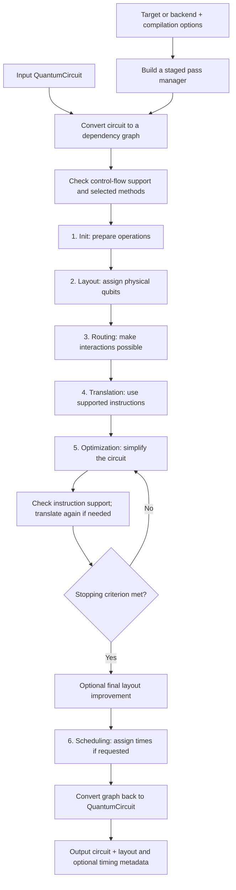

# How Qiskit transpilation works

Transpilation turns a circuit describing a quantum computation into a circuit that fits
a chosen machine: its available instructions, qubit connections, and timing constraints.
It also tries to reduce the cost of running that circuit, such as the number of two-qubit
gates or the circuit depth (the number of sequential layers).

This document describes the standard gate-based pipeline in this checkout, centered on
`qiskit/transpiler`. It follows the six-stage model introduced in the
[IBM Quantum transpilation guide](https://quantum.cloud.ibm.com/docs/en/guides/transpile).
The pass examples and implementation details below come from the local source; the exact
sequence varies with the target, optimization level, chosen methods, and Qiskit version.
Specialized pipelines, such as Clifford+T, can use different transformations.

Source review baseline: Qiskit `2.6.0.dev0`, commit `0131cbbcc`.

## 1. What goes in and what comes out?

| Input | What it supplies |
| --- | --- |
| A `QuantumCircuit`, or a list of circuits | The computation: gates, qubits, measurements, classical bits, and possibly parameters or control flow. Its logical qubits are not yet necessarily assigned to hardware qubits. |
| A `Target`, or a backend exposing one | The machine description: supported instructions and the qubits on which each can run, plus available error estimates, instruction durations, and timing constraints. |
| Optional separate constraints | `basis_gates` specifies the allowed gate vocabulary; `coupling_map` specifies qubit connectivity. These can be used when a full target is unavailable. |
| Compilation options | The optimization level, initial qubit assignment, routing/translation methods, random seed, synthesis options, and optional scheduling method. |

For the clearest configuration, supply a `target`, a `backend`, or separate constraints.
With only a backend, the preset uses its target. Without an explicit target, separate
constraints can override backend values when the preset constructs a target. An explicit
target is the primary hardware description for target-aware passes; conflicting extra
constraints should not be treated as harmless, since option parsing still processes them.
Transpilation can also run without hardware constraints, but then the output is not a
promise of compatibility with a particular device.

**The output is another `QuantumCircuit`**, or a list corresponding to the input list.
For a successful standard compilation against a suitable hardware target, it uses the
target's supported instructions on permitted qubits. This is commonly called an
**ISA circuit**, where ISA means instruction set architecture.

The output can have different gates, more qubit wires, a different qubit order, and a
different depth. When mapping is performed, `output.layout` records how the original
qubits relate to the output qubits. Explicit scheduling can also add delays and operation
start times. Symbolic parameters can remain unbound when the selected passes support them.

The intended computation is preserved under the configured assumptions, accounting for
qubit mappings and numerical tolerance. In particular, `qubits_initially_zero=True` is
the default: synthesis can use qubits known to start in the zero state. Approximate
synthesis settings can deliberately trade accuracy for fewer gates.
Transpilation itself produces neither measurement results nor a submitted hardware job;
execution is a later step.

## 2. The end-to-end flow



The diagram describes the logical stages, not a mandatory list of pass executions.
Stages can be empty, and a stage can do work associated with another stage. In particular,
`SabreLayout` can both choose a layout and perform routing; the routing stage then checks
whether more routing is necessary. Optimization can invoke translation internally after
a rewrite introduces gates outside the target instruction set.

The initial support check runs in `pre_init`, a hook before the six main stages.
Each stage also has optional `pre_` and `post_` hooks. The standard presets omit layout
and routing when neither a coupling map nor an initial layout is present. At level 0,
the default optimization stage is empty, so its entire loop in the diagram is skipped.

## 3. The six stages: purpose, input, output, and passes

A **pass** is one focused analysis or circuit transformation. A **stage** groups passes
that serve a larger purpose. The names below are representative passes in this checkout,
not a sequence that always runs in full.

| Stage | Input → output | What happens and representative passes |
| --- | --- | --- |
| **1. `init` — prepare the circuit** | Logical circuit with potentially complex operations → circuit prepared for mapping and routing. | Expand high-level operations and decompose larger gates as needed, generally toward one- and two-qubit operations while retaining supported instructions. `HighLevelSynthesis` handles structured operations; `UnitarySynthesis` decomposes matrix-defined operations; `BasisTranslator` or `Unroll3qOrMore` helps lower larger gates. Some levels also perform early cleanup with passes such as `InverseCancellation`. |
| **2. `layout` — choose where qubits start** | Circuit on logical qubits → circuit on physical qubits, with an initial mapping recorded. | Honor `initial_layout` through `SetLayout`, or choose an assignment. `TrivialLayout` uses a simple index assignment; `VF2Layout` searches for a matching connectivity pattern; `SabreLayout` searches using routing costs. `FullAncillaAllocation`, `EnlargeWithAncilla`, and `ApplyLayout` embed the circuit into the device's qubit space where needed. |
| **3. `routing` — make qubit interactions reachable** | Physically mapped circuit that may request unavailable connections → circuit whose two-qubit interactions fit the connectivity, with any resulting permutation recorded. | `CheckMap` determines whether routing is needed. `SabreSwap` inserts SWAPs to move logical states between physical qubits. Alternative methods include `BasicSwap` and `LookaheadSwap`. Depending on the preset, `VF2PostLayout` can improve the physical assignment using target error information. Gate direction and final instruction support are handled during translation. |
| **4. `translation` — express operations in the target vocabulary** | Routed circuit that may still contain unsupported gates, including SWAPs → circuit expressed in supported instructions on the relevant qubits. | `UnitarySynthesis` and `HighLevelSynthesis` produce decompositions; `BasisTranslator` uses known gate equivalences. `CheckGateDirection` and `GateDirection` check and fix directional interactions when necessary, followed by further translation as needed. `WrapAngles` handles target angle bounds when present. |
| **5. `optimization` — reduce execution cost** | Target-compatible circuit → simplified circuit, still respecting the target. | `Optimize1qGatesDecomposition` combines sequences of single-qubit gates. `InverseCancellation` or `CommutativeCancellation` removes canceling operations. `TwoQubitPeepholeOptimization` improves small two-qubit regions at higher levels. `GatesInBasis` triggers translation again if needed. `Depth`, `Size`, `FixedPoint`, or `MinimumPoint` help decide when to stop. Level 0 omits this optimization stage. |
| **6. `scheduling` — place operations in time** | Optimized circuit plus durations and timing constraints → circuit with explicit timing if requested. | `TimeUnitConversion` normalizes durations. `ASAPScheduleAnalysis` places operations as soon as dependencies allow; `ALAPScheduleAnalysis` places them as late as possible within the schedule. Alignment checks and `ConstrainedReschedule` can adjust timing. `PadDelay` fills idle intervals with delays. Without a scheduling method, this stage can still normalize delays or check alignment without creating a full schedule. |

Layout and routing answer different questions: **where does each logical qubit start?**
and **how do its interactions become possible as the computation proceeds?** Translation
then answers **which supported gates implement those interactions?**

## 4. A small example of the transformation

Suppose a device connects three physical qubits in a line:

```text
p0 ── p1 ── p2
```

The input requests a controlled-X (`CX`) between logical qubits `a` and `c`.
Assume the initial layout is fixed to `a → p0`, `b → p1`, and `c → p2`.

1. **Init:** the `CX` is already a two-qubit operation, so it needs no larger-gate decomposition.
2. **Layout:** the requested operation becomes `CX(p0, p2)` under the chosen assignment.
3. **Routing:** there is no direct `p0–p2` connection. One possible route is
   `SWAP(p0, p1)`, followed by `CX(p1, p2)`. The logical state of `a` is now at `p1`.
4. **Translation:** if the target supports `CX` in both directions on neighboring pairs,
   the SWAP can become three neighboring CX gates. A different target needs a different
   native decomposition, possibly for the original CX as well.
5. **Optimization:** simplify the resulting sequence wherever surrounding gates allow it.
6. **Scheduling:** if requested, assign operation times and fill idle intervals with delays.

This is an illustrative route, not a prediction of the preset's exact output. With a free
initial layout, the transpiler might place `a` and `c` next to each other and avoid that
SWAP entirely. It need not restore the starting qubit order at the end: layout metadata
records the final mapping, and measurement operations follow the logical states.

## 5. How passes cooperate internally

The public API accepts and returns circuits. During a run, the pass manager converts the
circuit to a **`DAGCircuit`**, a directed acyclic graph describing operations and their
ordering dependencies. This makes it easier to identify independent operations, replace
small regions, and preserve dependencies while rewriting the circuit.

Two kinds of passes cooperate:

- **Analysis passes** inspect the graph and put findings in a shared **`PropertySet`**.
  Examples include circuit depth, whether routing is needed, and scheduling start times.
- **Transformation passes** rewrite the graph, for example by canceling gates, translating
  an instruction, or inserting SWAPs.

A `PassManager` executes passes and their control flow. A `StagedPassManager` arranges
the stage-level pass managers in order. Conditions can skip unnecessary work, and loops
can repeat optimizations until the stopping criterion is met. Thus, an optimization
loop stopping does not prove the circuit is globally optimal.

In the default optimization stage, levels 1 and 2 stop when both depth and operation count
are unchanged between iterations. Level 2 runs its two-qubit peephole optimization before
the loop. Level 3 runs that optimization inside the loop and uses `MinimumPoint` to track
depth and operation count, potentially restoring a better earlier circuit. It can then
run `VF2PostLayout` and `ApplyLayout` for a final assignment improvement.

At the end, the graph becomes a `QuantumCircuit` again. The pass manager attaches layout
and available timing information collected during the run. Much of the underlying graph
and algorithm work is implemented in Rust, while the Python modules assemble the workflow.

## 6. Choosing and running a pipeline

The two main entry points use the same preset machinery:

```python
from qiskit import transpile
from qiskit.transpiler import generate_preset_pass_manager

# Given an input circuit and a backend:
pm = generate_preset_pass_manager(
    backend=backend,
    optimization_level=2,
    seed_transpiler=42,
)
output = pm.run(circuit)

# Convenience form: build and run a preset in one call.
output = transpile(
    circuit,
    backend=backend,
    optimization_level=2,
    seed_transpiler=42,
)
```

`generate_preset_pass_manager(...)` returns the reusable pipeline; `pm.run(...)` returns
the compiled circuit. `transpile(...)` builds a preset and runs it internally. To request
explicit scheduling, add `scheduling_method="alap"` or `"asap"` when building the pipeline,
with a target that supplies the needed durations.

The built-in `alap` and `asap` methods are rejected for circuits containing control-flow
operations in this checkout. Support for those operations also depends on the target and
selected routing method; for example, `basic` and `lookahead` routing are rejected for
control-flow circuits. These are checked before the main stages run.

| Optimization level | General behavior in the standard preset |
| --- | --- |
| **0** | Perform the transformations needed for compatibility, with no dedicated optimization stage. |
| **1** | Add inexpensive cleanup, such as single-qubit simplification and inverse cancellation. |
| **2** | Invest more in layout selection and two-qubit optimization, with commutation-based cleanup. This is the preset generator's default in this checkout. |
| **3** | Spend more effort searching layouts and repeatedly optimizing two-qubit regions. |

Higher levels spend more compilation effort but do not guarantee a better result for
every circuit. Randomized heuristics can choose different mappings and routes; specifying
`seed_transpiler` helps make comparisons reproducible with the same software and settings.
Stage plugins and custom pass managers can replace or extend the standard choices.
Backends can also supply default translation and scheduling plugins, so omitting a method
does not always select the built-in implementation described above.

When consuming the output, keep the mapping in mind. In particular, an observable defined
on the input's logical qubits needs the same layout transformation before it is paired
with the compiled circuit, for example `observable.apply_layout(output.layout)` for a
`SparsePauliOp`. The recorded measurement-to-classical-bit associations should also be
respected when interpreting results.
To inspect the combined mapping from original qubit indices to final output positions,
use `output.layout.final_index_layout()` when a layout is present. The `final_layout`
attribute alone describes the routing permutation, not that combined mapping.

## 7. How input/output equivalence is verified

**The standard transpiler does not run a general input-versus-output equivalence check
after each pass or at the end of every compilation.** It relies on transformations
designed to preserve the relevant behavior, with their implementations checked by tests.
Checks such as `CheckMap`, `GatesInBasis`, and `CheckGateDirection` verify hardware
compatibility; they do not establish that the computation is unchanged.

### What does "the same behavior" mean?

For a circuit containing only unitary operations, the strongest usual numerical check
compares the complete input and output operators, accounting for qubit mappings. Equality
up to a global phase means the circuits produce the same physical behavior for every
input state. Global phase is an overall complex factor that cannot be observed when
running the circuit on its own.

For circuits with measurements, resets, or classical control flow, a single unitary matrix
does not describe the whole computation. Compare the relevant classical outcome
probabilities and, where needed, the remaining quantum states and conditional branches.
For example, `RemoveDiagonalGatesBeforeMeasure` can remove a final phase gate without
changing measurement probabilities. Removing the measurements afterward and comparing
the remaining unitaries would test a different requirement.

### What the repository tests

| Verification layer | How it works | What it establishes |
| --- | --- | --- |
| **Individual-pass tests** | Test known rewrites and corner cases, including expected circuits, matrix equality, and global-phase handling. Examples: [`test_basis_translator.py`](../test/python/transpiler/test_basis_translator.py) and [`test_unitary_synthesis.py`](../test/python/transpiler/test_unitary_synthesis.py). | The tested transformation behaves correctly on those cases. |
| **Whole-pipeline matrix tests** | Transpile small unitary circuits and compare operators. For example, `test_translate_ecr_basis` in [`test_transpiler.py`](../test/python/compiler/test_transpiler.py) compares `Operator(circuit)` with `Operator.from_circuit(result)` across optimization levels. | Numerical equivalence for all input states of each tested unitary circuit, with the layout accounted for. |
| **Randomized simulation tests** | [`test_transpiler_equivalence.py`](../test/randomized/test_transpiler_equivalence.py) generates circuits, including measurements and resets, and varies backends, optimization levels, methods, and seeds. It runs the original and transpiled circuits on a noiseless `AerSimulator` and compares measurement counts. | Broader coverage of combinations and regressions, rather than a proof for every possible circuit. The current test uses 4,096 shots per circuit and allows each outcome's count to differ by up to 5% of the shot count. |

The randomized test's tolerance accommodates sampling differences; it is not a universal
correctness threshold or a bound on compiler error. Matching sampled counts can miss
differences in phase, unmeasured qubits, or untested inputs.

### A small, explicit equivalence check

For a small, fully specified unitary circuit, a user can perform the matrix check directly:

```python
from qiskit import QuantumCircuit, transpile
from qiskit.quantum_info import Operator

original = QuantumCircuit(3)
original.h(0)
original.cx(0, 2)
original.ry(0.37, 1)

compiled = transpile(
    original,
    basis_gates=["rz", "sx", "x", "cx"],
    coupling_map=[[0, 1], [1, 0], [1, 2], [2, 1]],
    initial_layout=[0, 1, 2],
    optimization_level=2,
    approximation_degree=1.0,
    qubits_initially_zero=False,
    seed_transpiler=42,
)

# from_circuit accounts for the recorded initial and final qubit mappings.
assert Operator(original).equiv(
    Operator.from_circuit(compiled), rtol=1e-7, atol=1e-8
)
```

Here, both circuits have three qubits, no measurements or resets, and no unbound parameters.
`qubits_initially_zero=False` avoids relying on a zero-initialized input, and
`approximation_degree=1.0` requests synthesis without deliberate approximation.
[`Operator.from_circuit`](../qiskit/quantum_info/operators/operator.py) accounts for layout;
`Operator(compiled)` alone would compare physical wire order. `equiv` ignores global
phase and applies the supplied numerical tolerances.

This approach has practical limits:

- **Extra qubits:** if compilation adds ancillas, the matrices have different dimensions.
  Account for the ancillas' required initial states and compare the logical outputs after
  undoing the mapping; `Operator.from_circuit` does not automatically remove ancillas.
- **Size:** an operator on `n` qubits contains `4**n` complex entries, so full matrix checks
  are practical only for small circuits. Simulating selected input states is cheaper but
  verifies only those inputs.
- **Parameters and approximation:** numerical checks require parameter values. Testing a
  few bindings does not prove equivalence for every binding. If approximation is enabled,
  compare a suitable error or fidelity measure against an explicit acceptable bound.
- **Hardware noise:** equivalence concerns the ideal computation under its stated
  assumptions. Actual hardware results can differ because the rewritten circuit has
  different gates, durations, and exposure to noise.

## 8. Where this flow lives in the repository

| Source | Role |
| --- | --- |
| [`qiskit/compiler/transpiler.py`](../qiskit/compiler/transpiler.py) | User-facing `transpile()` wrapper: resolves options, builds a preset, and runs it. |
| [`generate_preset_pass_manager.py`](../qiskit/transpiler/preset_passmanagers/generate_preset_pass_manager.py) | Resolves target constraints and chooses the preset pipeline. |
| [`level0.py`](../qiskit/transpiler/preset_passmanagers/level0.py), [`level1.py`](../qiskit/transpiler/preset_passmanagers/level1.py), [`level2.py`](../qiskit/transpiler/preset_passmanagers/level2.py), [`level3.py`](../qiskit/transpiler/preset_passmanagers/level3.py) | Assemble the stages for each optimization level. |
| [`builtin_plugins.py`](../qiskit/transpiler/preset_passmanagers/builtin_plugins.py) and [`common.py`](../qiskit/transpiler/preset_passmanagers/common.py) | Define the built-in stage implementations, pass sequences, conditions, and optimization loops. |
| [`passmanager.py`](../qiskit/transpiler/passmanager.py) and [`basepasses.py`](../qiskit/transpiler/basepasses.py) | Circuit/graph conversion, stage orchestration, output metadata, and pass interfaces. |
| [`passes/`](../qiskit/transpiler/passes) | Individual analysis and transformation passes. |
| [`target.py`](../qiskit/transpiler/target.py) and [`layout.py`](../qiskit/transpiler/layout.py) | Hardware capabilities and qubit mapping information. |

For the broader SDK context, see the [architecture overview](architecture-overview.md).
For the focused benchmark subset, correctness checks, metrics, and workflow for safely
evolving this pipeline, see [transpilation benchmarks](transpilation-benchmarks.md).
